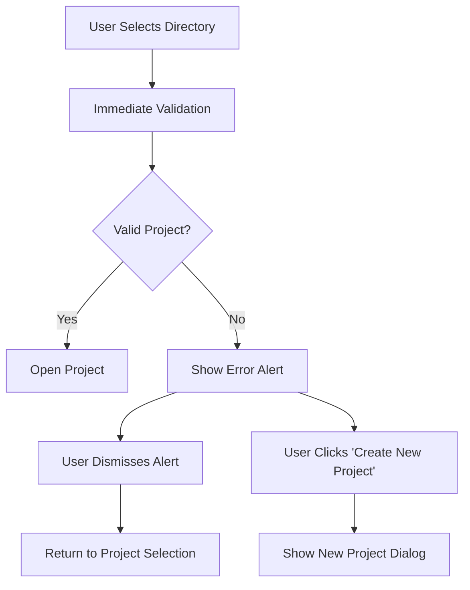

# Design Document

## Overview

This design addresses the user experience issue where the macOS Symposium app silently fails when users select invalid directories during project selection. The solution introduces comprehensive error handling with informative user feedback while maintaining the existing validation logic and app flow.

## Architecture

### Current Flow Analysis

The current project selection flow follows this path:
1. User clicks "Open Existing Project" → `ProjectSelectionView`
2. File picker opens → `fileImporter` modifier
3. User selects directory → `openProject(at: url.path)`
4. Calls `onProjectSelected(path)` → `handleProjectSelected` in `App.swift`
5. Sets `settingsManager.activeProjectPath = path`
6. Triggers `appStart()` → `runStartupLogic()`
7. Validates using `Project.isValidProjectDirectory(path)`
8. If invalid: clears path and shows project selection (silent failure)

### Proposed Architecture Changes

The design introduces error handling at two key points:

1. **Immediate Validation**: Add validation in `ProjectSelectionView` before calling `onProjectSelected`
2. **Fallback Validation**: Enhance existing validation in `runStartupLogic()` with user feedback

This dual approach ensures users get immediate feedback while maintaining backward compatibility with the existing app state machine.

## Components and Interfaces

### 1. Error Types

Create a new `ProjectValidationError` enum to represent different validation failure scenarios:

```swift
enum ProjectValidationError: LocalizedError {
    case missingProjectFile
    case invalidProjectStructure
    case directoryNotAccessible
    case unknownValidationFailure
    
    var errorDescription: String? {
        switch self {
        case .missingProjectFile:
            return "This directory is not a valid Symposium project"
        case .invalidProjectStructure:
            return "The project structure is invalid or corrupted"
        case .directoryNotAccessible:
            return "Unable to access the selected directory"
        case .unknownValidationFailure:
            return "An unknown error occurred while validating the project"
        }
    }
    
    var recoverySuggestion: String? {
        switch self {
        case .missingProjectFile:
            return "Please select a directory that contains a project.json file, or create a new project instead."
        case .invalidProjectStructure:
            return "Try selecting a different project directory or create a new project."
        case .directoryNotAccessible:
            return "Check that you have permission to access this directory and try again."
        case .unknownValidationFailure:
            return "Please try selecting a different directory or create a new project."
        }
    }
}
```

### 2. Enhanced Validation Service

Extend the existing `Project.isValidProjectDirectory()` method with detailed error reporting:

```swift
extension Project {
    static func validateProjectDirectory(_ path: String) -> Result<Void, ProjectValidationError> {
        let projectFilePath = "\(path)/project.json"
        
        // Check if directory is accessible
        guard FileManager.default.fileExists(atPath: path) else {
            return .failure(.directoryNotAccessible)
        }
        
        // Check if project.json exists
        guard FileManager.default.fileExists(atPath: projectFilePath) else {
            return .failure(.missingProjectFile)
        }
        
        // Attempt to load and validate project structure
        do {
            _ = try Project.load(from: path)
            return .success(())
        } catch {
            return .failure(.invalidProjectStructure)
        }
    }
}
```

### 3. Alert Presentation Service

Create a reusable alert presentation utility:

```swift
struct ProjectValidationAlert {
    static func present(for error: ProjectValidationError, in view: NSView) {
        let alert = NSAlert()
        alert.messageText = error.errorDescription ?? "Project Validation Failed"
        alert.informativeText = error.recoverySuggestion ?? "Please try again with a different directory."
        alert.alertStyle = .warning
        alert.addButton(withTitle: "OK")
        alert.addButton(withTitle: "Create New Project")
        
        if let window = view.window {
            alert.beginSheetModal(for: window) { response in
                if response == .alertSecondButtonReturn {
                    // Handle "Create New Project" action
                    NotificationCenter.default.post(
                        name: .showNewProjectDialog, 
                        object: nil
                    )
                }
            }
        }
    }
}
```

### 4. Updated ProjectSelectionView

Modify the file picker success handler to include immediate validation:

```swift
.fileImporter(
    isPresented: $showingDirectoryPicker,
    allowedContentTypes: [.folder],
    allowsMultipleSelection: false
) { result in
    switch result {
    case .success(let urls):
        Logger.shared.log("File picker succeeded with URLs: \(urls)")
        if let url = urls.first {
            Logger.shared.log("Selected URL: \(url.path)")
            
            // Immediate validation with user feedback
            switch Project.validateProjectDirectory(url.path) {
            case .success():
                openProject(at: url.path)
            case .failure(let error):
                Logger.shared.log("Project validation failed: \(error)")
                // Present error alert to user
                ProjectValidationAlert.present(for: error, in: self)
            }
        } else {
            Logger.shared.log("ERROR: No URL selected from file picker")
        }
    case .failure(let error):
        Logger.shared.log("ERROR: File picker failed: \(error)")
        // Could also present an alert for file picker failures
    }
}
```

### 5. Enhanced App.swift Error Handling

Update `runStartupLogic()` to provide fallback error handling:

```swift
private func runStartupLogic() {
    // ... existing permission and agent checks ...
    
    // Check 3: Is there a previously opened project?
    if !settingsManager.activeProjectPath.isEmpty {
        switch Project.validateProjectDirectory(settingsManager.activeProjectPath) {
        case .success():
            Logger.shared.log("Found valid last project, attempting to restore")
            dismissSplash()
            restoreLastProject(at: settingsManager.activeProjectPath)
            return
        case .failure(let error):
            Logger.shared.log("Last project validation failed: \(error)")
            // Clear invalid project path
            settingsManager.activeProjectPath = ""
            // Continue to show project selection
        }
    }
    
    // Default: Show project selection
    Logger.shared.log("No previous project, showing project selection window")
    dismissSplash()
    openWindow(id: "choose-project")
}
```

## Data Models

### ProjectValidationError

The error enum serves as the primary data model for validation failures, providing:
- Structured error categorization
- Localized error messages
- Recovery suggestions for users
- Integration with Swift's error handling system

### Alert Configuration

Alert presentation will use native `NSAlert` with:
- Warning style for validation errors
- Primary "OK" button for dismissal
- Secondary "Create New Project" button for alternative action
- Sheet modal presentation for better UX

## Error Handling

### Error Categories

1. **Missing Project File**: Most common case - directory lacks `project.json`
2. **Invalid Project Structure**: Corrupted or malformed project data
3. **Directory Not Accessible**: Permission or file system issues
4. **Unknown Validation Failure**: Catch-all for unexpected errors

### Error Recovery Strategies

1. **Immediate Feedback**: Show alert immediately when validation fails
2. **Alternative Actions**: Offer "Create New Project" as recovery option
3. **Graceful Degradation**: Return to project selection on any validation failure

### Error Presentation Flow



