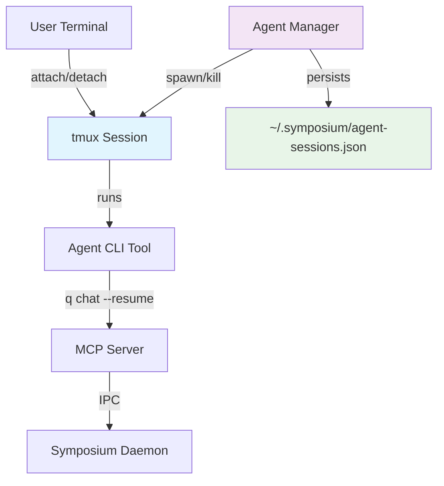

# Agent Manager

Symposium supports two execution models for AI agents:

### Synchronous Agents (Current Default)
- **Execution**: Agents run in VSCode integrated terminals as foreground processes
- **Lifecycle**: Agent dies when terminal closes or VSCode exits
- **State**: Conversation history managed by CLI tools per directory
- **Use Case**: Interactive development sessions with direct terminal access

### Persistent Agents (New Capability)
- **Execution**: Agents run in background tmux sessions managed by Agent Manager
- **Lifecycle**: Agents persist across terminal disconnections and VSCode restarts
- **State**: Session metadata in `~/.symposium/agent-sessions.json`, conversation history still managed by CLI tools
- **Use Case**: Long-running tasks, asynchronous work, multi-session collaboration

#### Agent Manager Commands
```bash
# Spawn persistent agent session
symposium-mcp agent spawn --uuid my-agent --workdir /path/to/project q chat

# List active sessions  
symposium-mcp agent list

# Attach to running session
symposium-mcp agent attach my-agent

# Kill session
symposium-mcp agent kill my-agent
```

#### Persistent Agent Architecture
