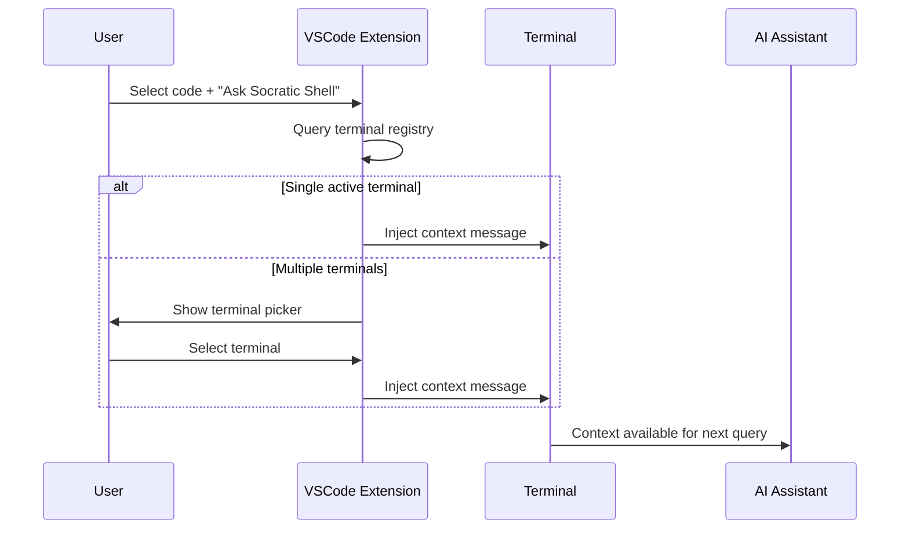

# Ask Socratic Shell

How users can select code and route it to AI assistants running in terminals.

## User Flow

1. User selects code in VSCode editor
2. Right-click → "Ask Socratic Shell" or use command palette
3. Extension queries terminal registry for active AI assistants
4. Routes to single terminal automatically, or shows picker for multiple
5. Injects formatted context into chosen terminal

## Message Flow



## Terminal Registry

The extension tracks which terminals have active AI assistants by monitoring:
- Shell PIDs from MCP server connections
- VSCode terminal process IDs
- Matching PIDs to route messages correctly

**Multi-window support**: Each VSCode window maintains its own terminal registry.

## Implementation Details

**Context Formatting**:
```
<context>looking at this code from src/auth.ts:42:1-50</context>
```

**Terminal Detection** (`extension/src/extension.ts`):
- Maintains `Set<number>` of active shell PIDs
- Updates registry based on daemon messages
- Matches VSCode terminals to shell processes

## Key Files

- `extension/src/extension.ts` - Terminal registry and routing logic
- `extension/src/reviewWebview.ts` - Selection handling (if applicable)
- Server components handle PID discovery and reporting
