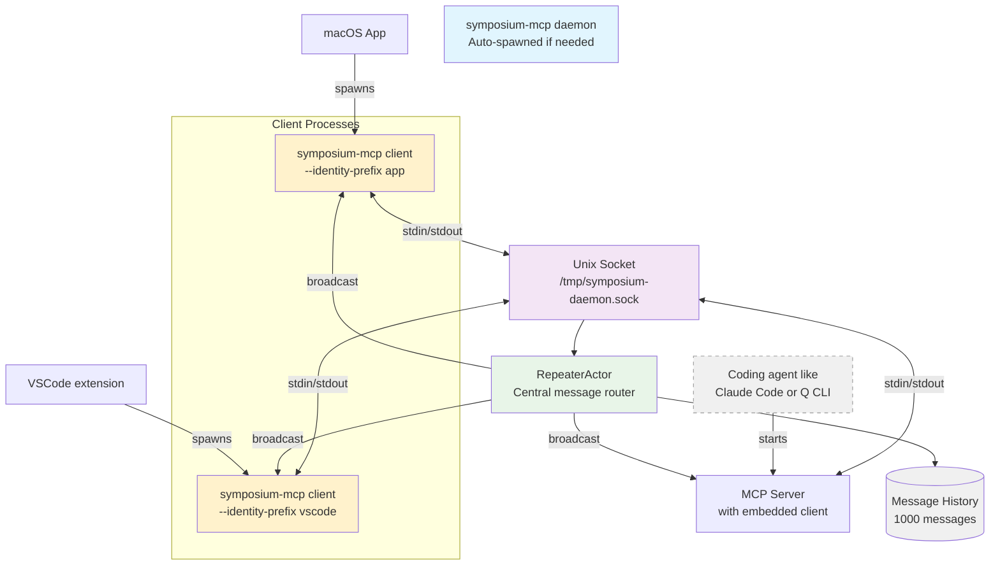

# Daemon Message Bus Architecture  

The daemon message bus serves as the central communication hub that routes messages between MCP servers and VSCode extensions across multiple windows. Built on a RepeaterActor architecture, it provides centralized message routing, client identity tracking, and comprehensive debugging capabilities.

## Architecture Overview 



## RepeaterActor Architecture 

The daemon's core is built around a RepeaterActor that centralizes all message routing:

### Key Components

- **RepeaterActor**: Central message router that maintains subscriber list and message history
- **Client Identity System**: Each client identifies itself with a descriptive identity on connection
- **Message History**: In-memory buffer of recent messages for debugging and replay
- **Debug Interface**: Commands to inspect message flow and client states

### Message Flow

1. **Client Connection**: Client connects to Unix socket and sends identity command
2. **Identity Registration**: RepeaterActor records client identity and adds to subscriber list  
3. **Message Broadcasting**: All messages are broadcast to all connected clients
4. **History Tracking**: Messages are stored in circular buffer for debugging

## Client Identity System 

Each client establishes an identity when connecting to help with debugging and monitoring:

### Identity Format

Identities follow the pattern: `prefix(pid:N,cwd:…/path)`

- **prefix**: Client type identifier
- **pid**: Process ID for system correlation
- **cwd**: Last two components of working directory

### Client Types

| Client Type | Identity Prefix | Example |
|-------------|----------------|---------|
| MCP Server | `mcp-server` | `mcp-server(pid:81332,cwd:…/symposium)` |
| CLI Client | `client` (default) | `client(pid:12345,cwd:…/my-project)` |
| VSCode Extension | `vscode` | `vscode(pid:67890,cwd:…/workspace)` |
| macOS App | `app` | `app(pid:54321,cwd:…/directory)` |

### Identity Commands

Clients send identity commands on connection:

```
#identify:mcp-server(pid:81332,cwd:…/symposium)
```

The daemon uses these identities for:
- Debug message attribution
- Connection tracking
- Process correlation

## Message Targeting and Routing 

### Broadcast Model

The RepeaterActor uses a simple broadcast model:
- All messages are sent to all connected clients
- Clients perform their own filtering based on message content
- No server-side routing logic needed

### Client-Side Filtering

Each client filters messages based on:
- Message type relevance
- Target working directory
- Taskspace UUID matching

This approach keeps the daemon simple while allowing flexible client-side logic.

## Debugging IPC Communications 

The RepeaterActor architecture enables comprehensive debugging capabilities:

### Debug Commands

```bash
# Show recent daemon messages
symposium-mcp debug dump-messages

# Show last 10 messages  
symposium-mcp debug dump-messages --count 10

# Output as JSON
symposium-mcp debug dump-messages --json
```

### Debug Output Format

```
Recent daemon messages (3 of 15 total):
────────────────────────────────────────────────────────────────────────────────
[19:33:43.939] BROADCAST[mcp-server(pid:81332,cwd:…/symposium)] {"type":"taskspace_state",...}
[19:33:44.001] BROADCAST[vscode(pid:12345,cwd:…/my-project)] {"type":"register_taskspace_window",...}
[19:33:44.301] BROADCAST[app(pid:67890,cwd:…/workspace)] {"type":"marco",...}
```

### Message History

- **Capacity**: 1000 messages (configurable)
- **Storage**: In-memory circular buffer
- **Persistence**: Lost on daemon restart
- **Access**: Via debug commands only

### Common Debugging Scenarios

**Connection Issues**: Check if clients are connecting and identifying properly
```bash
symposium-mcp debug dump-messages --count 5
```

**Message Flow**: Verify messages are being broadcast to all clients
```bash
symposium-mcp debug dump-messages --json | jq '.[] | .from_identifier'
```

**Client Identity**: Confirm clients are using correct identity prefixes
```bash
symposium-mcp debug dump-messages | grep BROADCAST
```

## Implementation Details 

### Actor System

The daemon uses Tokio actors following Alice Ryhl's actor pattern:

- **RepeaterActor**: Message routing and history
- **ClientActor**: Individual client connections  
- **StdioHandle**: Stdin/stdout bridging

### Channel Architecture

- **mpsc channels**: For actor communication
- **Unbounded channels**: For message broadcasting
- **Oneshot channels**: For debug command responses

### Error Handling

- **Connection failures**: Automatic client cleanup
- **Message parsing errors**: Logged but don't crash daemon
- **Actor panics**: Isolated to individual actors

### Performance Characteristics

- **Memory usage**: O(message_history_size + active_clients)
- **CPU usage**: O(active_clients) per message
- **Latency**: Single-digit milliseconds for local Unix sockets

## Socket Management 

### Socket Location

Default: `/tmp/symposium-daemon.sock`
Custom: `/tmp/{prefix}-daemon.sock`

### Auto-Start Behavior

Clients can auto-start the daemon if not running:
```bash
symposium-mcp client --auto-start
```

### Cleanup

- Socket files removed on daemon shutdown
- Stale sockets cleaned up on startup
- Process termination handled gracefully

## Testing 

The RepeaterActor has comprehensive unit tests covering:

- **Message routing**: Broadcast to all subscribers
- **Client management**: Add/remove subscribers
- **Identity tracking**: Client identifier handling
- **Message history**: Circular buffer behavior
- **Debug commands**: History retrieval and formatting

Tests use in-memory channels and mock clients for fast, reliable testing.
