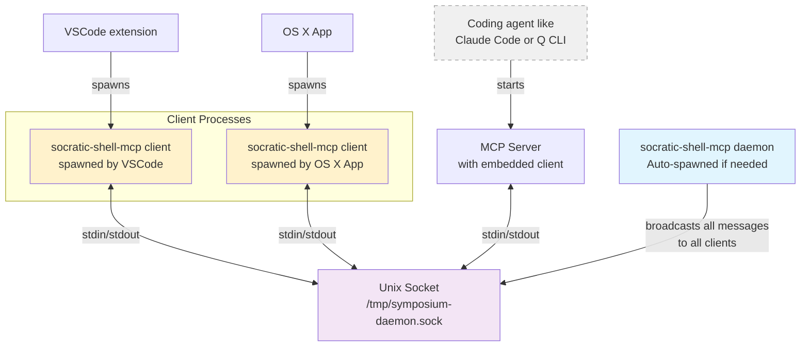

# Daemon Message Bus Architecture

The daemon message bus serves as the central communication hub that routes messages between MCP servers and VSCode extensions across multiple windows. It eliminates the need for direct connections while enabling intelligent message routing based on terminal capabilities.

## Architecture Overview



## Binary and Process Structure

The [MCP server](./mcp-server.md) and daemon are packaged in the same binary (`socratic-shell-mcp`) with these subcommands:

```bash
# Start MCP server (default, no subcommand) - has embedded IPC client
socratic-shell-mcp

# Start client process (spawned by VSCode extension, OS X app, etc.)
# This will automatically launch a daemon if needed
socratic-shell-mcp client

# Start daemon (usually auto-spawned by clients)  
socratic-shell-mcp daemon

# Run PID discovery probe (for testing)
socratic-shell-mcp probe
```

The daemon creates a Unix domain socket at `/tmp/symposium-daemon.sock` for IPC communication.

## Key Architecture Principles

**All logic in Rust**: The `socratic-shell-mcp` binary contains all IPC, daemon, and client logic. Other components (VSCode extension, OS X app) spawn Rust processes rather than reimplementing communication logic.
- See: `socratic-shell/mcp-server/src/main.rs` - subcommands for `client`, `daemon` modes
- See: `socratic-shell/vscode-extension/src/extension.ts` - spawns `socratic-shell-mcp client` process

**Simple broadcast model**: Daemon forwards every message to all connected clients. No parsing, filtering, or routing logic in the daemon itself.
- See: `socratic-shell/mcp-server/src/daemon.rs` - `broadcast_to_clients()` function

**Message format**: One JSON document per line over Unix domain socket at `/tmp/symposium-daemon.sock`.
- See: `socratic-shell/mcp-server/src/daemon.rs` - socket creation and message handling
- See: `socratic-shell/mcp-server/src/constants.rs` - `DAEMON_SOCKET_PREFIX` constant

**Automatic lifecycle**: Clients auto-spawn daemon if needed. Daemon auto-terminates after 30s idle. During development, `cargo setup --dev` kills daemon and sends `reload_window` to trigger VSCode reloads.
- See: `socratic-shell/mcp-server/src/daemon.rs` - `run_client()` spawns daemon if needed
- See: `setup/src/dev_setup.rs` - kills existing daemons during development

See [Communication Protocol](./protocol.md) for detailed message format specifications.
