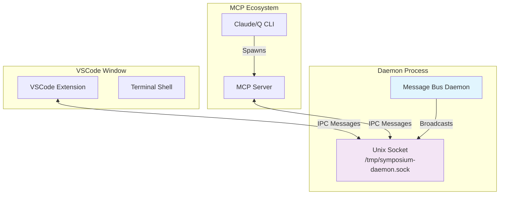

# Daemon Message Bus Architecture

The daemon message bus serves as the central communication hub that routes messages between MCP servers and VSCode extensions across multiple windows. It eliminates the need for direct connections while enabling intelligent message routing based on terminal capabilities.

## Architecture Overview



## Binary and Process Structure

The [MCP server](./mcp-server.md) and daemon are packaged in the same binary (`symposium-mcp`). The daemon is started by running:

```bash
symposium-mcp daemon --prefix symposium-daemon
```

This creates a Unix domain socket at `/tmp/symposium-daemon.sock` for IPC communication.

## Lifecycle Management

### Auto-Starting
When an [MCP server](./mcp-server.md) starts, it:
1. Identifies the PID of the IDE it is running inside of using process tree traversal
2. Attempts to connect to the daemon socket
3. If connection fails, spawns a new daemon process automatically
4. Retries connection with exponential backoff

### Auto-Termination
The daemon monitors the IDE PID and automatically terminates when:
- The parent IDE process exits
- It receives a SIGTERM or SIGINT signal
- All client connections are closed and the daemon is idle

### Graceful Shutdown
When terminating, the daemon:
1. Broadcasts a `reload_window` message to all connected VSCode extensions
2. Waits 100ms for clients to process the message
3. Closes all connections and exits cleanly

This enables automatic VSCode window reloading during development workflows.

## Structured Logging

The daemon implements component-based structured logging with PID prefixes:

```
[DAEMON:12345] INFO Successfully bound to socket: /tmp/symposium-daemon.sock
[MCP-SERVER:12346] INFO Connected to daemon via IPC  
[EXTENSION:12347] INFO Received reload_window signal, reloading window...
```

Logging configuration:
- **Development mode**: Logs to `/tmp/symposium-mcp.log` with `RUST_LOG=symposium_mcp=debug`
- **Production mode**: Standard structured logging without file output
- **Auto-cleanup**: Log file is truncated when daemon successfully binds to socket

## IPC Communication Protocol

### Socket Management
- **Socket path**: `/tmp/symposium-daemon.sock` (Unix domain socket)
- **Connection model**: Multiple clients can connect simultaneously
- **Message format**: JSON objects, one per line
- **Broadcasting**: All messages are rebroadcast to all connected clients

### Message Routing
Daemons are intentionally simple - they don't parse message content, just:
1. Accept newline-delimited JSON messages from any client
2. Rebroadcast each message to all other connected clients
3. Let clients handle message filtering and routing logic

### Connection Resilience
- **Automatic reconnection**: Clients retry with exponential backoff on connection failure
- **Clean disconnection**: Clients gracefully close connections on shutdown
- **Process monitoring**: Daemon tracks client processes and cleans up stale connections

## Development Integration

### Setup Tool Integration
The `cargo setup --dev` command:
1. Builds the MCP server and VSCode extension
2. **After building**, kills any existing daemon processes using `ps ux | grep 'symposium-mcp daemon'`
3. Extracts PIDs and sends `SIGTERM` to each daemon process
4. Daemon broadcasts `reload_window` before shutting down
5. Sets up MCP server configuration to use the new binary

### VSCode Extension Integration
The VSCode extension:
- Connects to daemon on activation via `DaemonClient.start()`
- Listens for `reload_window` messages and executes `vscode.commands.executeCommand('workbench.action.reloadWindow')`
- Maintains persistent connection for real-time message handling
- Automatically reconnects if daemon restarts

### Error Handling
- **Socket binding failures**: Daemon retries with different socket paths if needed
- **Permission issues**: Clear error messages with troubleshooting guidance  
- **Connection timeouts**: Exponential backoff prevents resource exhaustion
- **Process cleanup**: Stale socket files are automatically removed on startup

See [Communication Protocol](./protocol.md) for detailed message format specifications.
