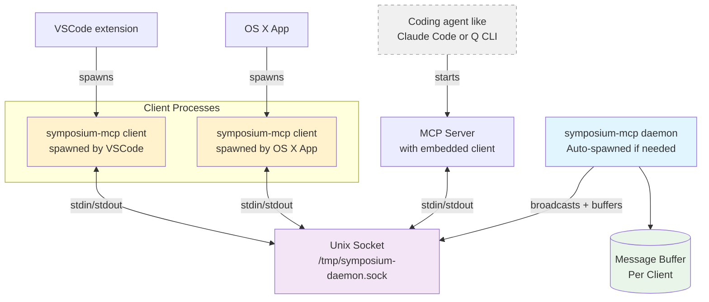

# Daemon Message Bus Architecture

The daemon message bus serves as the central communication hub that routes messages between MCP servers and VSCode extensions across multiple windows. It eliminates the need for direct connections while enabling intelligent message routing, buffering, and replay capabilities.

## Architecture Overview



## Message Targeting and Routing

## Message Targeting and Routing

### Hybrid Directory + PID Approach
The daemon uses intelligent message targeting to support both synchronous and persistent agents:

```typescript
interface IPCMessage {
    type: string;
    id: string;
    sender: {
        workingDirectory: string;      // Always present - reliable matching
        taskspaceUuid?: string;        // Optional - for taskspace-specific routing
        shellPid?: number;             // Optional - only when VSCode parent found
    };
    payload: any;
}
```

### Client-Side Filtering Logic
VSCode extensions filter incoming messages using hybrid directory + PID matching:

```typescript
private async isMessageForOurWindow(sender: MessageSender): Promise<boolean> {
    // 1. Check if working directory is within our workspace
    const workspaceMatch = vscode.workspace.workspaceFolders?.some(folder => 
        sender.workingDirectory.startsWith(folder.uri.fsPath)
    );
    
    if (!workspaceMatch) {
        return false; // Directory not in our workspace
    }
    
    // 2. If shellPid provided, verify it's one of our terminals
    if (sender.shellPid) {
        const terminals = vscode.window.terminals;
        for (const terminal of terminals) {
            const terminalPid = await terminal.processId;
            if (terminalPid === sender.shellPid) {
                return true; // Precise PID match
            }
        }
        return false; // shellPid provided but not found in our terminals
    }
    
    // 3. If no shellPid (persistent agent case), accept based on directory match
    return true;
}
```

### Benefits of Hybrid Approach
- **Universal Compatibility**: Works with both synchronous (terminal-based) and persistent (tmux-based) agents
- **Precise When Possible**: Uses PID matching when available for accuracy
- **Robust Fallback**: Directory matching works across all execution models
- **Multi-Window Safe**: Prevents cross-window message leakage

### Sender Information by Component

Different components populate sender information differently:

**MCP Server (Agent Messages)**:
```typescript
sender: {
    workingDirectory: "/path/to/workspace",  // Current working directory
    taskspaceUuid: "task-ABC123",           // Extracted from directory structure
    shellPid: 12345                        // Terminal shell PID (if available)
}
```

**VSCode Extension Messages**:
```typescript
sender: {
    workingDirectory: vscode.workspace.workspaceFolders[0].uri.fsPath,  // First workspace folder
    taskspaceUuid: getCurrentTaskspaceUuid() || undefined,  // Extracted from directory structure (if available)
    shellPid: undefined                         // Extensions don't provide shell PID
}
```

**Daemon Shutdown Messages**:
```typescript
sender: {
    workingDirectory: "/tmp",               // Generic path for daemon messages
    taskspaceUuid: undefined,
    shellPid: undefined                     // No specific PID for daemon messages
}
```

The daemon sends `reload_window` messages to all clients when it shuts down.

## Message Buffering and Replay

### Buffering Architecture
The daemon implements per-client message buffering to handle disconnections gracefully:

```rust
struct DaemonState {
    clients: HashMap<ClientId, ClientConnection>,
    message_buffers: HashMap<ClientId, VecDeque<IPCMessage>>,
    buffer_limits: BufferConfig,
}

struct BufferConfig {
    max_messages_per_client: usize,  // Default: 1000
    message_ttl: Duration,           // Default: 5 minutes
    eviction_policy: EvictionPolicy, // LRU, FIFO, etc.
}
```

### Buffering Behavior
1. **Message Routing**: When a message arrives, daemon attempts to deliver to target clients
2. **Buffer on Disconnect**: If target client is disconnected, message goes to their buffer
3. **Buffer Limits**: Enforce size and TTL limits to prevent memory exhaustion
4. **Replay on Reconnect**: When client reconnects, replay all buffered messages in order
5. **Buffer Cleanup**: Remove expired messages and enforce size limits

### Use Cases for Buffering
- **Agent Progress Updates**: Persistent agents can report progress while VSCode is closed
- **User Attention Signals**: `signal_user` messages buffered until VSCode reconnects
- **Taskspace Events**: Spawn/update notifications preserved across disconnections
- **Development Workflow**: Daemon restarts don't lose in-flight messages

### Buffering Implementation
```rust
impl MessageBus {
    async fn route_message(&mut self, message: IPCMessage) -> Result<()> {
        let target_clients = self.find_target_clients(&message).await?;
        
        for client_id in target_clients {
            if let Some(client) = self.clients.get_mut(&client_id) {
                if client.is_connected() {
                    // Direct delivery
                    client.send_message(message.clone()).await?;
                } else {
                    // Buffer for later replay
                    self.buffer_message(client_id, message.clone()).await?;
                }
            }
        }
        Ok(())
    }
    
    async fn handle_client_reconnect(&mut self, client_id: ClientId) -> Result<()> {
        // Replay all buffered messages for this client
        if let Some(buffer) = self.message_buffers.get_mut(&client_id) {
            while let Some(message) = buffer.pop_front() {
                self.clients[&client_id].send_message(message).await?;
            }
        }
        Ok(())
    }
}
```

## Binary and Process Structure

The [MCP server](./mcp-server.md) and daemon are packaged in the same binary (`symposium-mcp`) with these subcommands:

```bash
# Start MCP server (default, no subcommand) - has embedded IPC client
symposium-mcp

# Start client process (spawned by VSCode extension, OS X app, etc.)
# This will automatically launch a daemon if needed
symposium-mcp client

# Start daemon (usually auto-spawned by clients)  
symposium-mcp daemon

# Run PID discovery probe (for testing)
symposium-mcp probe
```

The daemon creates a Unix domain socket at `/tmp/symposium-daemon.sock` for IPC communication.

## Key Architecture Principles

**All logic in Rust**: The `symposium-mcp` binary contains all IPC, daemon, and client logic. Other components (VSCode extension, OS X app) spawn Rust processes rather than reimplementing communication logic.
- See: `mcp-server/src/main.rs` - subcommands for `client`, `daemon` modes
- See: `ide/vscode/src/extension.ts` - spawns `symposium-mcp client` process

**Intelligent message routing**: Daemon uses hybrid directory + PID targeting to route messages accurately across different agent execution models.
- Supports both synchronous (terminal-based) and persistent (tmux-based) agents
- Directory-based matching with PID precision when available

**Message buffering and replay**: Daemon buffers messages when target clients are disconnected and replays them on reconnection.
- Prevents message loss during VSCode restarts or network issues
- Essential for persistent agents that may outlive VSCode sessions

**Message format**: One JSON document per line over Unix domain socket at `/tmp/symposium-daemon.sock`.
- See: `mcp-server/src/daemon.rs` - socket creation and message handling
- See: `mcp-server/src/constants.rs` - `DAEMON_SOCKET_PREFIX` constant

**Automatic lifecycle**: Clients auto-spawn daemon if needed. Daemon auto-terminates after 30s idle. During development, `cargo setup --dev` kills daemon and sends `reload_window` to trigger VSCode reloads.
- See: `mcp-server/src/daemon.rs` - `run_client()` spawns daemon if needed
- See: `setup/src/dev_setup.rs` - kills existing daemons during development

## Future Enhancements

### HTTP-Based Communication
[Experiment 1](../work-in-progress/big-picture/experiments/experiment-1-http-buffering-daemon.md) explores migrating from Unix sockets to HTTP for improved debugging and cross-platform compatibility.

### Persistent Message Storage
Buffered messages could be persisted to disk for daemon restart resilience, though this adds complexity.

### Advanced Routing
More sophisticated routing based on message content, client capabilities, or user preferences.

See [Communication Protocol](./protocol.md) for detailed message format specifications.
