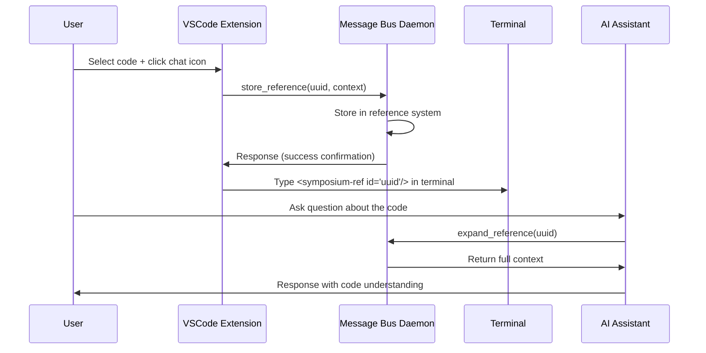

# Discuss in Symposium

How users can quickly share code context with AI assistants running in terminals by selecting code and clicking the chat icon.

## User Experience

**Goal**: Make it effortless to give an AI assistant context about specific code without manual copying/pasting or complex explanations.

**Workflow**:
1. User selects relevant code in VSCode editor
2. Clicks the chat icon in the status bar or editor
3. A compact reference appears in their active AI terminal(s)
4. User can immediately ask questions about that code

## User Flow

1. **Select Code**: User highlights code they want to discuss
2. **Click Chat Icon**: Triggers reference creation and distribution
3. **Reference Created**: System generates `<symposium-ref id="..."/>` and stores context
4. **Auto-Route to Terminal**: Reference sent to active AI-enabled terminals
5. **Immediate Use**: User can ask AI about the code using the reference

## Terminal Selection Logic

The extension automatically determines where to send the reference:

**Single AI Terminal**: Sends reference directly, no user interaction needed
**Multiple AI Terminals**: Sends to all terminals (user sees reference in each)
**No AI Terminals**: Shows warning to start an MCP-enabled terminal

**Terminal Discovery**: Extension tracks active terminals through:
- Marco/Polo discovery protocol with MCP servers
- Shell PID matching between VSCode terminals and MCP processes
- Real-time registry updates as terminals start/stop

## Implementation Details

**Reference Distribution**:
The extension sends the compact reference (`<symposium-ref id="..."/>`) directly to terminal stdin, making it appear as if the user typed it. This provides immediate visual feedback and allows the user to see exactly what will be sent to the AI.

**Multi-Window Support**:  
Each VSCode window maintains its own terminal registry through the global daemon, ensuring references are routed correctly even with multiple VSCode instances.

**Error Handling**:
- **No AI Terminals**: User gets clear warning message
- **Terminal Discovery Failure**: Graceful degradation with manual terminal selection
- **Reference Storage Failure**: User sees error but can retry

## Message Flow

## Related Systems

This feature builds on the [Symposium Reference System](./symposium-ref-system.md) for context storage and retrieval.

## Key Files

- `symposium/vscode-extension/src/extension.ts` - Chat icon handling, terminal selection, reference distribution
