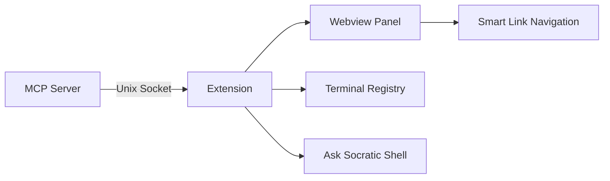

# VSCode Extension Design

The VSCode extension provides two core features: displaying AI-generated code reviews in a webview panel and enabling "Ask Socratic Shell" for routing selected code to AI assistants.

## Architecture Overview

**Key Components:**
- **Daemon Client** (`extension.ts`) - Manages Unix socket connection to MCP server
- **Review Webview** (`reviewWebview.ts`) - Displays markdown reviews with custom link handling
- **Terminal Registry** - Tracks which terminals have active AI assistants
- **Ask Socratic Shell** - Routes selected code to appropriate AI terminal

## Review Display

Reviews are displayed in a webview panel using markdown-it with custom link rendering. The interesting part is the link handling system:

**Supported Link Formats:**
- `file.ts?searchTerm` - Search-based navigation with disambiguation
- `file.ts#L42` - Jump to specific line
- `file.ts#L42-L50` - Jump to line range
- `file.ts` - Open file

**Smart Navigation:**
When search-based links find multiple matches, the extension shows a QuickPick with live preview - you can see each match as you navigate through options before selecting.

Links are converted to a custom `dialectic:` URL scheme and handled via webview-to-extension postMessage communication.

## Ask Socratic Shell

Allows users to select code and route it to AI assistants running in terminals:

1. User selects code and chooses "Ask Socratic Shell"
2. Extension queries terminal registry for active AI assistants
3. Routes to single terminal automatically, or shows picker for multiple
4. Injects formatted context into the chosen terminal

The terminal registry tracks shell PIDs and matches them to VSCode terminals for intelligent routing.

## Multi-Window Support

Each VSCode window runs an independent extension instance with its own terminal registry. Messages from the MCP server are routed to the correct window based on shell PID matching.

## Key Files

- `extension/src/extension.ts` - Main activation and daemon client
- `extension/src/reviewWebview.ts` - Webview provider and link handling
- `extension/package.json` - Extension manifest and commands

The implementation prioritizes user experience over architectural purity - the smart link navigation and terminal routing create a seamless workflow for AI-assisted code review.
