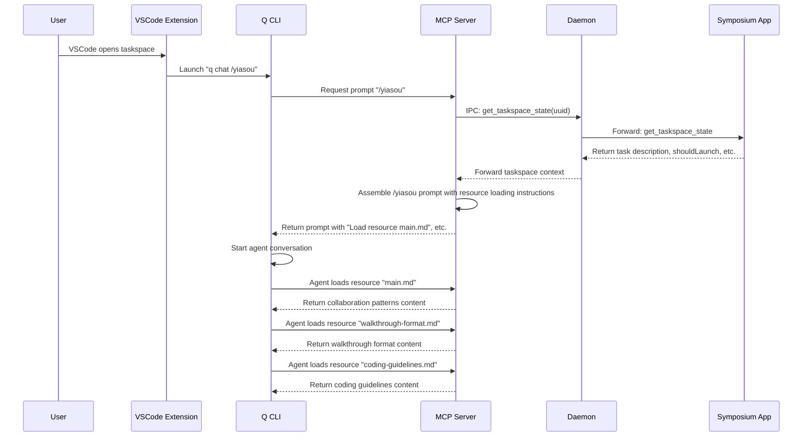

# Guidance and Initialization

This chapter describes how Symposium provides agents with collaboration patterns, project context, and initialization instructions through embedded guidance and streamlined boot sequences.

## Problem Statement

### Current Boot Sequence Issues

The current taskspace initialization has several problems:

1. **Shell Argument Length Limits**: Long initial prompts passed via command line arguments get truncated, creating messy output with shell continuation prompts (`dquote>`).

2. **Manual Context Configuration**: Agents must manually discover and read project documentation (AGENTS.md, CLAUDE.md, etc.) to understand collaboration patterns.

3. **Fragmented Setup**: Users need to configure both user-wide context files AND install MCP servers separately, with potential sync issues.

4. **Awkward User Experience**: The terminal shows truncated commands and confusing output during agent startup.

### Example of Current Problems

When launching a taskspace, users see:
```bash
q chat "Hi, welcome\! You are a new agent just getting started as part of the project Symposium..."
# Command gets truncated, showing:
dquote> User's task description:
dquote> This workspace is just for testing — I'm planning to delete it...
```

## Design Solution

### Stored Prompt + MCP Resources Approach

Instead of passing long prompts as command-line arguments, we use a **stored prompt system** combined with **MCP resources**:

```bash
# Clean, simple command
q chat /yiasou
```

Where `/yiasou` is a stored prompt that instructs the agent to load specific MCP resources with behavioral directives.

### MCP Resources Architecture

The MCP server exposes guidance files as individual resources using the standard MCP resource protocol:

```rust
// Expose guidance files as MCP resources
async fn list_resources(&self, ...) -> Result<ListResourcesResult, McpError> {
    Ok(ListResourcesResult {
        resources: vec![
            Resource {
                uri: "main.md".into(),
                name: Some("Collaboration Patterns".into()),
                description: Some("Mindful collaboration patterns demonstrated through dialogue".into()),
                mime_type: Some("text/markdown".into()),
            },
            Resource {
                uri: "walkthrough-format.md".into(),
                name: Some("Walkthrough Format".into()),
                description: Some("Specification for creating interactive code walkthroughs".into()),
                mime_type: Some("text/markdown".into()),
            },
            Resource {
                uri: "coding-guidelines.md".into(),
                name: Some("Coding Guidelines".into()),
                description: Some("Development best practices and standards".into()),
                mime_type: Some("text/markdown".into()),
            },
        ],
    })
}
```

### Complete Boot Sequence

The `/yiasou` stored prompt provides a structured initialization with resource loading instructions:

```markdown
# Agent Boot Sequence

This prompt defines the agent boot sequence.

If you encounter ambiguous instructions, remember to ask questions and seek 
clarifications before proceeding, particularly with side-effect-ful or 
dangerous actions (e.g., deleting content or interacting with remote systems).

## Load Collaboration Patterns

Load the resource `main.md` into your working context. This contains collaboration 
patterns demonstrated through dialogue. Embody the collaborative spirit shown in 
these examples - approach our work with genuine curiosity, ask questions when 
something isn't clear, and trust that we'll navigate together what's worth pursuing.

## Load Walkthrough Format

Load the resource `walkthrough-format.md` into your working context. This defines 
how to create interactive code walkthroughs using markdown with embedded XML 
elements for comments, diffs, and actions.

## Load Coding Guidelines  

Load the resource `coding-guidelines.md` into your working context. Follow these 
development standards and best practices in all code work.

## Initial Task

<dynamic content fetched via MCP tool/IPC>
```

## Implementation Architecture

### File Organization

```
symposium/mcp-server/
├── src/
│   ├── guidance/           # Guidance files exposed as MCP resources
│   │   ├── main.md        # Collaboration patterns → @../../../symposium/mcp-server/src/guidance/main.md
│   │   ├── walkthrough-format.md → @../../../symposium/mcp-server/src/guidance/walkthrough-format.md
│   │   └── coding-guidelines.md → @../../../symposium/mcp-server/src/guidance/coding-guidelines.md
│   ├── server.rs          # MCP server with resource + prompt support → @../../../symposium/mcp-server/src/server.rs
│   ├── types.rs           # IPC message types and payloads → @../../../symposium/mcp-server/src/types.rs
│   └── ipc.rs             # IPC communication layer → @../../../symposium/mcp-server/src/ipc.rs
```

### Key Implementation Files

**MCP Server Core** → @../../../symposium/mcp-server/src/server.rs
- `list_resources()` - Exposes guidance files as MCP resources
- `read_resource()` - Serves guidance file content  
- `get_prompt()` - Implements `/yiasou` stored prompt
- `assemble_yiasou_prompt()` - Dynamic prompt assembly with taskspace context
- `expand_reference()` - Enhanced tool supporting guidance files and `yiasou` reference

**IPC Communication** → @../../../symposium/mcp-server/src/ipc.rs  
- `get_taskspace_state()` - Fetches real taskspace context from daemon/app
- Message routing and error handling for dynamic context integration

**Type Definitions** → @../../../symposium/mcp-server/src/types.rs
- `GetTaskspaceStatePayload` - IPC request structure
- `TaskspaceStateResponse` - Taskspace context response
- `IPCMessageType::GetTaskspaceState` - Message type for context fetching

**Embedded Guidance Files**
- **Collaboration Patterns** → @../../../symposium/mcp-server/src/guidance/main.md
- **Walkthrough Format** → @../../../symposium/mcp-server/src/guidance/walkthrough-format.md  
- **Coding Guidelines** → @../../../symposium/mcp-server/src/guidance/coding-guidelines.md

### Data Flow



### Architectural Benefits

This design provides several advantages over embedded content:

1. **Modularity**: Each guidance file is independently accessible
2. **Selective Loading**: Agents can load only relevant guidance
3. **Resource Introspection**: Standard MCP resource listing shows available guidance
4. **Behavioral Directives**: Each resource comes with specific usage instructions
5. **Debugging**: Easy to see which guidance files are being loaded and used

### Implementation Clarifications

**MCP Resource Support**: The Rust MCP SDK fully supports resources through `list_resources()` and `read_resource()` methods in the ServerHandler trait.

**MCP Prompt Support**: The Rust MCP SDK fully supports dynamic prompts through `get_prompt()` method, which can perform async computation and return dynamically assembled content.

**Taskspace UUID Detection**: Existing code in the MCP server already handles finding the taskspace UUID from the current working directory.

**Error Handling**: If the MCP server can't reach the daemon/app, `/yiasou` will omit the "Initial Task" section but still provide resource loading instructions.

**Resource Loading Flow**: The `/yiasou` prompt instructs the agent to load specific resources, and the agent makes separate MCP resource requests to fetch the actual content.

**Dynamic Prompt Assembly**: `/yiasou` will be implemented as an MCP prompt (not resource) that dynamically computes content in the `get_prompt()` method by making IPC calls for task context.

**Migration Strategy**: Changes are purely additive until the extension is updated - no backwards compatibility concerns during development.

### Benefits

1. **Clean User Experience**: Simple `/yiasou` command instead of truncated arguments
2. **Modular Guidance**: Each guidance file is independently accessible as an MCP resource
3. **Selective Loading**: Agents can choose which guidance to load based on context
4. **Behavioral Directives**: Each resource comes with specific instructions for how to embody that guidance
5. **Standard Protocol**: Uses standard MCP resource protocol for guidance access
6. **Automatic Updates**: New MCP server versions include updated guidance
7. **No Manual Configuration**: No separate context files to install or maintain
8. **Versioned Guidance**: Collaboration patterns are versioned with the codebase

## Implementation Plan

### Phase 1: Embedded Guidance ✅ COMPLETE
- [x] Add `rust-embed` dependency to MCP server
- [x] Create `guidance/` directory structure
- [x] Ask user to populate directory with collaboration patterns and other guidance
- [x] Implement guidance file loading in MCP server
- [x] Add comprehensive tests for guidance loading functionality
- [x] Create test tool to verify guidance assembly works correctly

**Status**: Phase 1 is complete and tested. All guidance files are embedded correctly and the `assemble_yiasou_prompt()` method successfully combines them into a complete initialization prompt.

### Phase 2: MCP Resource System ✅ COMPLETE
- [x] Implement `list_resources()` method to expose guidance files as MCP resources
- [x] Implement `read_resource()` method to serve guidance file content
- [x] Test resource listing and reading through MCP protocol
- [x] Update guidance files to be optimized for individual loading

**Status**: Phase 2 is complete and tested. All guidance files are now exposed as MCP resources with proper metadata and can be loaded individually by agents.

### Phase 3: MCP Prompt System ✅ COMPLETE
- [x] Implement `/yiasou` prompt using MCP server prompt capabilities
- [x] Create prompt assembly logic with resource loading instructions
- [x] Add behavioral directives for each resource type (using inviting language)
- [x] Test prompt delivery through MCP protocol

### Phase 4: Dynamic Context Integration ✅ COMPLETE
- [x] Implement IPC call for taskspace context in `/yiasou` prompt
- [x] Add task description fetching
- [x] Integrate project-specific information
- [x] Test complete boot sequence with resource loading

### Phase 5: Migration and Testing ✅ COMPLETE
- [x] Update Swift application to use unified TaskspaceState protocol
- [x] Implement unified IPC message handling in macOS app  
- [x] Test end-to-end compilation and protocol compatibility
- [x] Document new TaskspaceState protocol in design docs
- [x] **Update affected mdbook chapters**:
  - [x] Added comprehensive TaskspaceState protocol documentation
  - [ ] `work-in-progress/mvp/taskspace-bootup-flow.md` - Remove old flow references
  - [ ] `design/startup-and-window-management.md` - Update startup sequence  
  - [ ] Any other chapters referencing current boot sequence
- [x] Remove old embedded guidance approach - replaced with MCP resources

## Taskspace State Protocol

The taskspace state protocol enables dynamic agent initialization and taskspace management through a unified IPC message system. This protocol is used by the `/yiasou` prompt system to fetch real taskspace context and by the `update_taskspace` tool to modify taskspace properties.

### Protocol Overview

**Message Type:** `IPCMessageType::TaskspaceState`

**Request Structure:** `TaskspaceStateRequest`
```rust
{
    project_path: String,        // Path to .symposium project
    taskspace_uuid: String,      // UUID of the taskspace
    name: Option<String>,        // None = don't update, Some(value) = set new name
    description: Option<String>, // None = don't update, Some(value) = set new description
}
```

**Response Structure:** `TaskspaceStateResponse`
```rust
{
    name: Option<String>,         // Current taskspace name (user-visible)
    description: Option<String>,  // Current taskspace description (user-visible)
    initial_prompt: Option<String>, // LLM task description (cleared after updates)
}
```

### Field Semantics

**Request Fields:**
- `project_path`: Absolute path to the `.symposium` project directory
- `taskspace_uuid`: Unique identifier for the taskspace (extracted from directory structure)
- `name`: Optional new name to set (None = read-only operation)
- `description`: Optional new description to set (None = read-only operation)

**Response Fields:**
- `name`: User-visible taskspace name displayed in GUI tabs, window titles, etc.
- `description`: User-visible summary shown in GUI tooltips, status bars, etc.
- `initial_prompt`: Task description provided to LLM during agent initialization

### Operation Types

#### Read Operation (Get Taskspace State)
```rust
TaskspaceStateRequest {
    project_path: "/path/to/project.symposium".to_string(),
    taskspace_uuid: "task-abc123...".to_string(),
    name: None,        // Don't update name
    description: None, // Don't update description
}
```

Used by:
- `/yiasou` prompt assembly to fetch taskspace context
- Agent initialization to get current state

#### Write Operation (Update Taskspace)
```rust
TaskspaceStateRequest {
    project_path: "/path/to/project.symposium".to_string(),
    taskspace_uuid: "task-abc123...".to_string(),
    name: Some("New Taskspace Name".to_string()),
    description: Some("Updated description".to_string()),
}
```

Used by:
- `update_taskspace` MCP tool when agent modifies taskspace properties
- GUI application when user changes taskspace settings

### Lifecycle Management

The protocol implements automatic `initial_prompt` cleanup:

1. **Agent Initialization:**
   - Agent requests taskspace state (read operation)
   - Receives `initial_prompt` with task description
   - Uses prompt content for initialization context

2. **Agent Updates Taskspace:**
   - Agent calls `update_taskspace` tool (write operation)
   - GUI application processes the update
   - GUI automatically clears `initial_prompt` field
   - Returns updated state with `initial_prompt: None`

3. **Natural Cleanup:**
   - Initial prompt is only available during first agent startup
   - Subsequent operations don't include stale initialization data
   - No manual cleanup required

### Implementation Details

**MCP Server Methods:**
- `get_taskspace_state()` → @../../../symposium/mcp-server/src/ipc.rs (read operation)
- `update_taskspace()` → @../../../symposium/mcp-server/src/ipc.rs (write operation)

**Message Flow:**
```
Agent → MCP Server → Daemon → GUI Application
                              ↓
Agent ← MCP Server ← Daemon ← GUI Application
```

**Error Handling:**
- Taskspace detection failure → `extract_project_info()` error
- Daemon unreachable → IPC timeout/connection error
- GUI application unavailable → Empty response or error
- Graceful degradation in `/yiasou` prompt assembly

### Benefits

**Unified Protocol:**
- Single message type for all taskspace state operations
- Consistent request/response pattern
- Reduced protocol complexity

**Automatic Lifecycle Management:**
- Natural `initial_prompt` cleanup on updates
- No manual state management required
- Clear separation between initialization and runtime data

**Dynamic Agent Initialization:**
- Real taskspace context in `/yiasou` prompts
- Context-aware agent startup
- Seamless integration with MCP resource system

### Usage Examples

**Agent Initialization (via `/yiasou` prompt):**
```rust
// MCP server calls during prompt assembly
let state = ipc.get_taskspace_state().await?;
// Returns: { name: "Feature X", description: "Add new API", initial_prompt: "Implement REST endpoint..." }
```

**Agent Updates Taskspace:**
```rust
// Agent calls update_taskspace tool
let updated_state = ipc.update_taskspace("Feature X v2", "Updated API design").await?;
// Returns: { name: "Feature X v2", description: "Updated API design", initial_prompt: None }
```

This protocol enables the complete dynamic agent initialization system while maintaining clean separation between user-visible properties and LLM-specific initialization data.

## Future Enhancements

### Customizable Guidance
- Support for project-specific guidance overrides
- User-level customization of collaboration patterns
- Team-specific guidance variations

### Advanced Context
- Integration with project documentation systems
- Automatic detection of project type and relevant patterns
- Context-aware guidance based on task type

### Performance Optimization
- Lazy loading of guidance files
- Caching of assembled prompts
- Compression of embedded resources
