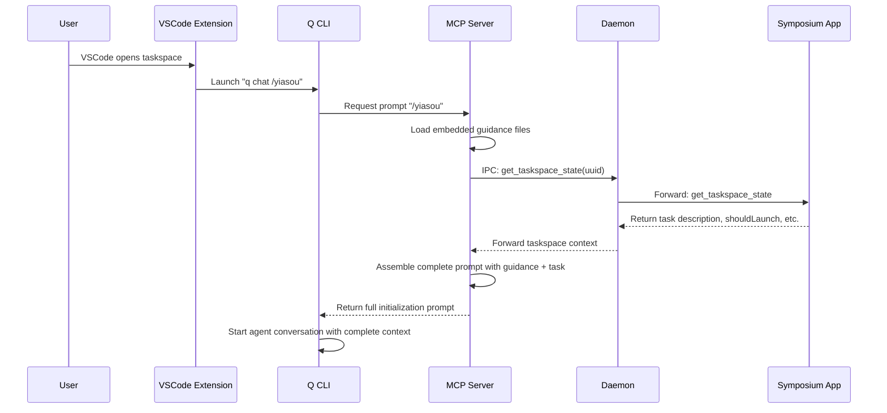

# Guidance and Initialization

This chapter describes how Symposium provides agents with collaboration patterns, project context, and initialization instructions through embedded guidance and streamlined boot sequences.

## Problem Statement

### Current Boot Sequence Issues

The current taskspace initialization has several problems:

1. **Shell Argument Length Limits**: Long initial prompts passed via command line arguments get truncated, creating messy output with shell continuation prompts (`dquote>`).

2. **Manual Context Configuration**: Agents must manually discover and read project documentation (AGENTS.md, CLAUDE.md, etc.) to understand collaboration patterns.

3. **Fragmented Setup**: Users need to configure both user-wide context files AND install MCP servers separately, with potential sync issues.

4. **Awkward User Experience**: The terminal shows truncated commands and confusing output during agent startup.

### Example of Current Problems

When launching a taskspace, users see:
```bash
q chat "Hi, welcome\! You are a new agent just getting started as part of the project Symposium..."
# Command gets truncated, showing:
dquote> User's task description:
dquote> This workspace is just for testing — I'm planning to delete it...
```

## Design Solution

### Stored Prompt Approach

Instead of passing long prompts as command-line arguments, we use a **stored prompt system**:

```bash
# Clean, simple command
q chat /yiasou
```

Where `/yiasou` is a stored prompt that expands to a complete initialization sequence.

### Embedded Guidance Architecture

The MCP server embeds all guidance files using Rust's `rust-embed` crate:

```rust
#[derive(RustEmbed)]
#[folder = "guidance/"]
struct GuidanceFiles;

// Access embedded files at runtime
let main_md = GuidanceFiles::get("main.md").unwrap();
let walkthrough_format = GuidanceFiles::get("walkthrough-format.md").unwrap();
```

### Complete Boot Sequence

The `/yiasou` stored prompt expands to a structured initialization that includes:

```markdown
# Agent Boot Sequence

This prompt defines the agent boot sequence.

If you encounter ambiguous instructions, remember to ask questions and seek 
clarifications before proceeding, particularly with side-effect-ful or 
dangerous actions (e.g., deleting content or interacting with remote systems).

# Coding Guidelines

<embedded content from coding-guidelines.md>

# Collaboration Guidelines

<embedded content from main.md>

# Walkthrough Format

<embedded content from walkthrough-format.md>

# Initial Task

<dynamic content fetched via MCP tool/IPC>
```

## Implementation Architecture

### File Organization

```
mcp-server/
├── src/
│   ├── guidance/           # Embedded guidance files
│   │   ├── main.md        # Collaboration patterns
│   │   ├── walkthrough-format.md
│   │   └── coding-guidelines.md
│   └── server.rs          # MCP server with embedded resources
```

### Data Flow



### Architectural Change

This design moves taskspace coordination logic from the VSCode extension into the MCP server:

**Before**: Extension calls `get_taskspace_state` → App responds with `agentCommand` → Extension launches agent with complex command

**After**: Extension simply launches `q chat /yiasou` → MCP server coordinates with app → MCP server provides complete context

This simplifies the extension and centralizes coordination logic in the MCP server where it belongs.

### Implementation Clarifications

**MCP Prompt Support**: The Rust MCP SDK fully supports dynamic prompts through `get_prompt()` method, which can perform async computation and return dynamically assembled content.

**Taskspace UUID Detection**: Existing code in the MCP server already handles finding the taskspace UUID from the current working directory.

**Error Handling**: If the MCP server can't reach the daemon/app, `/yiasou` will omit the "Initial Task" section but still provide all embedded guidance content.

**Guidance File Sources**: User will provide specific guidance files during Phase 1 implementation.

**Dynamic Prompt Assembly**: `/yiasou` will be implemented as an MCP prompt (not resource) that dynamically computes content in the `get_prompt()` method by loading embedded files and making IPC calls.

**Migration Strategy**: Changes are purely additive until the extension is updated - no backwards compatibility concerns during development.

### Benefits

1. **Clean User Experience**: Simple `/yiasou` command instead of truncated arguments
2. **Single Source of Truth**: Guidance travels with the MCP server, always in sync
3. **Automatic Updates**: New MCP server versions include updated guidance
4. **No Manual Configuration**: No separate context files to install or maintain
5. **Versioned Guidance**: Collaboration patterns are versioned with the codebase

## Implementation Plan

### Phase 1: Embedded Guidance
- [ ] Add `rust-embed` dependency to MCP server
- [ ] Create `guidance/` directory structure
- [ ] Ask user to populate directory with collaboration patterns and other guidance
- [ ] Implement guidance file loading in MCP server

### Phase 2: MCP Prompt System
- [ ] Implement `/yiasou` prompt using MCP server prompt capabilities
- [ ] Create prompt assembly logic in MCP server
- [ ] Test prompt delivery through MCP protocol
- [ ] Test with various prompt lengths

### Phase 3: Dynamic Context Integration
- [ ] Implement IPC call for taskspace context
- [ ] Add task description fetching
- [ ] Integrate project-specific information
- [ ] Test complete boot sequence

### Phase 4: Migration and Testing
- [ ] Update VSCode extension to use `/yiasou` instead of `get_taskspace_state` coordination
- [ ] Test with various taskspace scenarios
- [ ] Document new onboarding process
- [ ] **Update affected mdbook chapters**:
  - [ ] `work-in-progress/mvp/taskspace-bootup-flow.md` - Remove `get_taskspace_state` flow
  - [ ] `design/startup-and-window-management.md` - Update startup sequence
  - [ ] Any other chapters referencing current boot sequence
- [ ] Remove old command-line argument approach

## Future Enhancements

### Customizable Guidance
- Support for project-specific guidance overrides
- User-level customization of collaboration patterns
- Team-specific guidance variations

### Advanced Context
- Integration with project documentation systems
- Automatic detection of project type and relevant patterns
- Context-aware guidance based on task type

### Performance Optimization
- Lazy loading of guidance files
- Caching of assembled prompts
- Compression of embedded resources
