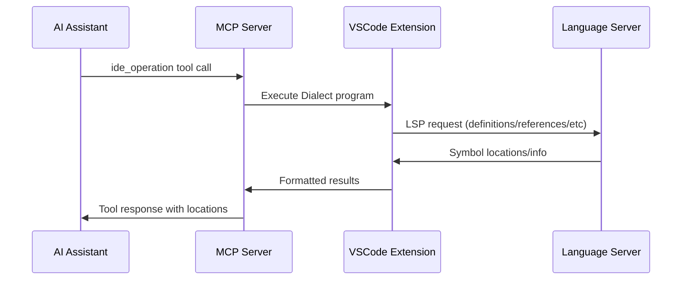

# IDE Capabilities

How AI assistants access VSCode's Language Server Protocol (LSP) features through the `ide_operation` tool.

## Dialect Mini-Language

The `ide_operation` tool uses a composable [JSON mini-language called Dialect](./dialect-language.md) for IDE operations:

```json
{"findDefinitions": "MyFunction"}
{"findReferences": "MyClass"}
{"getSymbolInfo": "methodName"}
```

## Message Flow



## Implementation Details

**MCP Server** (`server/src/server.rs`):
- Receives Dialect program in `IdeOperationParams`
- Forwards to extension via IPC for execution
- Returns structured results to AI assistant

**VSCode Extension**:
- Interprets Dialect operations
- Translates to appropriate VSCode/LSP API calls
- Handles disambiguation when multiple matches found
- Returns formatted location/symbol information

**Supported Operations**:
- `findDefinitions` - Where symbols are defined
- `findReferences` - Where symbols are used
- `getSymbolInfo` - Type signatures and documentation
- Future: completion, hover info, workspace symbols

## Key Files

- `server/src/server.rs` - Tool handler and parameter validation
- Extension components handle Dialect interpretation and LSP communication
- `server/src/dialect/` - Dialect interpreter (if implemented)
