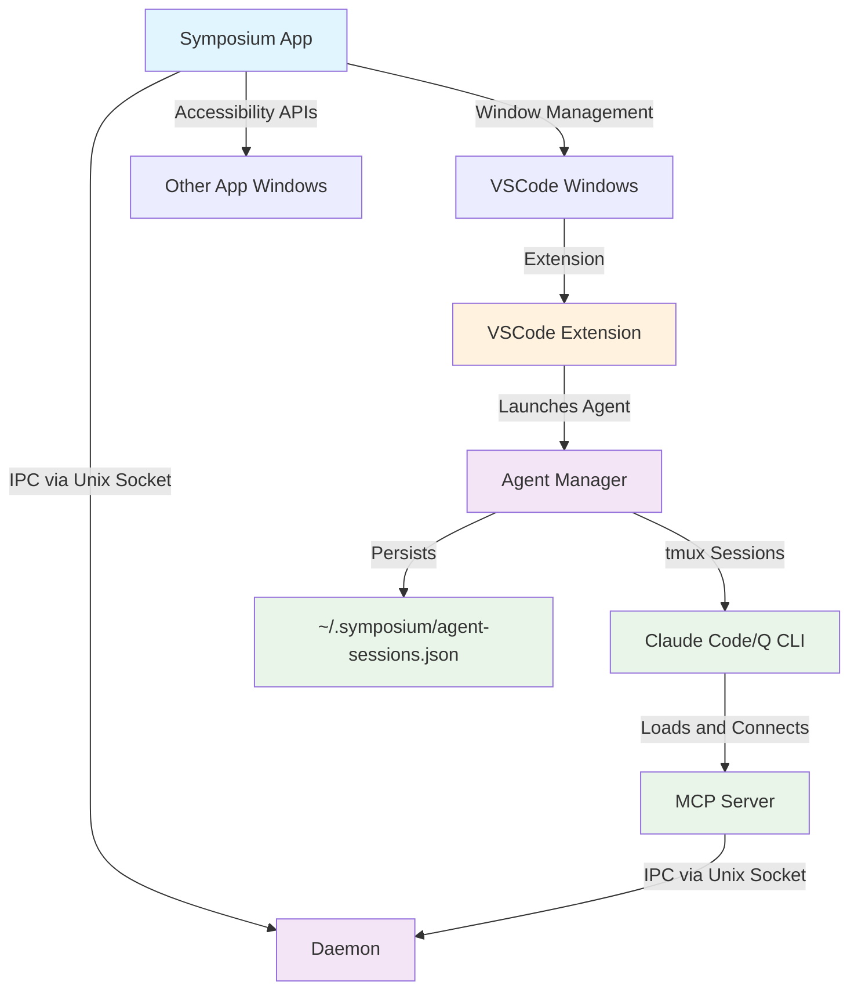
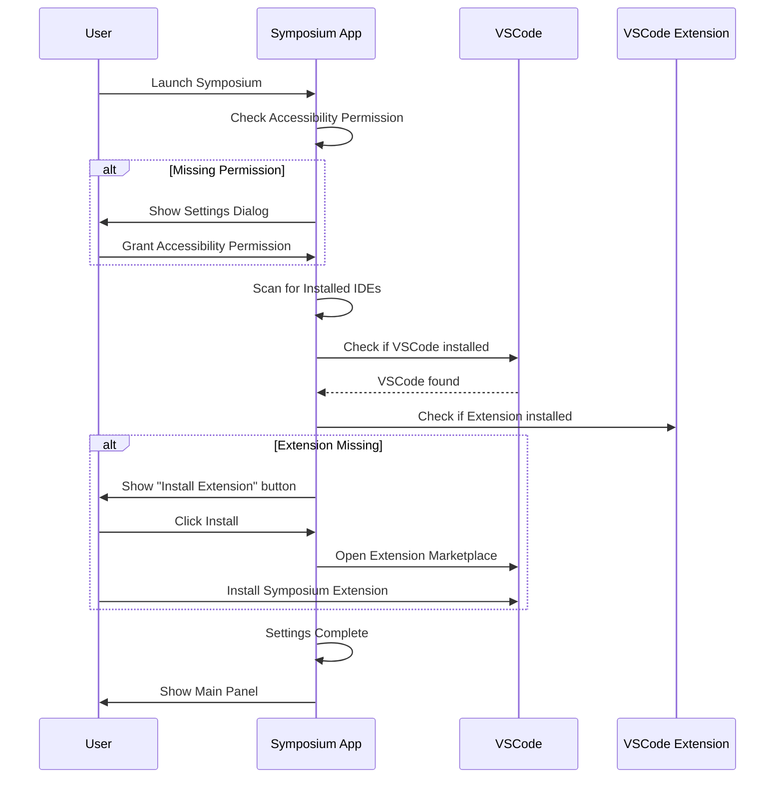
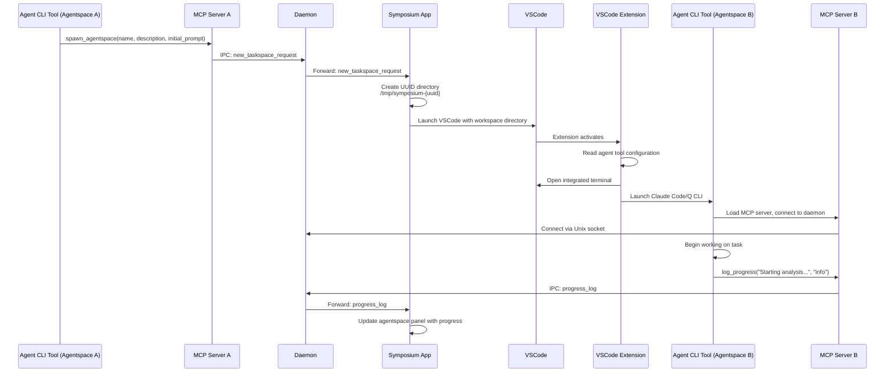
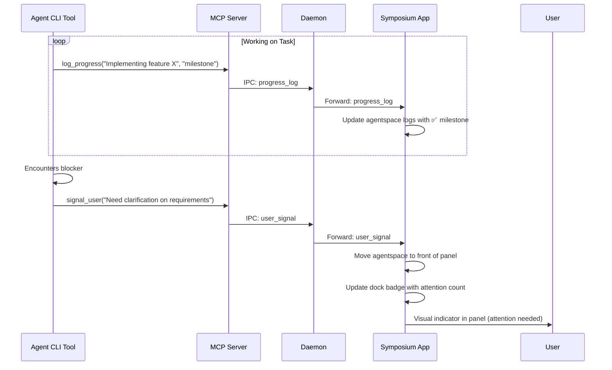
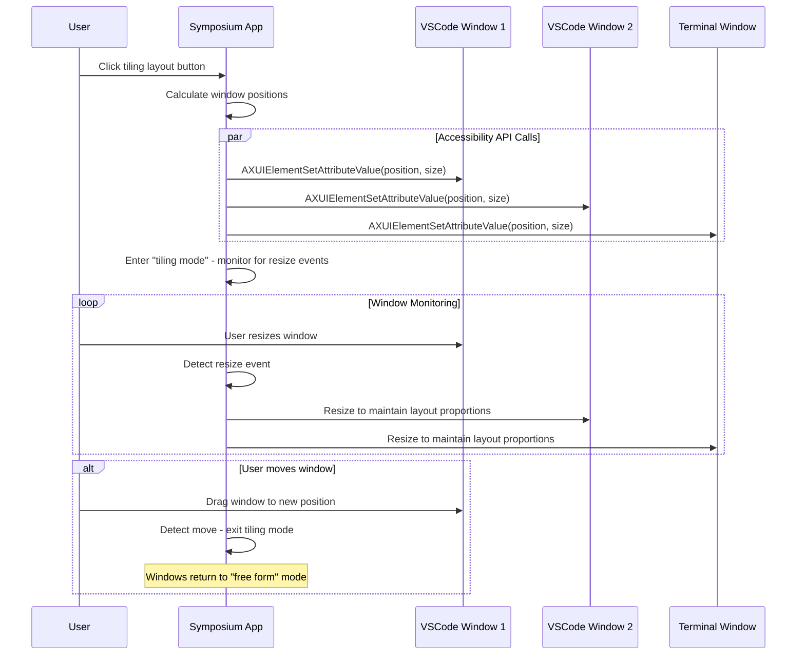

# Implementation Overview

Symposium is a "meta-IDE" that orchestrates multiple AI agent workspaces through coordinated window management and cross-application communication.

## System Architecture



## Architecture Principles

### Single Source of Truth Pattern

**Critical Design**: The application uses `AppDelegate.currentProjectManager` as the single owner of ProjectManager instances. This prevents reference leaks and ensures clean lifecycle management.

```swift
// ✅ All views observe the single source
@EnvironmentObject var appDelegate: AppDelegate

if let projectManager = appDelegate.currentProjectManager {
    // Use projectManager
} else {
    // Show "No project selected" state
}
```

**Benefits**:
- Eliminates duplicate ProjectManager references
- Automatic view updates when project changes
- Clean cleanup when `currentProjectManager = nil`
- Prevents IpcManager instance leaks

### Component Ownership

```
AppDelegate (single owner)
    ↓
ProjectManager (owned by AppDelegate)
    ↓
IpcManager (owned by ProjectManager)
```

All views observe AppDelegate via `@EnvironmentObject` rather than holding direct references.

## Core Components

### Symposium App (Swift/macOS)
- **Window Management**: Uses Accessibility APIs to position, resize, and focus windows across applications
- **Screenshot Capture**: Uses ScreenCaptureKit to create window thumbnails for the panel interface
- **IPC Communication**: Listens on Unix socket for MCP server commands
- **Main UI**: Panel interface showing agentspace overviews with tiling controls

### [Agent Manager](./agent-manager.md) (Rust)
- **Persistent Sessions**: Manages long-running AI agent processes using tmux sessions
- **Session Lifecycle**: Handles spawn, attach, detach, and kill operations for agent sessions
- **Background Execution**: Enables agents to run independently of terminal sessions
- **State Persistence**: Tracks session metadata in `~/.symposium/agent-sessions.json`

### Daemon (Node.js/TypeScript)
- **Communication Hub**: Central IPC coordinator between Symposium app and MCP servers
- **Message Routing**: Routes commands between components via Unix socket
- **Socket Management**: Manages Unix socket at `~/.socratic-shell/symposium/daemon.sock`

### MCP Server (Rust)  
- **Agent Tool Integration**: Loaded and used by AI agent CLI tools (Claude Code, Q CLI)
- **Tool Provider**: Provides MCP tools (`spawn_taskspace`, `update_taskspace`, `log_progress`, `signal_user`)
- **Resource Provider**: Exposes embedded guidance files as MCP resources (collaboration patterns, walkthrough format, coding guidelines)
- **Prompt Provider**: Implements `/yiasou` stored prompt for dynamic agent initialization with taskspace context
- **Daemon Communication**: Connects to daemon via IPC to fetch real taskspace state and send commands
- **Unified Protocol**: Uses TaskspaceState message for both reading and writing taskspace information

### VSCode Extension (TypeScript)
- **Agent Bootstrap**: Automatically launches AI agent tools in VSCode's integrated terminal
- **Configuration**: Reads settings to determine which agent tool (Claude Code vs Q CLI) to start
- **Terminal Management**: Opens integrated terminal and starts the configured agent tool

### Agent CLI Tools (Claude Code/Q CLI)
- **MCP Server Loading**: Loads and connects the MCP server to the daemon
- **Agent Interface**: Provides the actual AI agent interaction interface
- **Tool Invocation**: Uses MCP server tools to coordinate with Symposium

## Key Workflows

### 1. Initial Setup and Configuration



### 2. Spawn New Agentspace



### 3. Agent Progress Reporting and User Attention



### 4. Window Tiling and Management



## MCP Tools Available to Agents

### spawn_agentspace
**Purpose**: Create new isolated workspace with background AI agent
**Parameters**:
- `name` (required): Display name for the agentspace
- `task_description` (required): Brief description of work to be done  
- `initial_prompt` (optional): Context/instructions for the new agent

### update_taskspace
**Purpose**: Update taskspace name and description based on user interaction
**Parameters**:
- `name` (required): New name for the taskspace
- `description` (required): New description for the taskspace

### log_progress  
**Purpose**: Report progress with visual categorization
**Parameters**:
- `message` (required): Progress update text
- `category` (required): `info` (ℹ️), `warn` (⚠️), `error` (❌), `milestone` (✅), `question` (❓)

### signal_user
**Purpose**: Request user attention for assistance or input
**Parameters**:
- `message` (required): Description of why user attention is needed

## Data Flow and State Management

### Workspace Isolation
- Each agentspace gets a UUID-named local directory: `/tmp/symposium-{uuid}`
- VSCode workspace is opened to this directory for file isolation
- MCP server only provides tools when running within a recognized taskspace directory

### Configuration Management
- **Global Settings**: Stored in Symposium app preferences (agent tool selection, IDE preferences)
- **Per-Workspace Config**: Written by Symposium when creating workspace (which agent tool to launch)
- **Extension Config**: VSCode extension reads workspace config to determine startup behavior

### Window Association and Tracking
- **Process Tracking**: Symposium tracks launched VSCode process IDs
- **Window Identification**: Uses Accessibility APIs to map process IDs to window objects
- **Screenshot Capture**: ScreenCaptureKit captures individual windows by CGWindowID for panel thumbnails

## Security and Permissions

### Required Permissions
- **Accessibility**: Required for window positioning, resizing, and focus management across applications
- **Screen Recording**: Optional, needed for window screenshot thumbnails

### Permission Flows  
- Settings dialog blocks Symposium startup until Accessibility permission granted
- Screen Recording permission requested on first screenshot attempt
- Debug option available to reset TCC database: `tccutil reset Accessibility com.symposium.app`

## Implementation Notes

### MVP Limitations
- Single VSCode window per agentspace (no multiple window support initially)
- Local workspaces only (remote development planned for future)
- Agent tool limited to Claude Code or Q CLI
- Panel appears only when dock icon clicked (anchored panels planned for later)

### Extension Points for Future Development
- **Remote Development**: VSCode's remote development extensions can be leveraged
- **Multiple IDEs**: Architecture supports adding IntelliJ, Emacs support
- **Advanced Window Management**: Framework ready for complex tiling layouts
- **Agent Tool Plugins**: MCP server design allows adding new agent tool integrations

## Technical Dependencies

### macOS APIs
- **Accessibility Framework**: Core window management functionality
- **ScreenCaptureKit**: Window screenshot capture (macOS 12.3+)
- **Core Graphics**: Window enumeration and identification

### Development Tools
- **Swift Package Manager**: Symposium app build system
- **Node.js/TypeScript**: MCP server implementation
- **VSCode Extension API**: Extension development and terminal automation

### External Tools
- **Claude Code CLI**: AI agent tool option
- **Q CLI**: Alternative AI agent tool option
- **Unix Domain Sockets**: IPC communication protocol