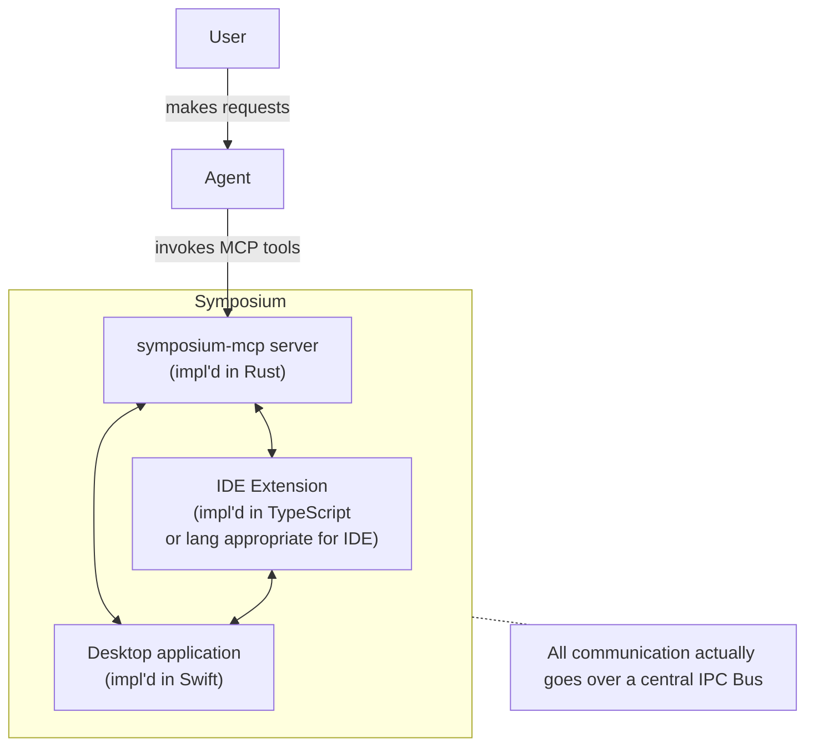

# Implementation Overview

Symposium consists of several major components:

* a MCP server, implemented in Rust (`symposium/mcp-server`), which also serves as an IPC bus;
* a VSCode extension, implemented in TypeScript (`symposium/vscode`);
* a desktop application, implemented in Swift (`symposium/macos-app`).

## Chart



## IPC Bus

All components talk over an IPC bus which is implemented in `symposium-mcp`. The IDE + application connect to this bus by running `symposium-mcp client`. This will create a daemon process (using `symposium-mcp server`) if one is not already running. The MCP server just runs the code inline, starting the server if needed.

The client has a simple interface:

* a message is a single-line of json;
* each message that is sent is forwarded to all connected clients (including the sender);
* there are some special "control" messages that begin with `#`, e.g.
    * `#identify:name` sets the "id" for this client to "name"
    * see `handle_debug_command` in `daemon.rs`

## Debugging

The server tracks the last N messages that have been gone out over the bus for debugging purposes. You can run

```bash
symposium-mcp debug
```

to access those logs. Very useful!
