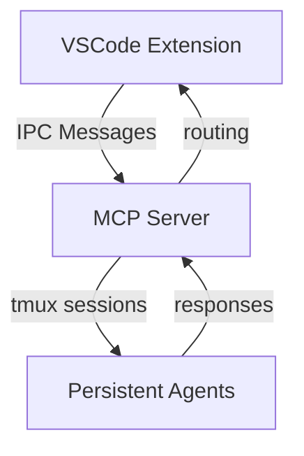

# mdbook Conventions

*Documentation standards and best practices for the Symposium project*

## Purpose

This mdbook captures the high-level structure, design decisions, and architectural patterns of the Symposium codebase. It serves as a living document that stays synchronized with the actual implementation.

## Core Principles

### 1. High-Level Structure Focus

The mdbook documents **architecture and design**, not implementation details. We focus on:
- System interactions and data flow
- Design decisions and their rationale  
- Component relationships and responsibilities
- API contracts and message formats

### 2. RFD Status Badges

When implementing an [RFD](../rfds/index.html), you should be creating new documentation as you go. Tag sections that are specific to that RFD with `{RFD:rfd-name}`.

### 3. Visual Documentation with Mermaid

Use Mermaid diagrams to convey complex relationships:



**When to use Mermaid:**
- Sequence diagrams for multi-step processes
- Flowcharts for decision logic
- Architecture diagrams for system overview
- State diagrams for lifecycle management

### 4. Self-Documenting Code with Anchors

Write code that documents itself through:
- Clear function and variable names
- Comprehensive doc comments
- Logical structure and organization

Then use mdbook anchors to include relevant sections:

```rust
// ANCHOR: message_sender
#[derive(Debug, Clone, Deserialize, Serialize)]
pub struct MessageSender {
    /// Working directory - always present for reliable matching
    #[serde(rename = "workingDirectory")]
    pub working_directory: String,
    // ... rest of implementation
}
// ANCHOR_END: message_sender
```

Reference in documentation:
```markdown
{{#include ../../symposium/mcp-server/src/types.rs:message_sender}}
```

## Strict Conventions

### ✅ DO

- **Use status badges** to indicate implementation progress
- **Update badges** as features are implemented or deprecated
- **Use ANCHOR comments** for all code references
- **Write descriptive anchor names** that explain the concept
- **Include complete, meaningful code sections** (full structs, methods, etc.)
- **Update anchors when refactoring** to maintain documentation sync
- **Use Mermaid for visual explanations**
- **Focus on design and architecture**

### ❌ NEVER

- **Hardcode code blocks** that will fall out of sync
- **Use line-based includes** like `{ {#include file.rs:10:20} }` (without spaces)
- **Include implementation details** that change frequently
- **Copy-paste code** into documentation
- **Reference specific line numbers** in explanations

### Example: Wrong vs Right

**❌ Wrong - Hardcoded and fragile:**
```markdown
The IPCMessage structure looks like this:
```typescript
interface IPCMessage {
    type: string;
    id: string;
    // ... hardcoded content that will drift
}
```

**✅ Right - Anchored and synchronized:**
```markdown
The IPCMessage structure provides the foundation for all IPC communication:

```typescript
{{#include ../../symposium/vscode-extension/src/ipc.ts:ipc_message}}
```

## Anchor Naming Conventions

Use descriptive, concept-based names:

- `message_sender` - not `struct_at_line_133`
- `agent_lifecycle` - not `spawn_kill_methods`  
- `routing_logic` - not `big_function_in_daemon`
- `error_handling` - not `catch_blocks`

## Documentation Lifecycle

1. **Design Phase**: Create architectural diagrams and high-level structure
2. **Implementation Phase**: Add ANCHOR comments as you write code
3. **Documentation Phase**: Reference anchors in mdbook chapters
4. **Maintenance Phase**: Update anchors when refactoring, documentation stays current

## Benefits

- **Always Current**: Documentation automatically reflects code changes
- **Single Source of Truth**: Code is the authoritative source
- **Reduced Maintenance**: No manual synchronization needed
- **Better Code Quality**: Encourages self-documenting practices
- **Clear Architecture**: Focus on design over implementation details

This approach ensures our documentation remains valuable and trustworthy throughout the project's evolution.
