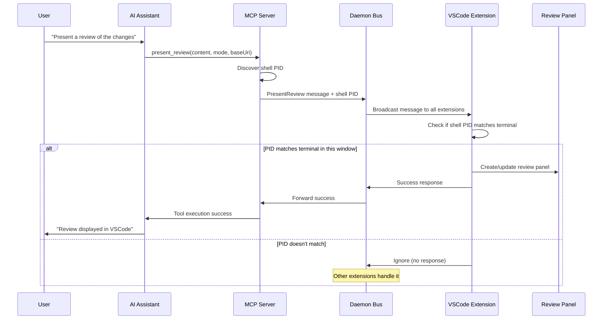
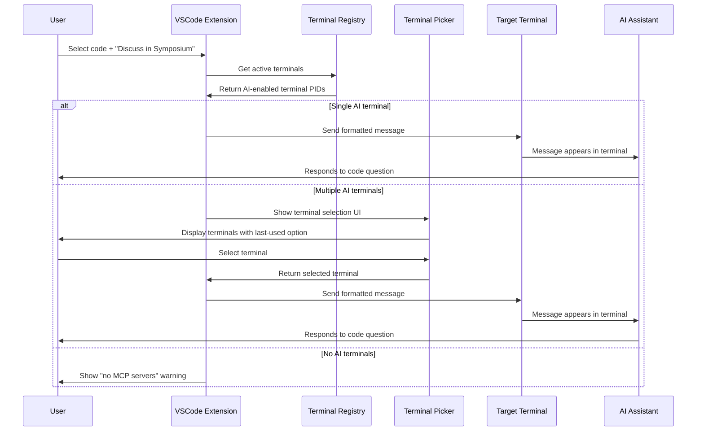
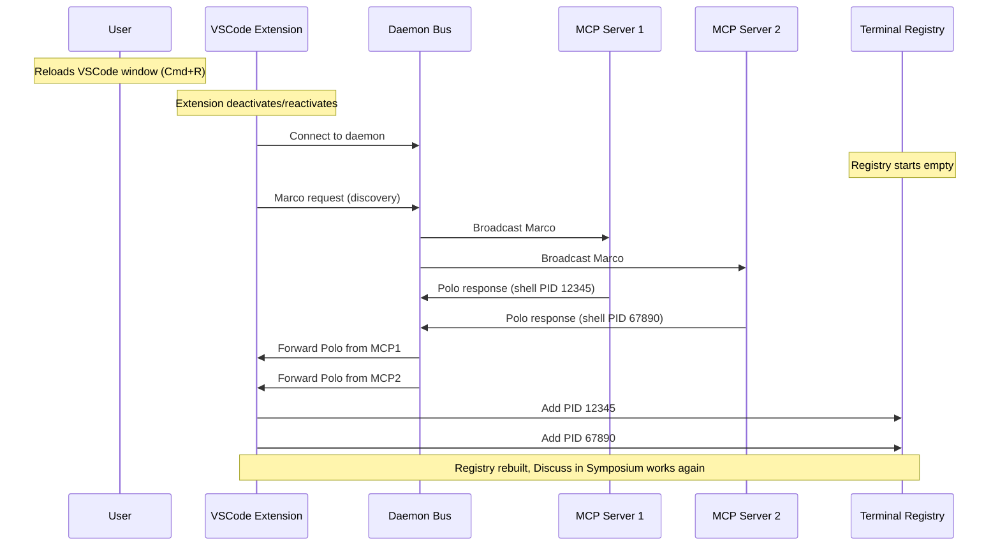
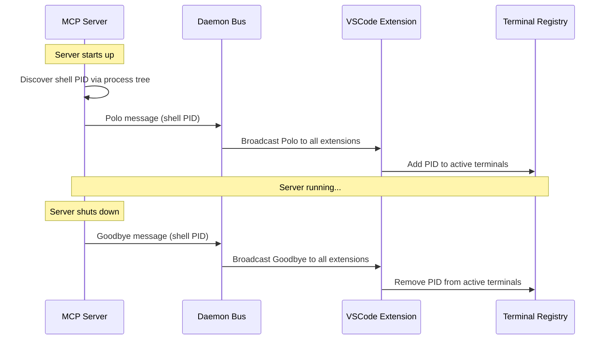

# Message Flows

This section shows the detailed message flows for key Dialectic operations using sequence diagrams.

## Review Presentation Flow

When a user requests a code review, here's the complete message flow:



## Discuss in Symposium Flow

When a user selects code and uses "Discuss in Symposium":



## Extension Reload Flow

When a user reloads the VSCode window, the extension restarts but MCP servers continue running:



## Discovery Protocol (Marco-Polo)

How MCP servers announce their presence and maintain the terminal registry:



## Key Message Types

### PresentReview Message
```json
{
  "type": "PresentReview",
  "content": "# Review content...",
  "mode": "replace",
  "baseUri": "/path/to/project",
  "shellPid": 12345
}
```

### Polo Message
```json
{
  "type": "Polo",
  "shellPid": 12345
}
```

### Goodbye Message
```json
{
  "type": "Goodbye", 
  "shellPid": 12345
}
```

These flows show how the daemon message bus enables intelligent routing and multi-window support while maintaining a simple interface for AI assistants.
