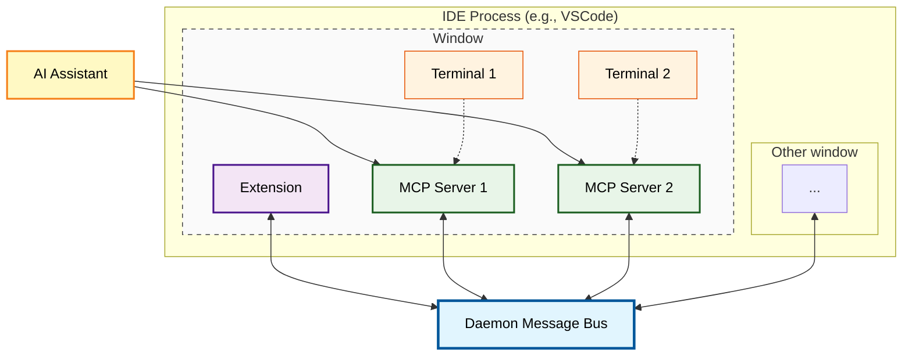

# Design & Implementation Overview

*This section documents the design decisions and implementation details for Dialectic. It serves as both a design document during development and a reference for future contributors.*

## Architecture Summary

Dialectic consists of three main components that communicate via a [daemon message bus](./protocol.md):

1. **VSCode Extension** - Provides the review panel UI, handles file navigation, and manages [terminal registry](./terminal-registry.md)
2. **Daemon Message Bus** - Routes messages between MCP servers and VSCode extensions across multiple windows; there is one per IDE process
3. **MCP Server** - Acts as a bridge between AI assistants and the VSCode extension via daemon communication

## Communication Architecture

## Example flow

Here is a high-level overview of how the flow works when the user requests a review:

* User requests a walkthrough. LLM invokes the "present review" [MCP tool](./mcp-tool-interface.md).
* The MCP server sends a message to the [daemon bus](./protocol.md). The daemon bus broadcasts the message to all connected clients. The message includes the PID of the shell in which the MCP server is running.
* The extension receives the message from the daemon bus. It identifies that the shell PID belongs to one of the terminals in its window, so it processes the request and creates a webview.

Read more details in the [communication protocol](./protocol.md) section.

## Component Responsibilities

### MCP Server (`server/`)
- Exposes `present-review` tool to AI assistants
- Discovers terminal shell PID through process tree walking
- Announces presence to daemon via Marco-Polo protocol
- Handles graceful disconnection and cleanup
- See `server/src/main.rs` for main server implementation

### Daemon Message Bus (`server/src/daemon.rs`)
- Routes messages between MCP servers and VSCode extensions
- Manages client connections and handles disconnections
- Broadcasts messages to appropriate VSCode windows
- Provides process lifecycle management
- Runs as background process tied to VSCode instance

### VSCode Extension (`extension/`)
- Creates daemon client connection and manages terminal registry
- Provides tree-based review display in sidebar with navigation
- Implements Ask Socratic Shell integration with intelligent terminal routing
- Manages terminal picker UI with memory and quick access options
- Handles workspace state persistence for user preferences
- See `extension/src/extension.ts` for activation and daemon client logic

### Terminal Registry (`extension/src/extension.ts`)
- Tracks active terminals with MCP servers using shell PIDs
- Updates registry based on Marco-Polo discovery messages
- Provides API for Ask Socratic Shell to query AI-enabled terminals
- Maintains workspace-specific preferences and memory

## Key Implementation Files

- `server/src/main.rs` - Main MCP server with tool handlers and process discovery
- `server/src/daemon.rs` - Daemon message bus with client management
- `server/src/pid_discovery.rs` - Process tree walking for terminal shell PID detection
- `extension/src/extension.ts` - VSCode extension with daemon client and terminal registry
- `extension/src/reviewProvider.ts` - Tree view implementation and markdown parsing
- `server/tests/` - Integration tests with real daemon and terminal scenarios

For detailed implementation specifics, refer to the source code and inline comments that explain design decisions and architectural patterns.