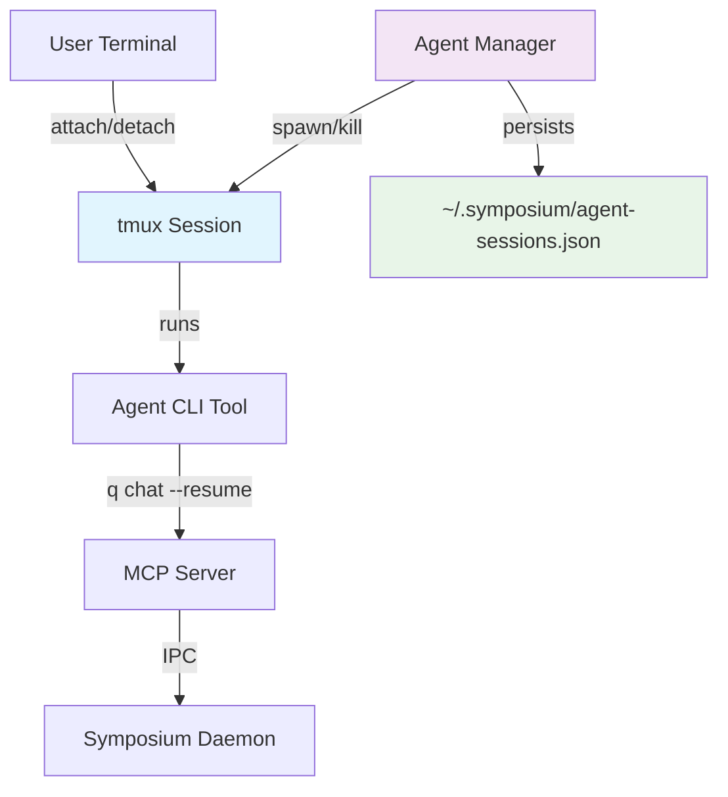

# Persistent Agent Sessions

*Enabling background, persistent AI agents that survive terminal disconnection*

## Overview

The Agent Process Manager enables persistent, asynchronous AI agents by wrapping CLI tools (Q CLI, Claude Code) in tmux sessions. This allows agents to:

- Run in the background independently of terminal sessions
- Persist across user disconnections
- Be attached/detached at will
- Continue work asynchronously

## Architecture



## Usage

### Spawn Agent Session
```bash
symposium-mcp agent spawn --uuid my-agent-1 --workdir /path/to/project q chat --resume
```

### List Active Sessions
```bash
symposium-mcp agent list
# Output:
# Active agent sessions:
#   my-agent-1 - Running (symposium-agent-my-agent-1)
```

### Attach to Session
```bash
symposium-mcp agent attach my-agent-1
# Output: To attach to agent session my-agent-1, run:
#   tmux attach-session -t symposium-agent-my-agent-1

# Then run the command:
tmux attach-session -t symposium-agent-my-agent-1
```

### Kill Session
```bash
symposium-mcp agent kill my-agent-1
```

## Implementation Details

### Session Management
- **tmux Sessions**: Each agent runs in a dedicated tmux session named `symposium-agent-{uuid}`
- **Metadata Storage**: Session info persisted in `~/.symposium/agent-sessions.json`
- **Auto-Sync**: On startup, syncs with actual tmux sessions to handle crashes/restarts
- **Status Tracking**: Monitors session state (Starting, Running, Crashed, Stopped)

### Agent Lifecycle
1. **Spawn**: Creates tmux session with agent command in specified working directory
2. **Monitor**: Tracks session status and syncs with tmux reality
3. **Attach**: Provides tmux attach command for user connection
4. **Detach**: User can disconnect without killing agent (standard tmux behavior)
5. **Kill**: Terminates tmux session and cleans up metadata

### Session Persistence
```rust
#[derive(Debug, Clone, Serialize, Deserialize)]
pub struct AgentSession {
    pub uuid: String,
    pub tmux_session_name: String,
    pub agent_command: Vec<String>,
    pub working_directory: PathBuf,
    pub status: AgentStatus,
    pub created_at: SystemTime,
    pub last_attached: Option<SystemTime>,
}
```

## Integration with Existing System

### Current Flow (Synchronous)
```
VSCode Extension → Terminal → Agent CLI (foreground) → Dies with terminal
```

### New Flow (Persistent)
```
VSCode Extension → Agent Manager → tmux Session → Agent CLI (background)
                                      ↑
User Terminal ────────────────────────┘ (attach/detach)
```

### Conversation Persistence
- **CLI Tool Responsibility**: Q CLI and Claude Code handle conversation history per directory
- **Directory-Based**: `q chat --resume` resumes last conversation in working directory
- **No Additional State**: Agent Manager doesn't duplicate conversation storage

## Future Enhancements

### Custom Pty Manager
Consider replacing tmux with custom Rust implementation using:
- [`tty_spawn`](https://crates.io/crates/tty_spawn) - Spawn processes in pseudo-terminals
- [`teetty`](https://github.com/mitsuhiko/teetty) - Terminal session management

**Benefits**:
- Eliminate tmux dependency
- More control over session lifecycle
- Custom attach/detach protocols
- Better integration with Symposium

### Conversation Identification
Enhance CLI tools to support named conversations:
```bash
q chat --list-conversations
q chat --resume conversation-id-123
```

### Multi-Connection Support
Allow multiple users/terminals to connect to same agent session simultaneously.

### Background Task Queue
Enable agents to work on tasks asynchronously while disconnected:
```bash
symposium-mcp agent queue my-agent-1 "Implement authentication system"
```

## Error Handling

### Session Recovery
- **Crashed Sessions**: Detected during sync, marked as `Crashed` status
- **Orphaned Metadata**: Sessions without tmux counterpart are cleaned up
- **Startup Sync**: Reconciles stored sessions with actual tmux sessions

### tmux Availability
- **Missing tmux**: Commands fail gracefully with clear error messages
- **Permission Issues**: Standard tmux error handling applies

## Testing

### Manual Testing
```bash
# Test basic lifecycle
symposium-mcp agent spawn --uuid test-1 --workdir /tmp sleep 30
symposium-mcp agent list
symposium-mcp agent attach test-1
# (attach and verify session works)
symposium-mcp agent kill test-1

# Test with real agent
symposium-mcp agent spawn --uuid q-test --workdir /path/to/project q chat
symposium-mcp agent attach q-test
# (interact with Q CLI, detach with Ctrl-B D, reattach)
```

### Integration Testing
- Verify agent CLI tools work correctly in tmux sessions
- Test MCP server connectivity from tmux-spawned agents
- Validate conversation persistence across attach/detach cycles

## Security Considerations

### Session Isolation
- Each agent runs in separate tmux session
- Working directory isolation per agent
- No shared state between agent sessions

### File Permissions
- Session metadata stored in user home directory
- Standard tmux socket permissions apply
- No elevation of privileges required

## Related Documentation

- [Implementation Overview](./implementation-overview.md) - Current synchronous agent system
- [Taskspace Bootup Flow](../work-in-progress/mvp/taskspace-bootup-flow.md) - How agents are currently launched
- [Agent Manager Source](../../symposium/mcp-server/src/agent_manager.rs) - Implementation details
