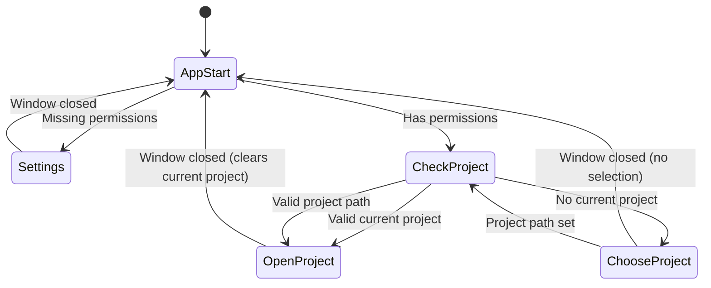

# Startup and Window Management {RFD:tile-based-window-management}

Symposium maintains exactly one window open at any time, using three distinct window types for different application states.

## Single Source of Truth Architecture

**Critical Change**: The application now uses AppDelegate as the single source of truth for ProjectManager instances.

### Key Principles

1. **Single Owner**: Only `AppDelegate.currentProjectManager` stores the ProjectManager
2. **Observer Pattern**: All views get ProjectManager via `@EnvironmentObject var appDelegate: AppDelegate`
3. **Graceful Degradation**: Views handle `nil` ProjectManager by showing "No project selected" state
4. **Clean Lifecycle**: Setting `currentProjectManager = nil` automatically updates all views

### Component Architecture

```swift
// ✅ CORRECT: Single source of truth
struct ProjectView: View {
    @EnvironmentObject var appDelegate: AppDelegate
    
    var body: some View {
        if let projectManager = appDelegate.currentProjectManager {
            // Use projectManager here
        } else {
            Text("No project selected")
        }
    }
}

// ❌ OLD: Direct references create cleanup issues
struct ProjectView: View {
    let projectManager: ProjectManager  // Creates duplicate reference
}
```

This architecture prevents reference leaks and ensures clean ProjectManager lifecycle management.

## Three-Window Architecture

The application uses three distinct window types for different application states:

1. **Settings Window** - for permissions and agent configuration
2. **Project Selection Window** - for creating or opening projects  
3. **Project Window** - the main project workspace

## Startup State Machine

The application follows a deterministic state machine on startup and window transitions:



### State Descriptions

**AppStart**: Entry point that validates permissions and current project state
- If the correct window for the current state is already open, takes no action
- Checks accessibility and screen recording permissions
- If missing permissions → Settings Window
- If has permissions → CheckProject

**Settings**: Regular window for permission management and agent configuration
- User grants required permissions
- User configures available agents
- When closed → AppStart (re-validates permissions)

**ChooseProject**: Project selection and creation interface
- Lists available agents with refresh capability
- Provides new project creation form
- Provides "Open existing project" file picker
- When project created or selected → sets `activeProjectPath` and dismisses
- Main app flow detects path change → CheckProject
- When closed without selection → AppStart

**CheckProject**: Validates the persisted current project
- Checks if current project path exists and is valid
- If valid project → OpenProject
- If no/invalid project → ChooseProject

**OpenProject**: Main project workspace window
- Displays project taskspaces and management interface
- When closed → clears current project and goes to AppStart

## Window Management Implementation

### Single Window Principle

The application typically maintains one window at a time, with the exception that Settings can be opened from any state:

```swift
func openWindow(id: String) {
    if id != "settings" {
        closeAllWindows()
    }
    // Open the requested window
}

func appStart() {
    // If the project window is open and we have a valid current project, do nothing
    if isProjectWindowOpen() && hasValidCurrentProject() {
        return
    }
    
    // If settings window is open, do nothing (user is configuring)
    if isSettingsWindowOpen() {
        return
    }
    
    // Normal startup logic...
    if !hasRequiredPermissions {
        openWindow(id: "settings")
    } else if let validCurrentProject = validateCurrentProject() {
        openWindow(id: "open-project") 
    } else {
        openWindow(id: "choose-project")
    }
}
```

### Window Close Handling

Window close handling requires careful distinction between "user clicked close button" and "window disappeared due to app shutdown":

```swift
.onReceive(NotificationCenter.default.publisher(for: NSWindow.willCloseNotification)) { notification in
    // Only clear project when user explicitly closes the window
    if let window = notification.object as? NSWindow,
       window.identifier?.rawValue == "open-project" {
        // Clear project and return to startup flow
        appDelegate.currentProjectManager = nil
        settingsManager.activeProjectPath = ""
        appStart()
    }
}
.onDisappear {
    // NOTE: We don't handle project cleanup here because onDisappear
    // fires both when user closes window AND when app quits.
    // We only want to clear the project on explicit user close.
}
```

This ensures the project path persists between app launches when the user quits the app, but gets cleared when they explicitly close the project window.

## Project Persistence

### Current Project Storage

The current project is persisted in UserDefaults:

```swift
@AppStorage("activeProjectPath") var activeProjectPath: String = ""
```

### Project Metadata

Each project stores metadata in `project.json`:

```json
{
  "version": 1,
  "id": "uuid-string",
  "name": "Project Name",
  "gitURL": "https://github.com/user/repo.git",
  "directoryPath": "/path/to/Project.symposium",
  "agent": "claude-code",
  "defaultBranch": null,
  "createdAt": "2025-01-01T00:00:00Z",
  "taskspaces": []
}
```

### Default Branch Handling

The `defaultBranch` field controls which branch new taskspaces start from:

- If `defaultBranch` is specified: Use that remote/branch (e.g., `main`, `origin/foo`, etc.)
- If `defaultBranch` is null/empty: Auto-detect the default branch from origin remote (e.g., `origin/main`)
- Auto-detection uses `git symbolic-ref refs/remotes/origin/HEAD` or falls back to `origin/main`
- New taskspace worktrees are created from the specified or detected remote branch

### Validation Logic

On startup, the application validates the current project:

1. Check if `activeProjectPath` exists as directory
2. Check if `project.json` exists and is valid JSON
3. Check if version number is supported
4. If any validation fails → clear current project, go to ChooseProject

## Project Creation and Opening Flow

### Project Creation

The ChooseProject window includes a comprehensive project creation form that:

1. Collects project metadata (name, git URL, directory, agent, etc.)
2. Creates the project directory structure and `project.json`
3. Sets `activeProjectPath` to the new project directory
4. Dismisses the dialog
5. Main app flow detects the path change and validates/opens the project

### Project Opening

The project opening flow:

1. User selects existing project directory via file picker
2. Sets `activeProjectPath` to the selected directory  
3. Dismisses the dialog
4. Main app flow detects the path change and validates/opens the project

### Single ProjectManager Creation Point

This architecture ensures that ProjectManager instances are only created in one place - the main app flow when validating and opening projects. The dialogs are purely UI for collecting user input and setting the project path.

### New Project Form

The ChooseProject window includes a comprehensive project creation form:

- **Project Name**: Used for directory name (`Name.symposium`)
- **SSH Host**: Currently localhost only (placeholder for future remote projects)
- **Directory Location**: Parent directory with browse button
- **Origin Git Repository**: Initial repository to clone
- **Additional Remotes**: Extra git remotes with custom names
- **Editor**: VSCode only (placeholder for future editor support)
- **AI Agent**: Selection from available agents, including "None" option

**Advanced Settings** (collapsible section):
- **Default Branch for New Taskspaces**: Branch name to use when creating new taskspaces (defaults to origin's default branch if empty)

### Agent Selection

The agent selection uses the same widget as Settings but in selectable mode:

- Lists all available agents from `AgentManager.availableAgents`
- Includes "Refresh" button to rescan for agents
- Includes "None" option for projects without AI assistance
- Selected agent is stored in project metadata

### Project Directory Structure

New projects create this structure:

```
ProjectName.symposium/
├── project.json          # Project metadata
├── .git/                 # Bare git repository
└── taskspaces/           # Individual taskspace directories
```

## Error Handling

### Validation Failures

When validation fails during CheckProject:
- Log the specific failure reason
- Show user notification explaining what happened
- Clear `activeProjectPath` 
- Proceed to ChooseProject

### Missing Agents

If a project's selected agent is no longer available:
- Allow the project to open (don't block on missing agents)
- Show warning in project window about missing agent
- User will discover the issue when attempting to use agent features

### Corrupted Project Files

If `project.json` is corrupted or unreadable:
- Show user notification: "Project file corrupted, please select a different project"
- Treat as validation failure
- Clear current project and go to ChooseProject
- User can attempt to recover or create new project

## Implementation Notes

### Window IDs

The application uses four SwiftUI WindowGroup IDs:
- `"splash"` - Startup coordinator window (auto-opened by SwiftUI, immediately closes itself)
- `"settings"` - Settings window
- `"choose-project"` - Project selection window  
- `"open-project"` - Main project window

### Startup Window Handling

Since SwiftUI automatically opens the first WindowGroup, the splash window serves as a startup coordinator:

```swift
WindowGroup(id: "splash") {
    SplashCoordinatorView()
        .onAppear {
            // Brief delay to show the amusing message
            DispatchQueue.main.asyncAfter(deadline: .now() + 0.8) {
                appStart()
                closeWindow(id: "splash")
            }
        }
}
```

The splash window:
- Opens automatically when the app launches
- Shows a brief Socratic-themed message (e.g., "Preparing the symposium...", "Gathering the philosophers...", "Arranging the dialogue...", "Calling the assembly to order...")
- Triggers the `appStart()` logic after a short delay
- Closes itself once startup is complete
- Never reopens during the app session

### Race Condition Resolution

A critical implementation challenge was a race condition where project restoration happened before agent scanning completed, causing "waiting for daemon" issues. The solution was to wait for `agentManager.scanningCompleted` before attempting project restoration:

```swift
private func runStartupLogic() {
    // Check if agents are ready (needed for project restoration)
    if !agentManager.scanningCompleted {
        Logger.shared.log("App: Agent scan not complete, waiting...")
        DispatchQueue.main.asyncAfter(deadline: .now() + 0.5) {
            self.runStartupLogic()
        }
        return
    }
    // ... rest of startup logic
}
```

### Automatic Window Refresh

To improve user experience, the system automatically calls `reregisterWindows()` after project restoration to re-establish VSCode window connections without requiring manual refresh button clicks:

```swift
// Automatically refresh window connections on startup
DispatchQueue.main.asyncAfter(deadline: .now() + 1.0) {
    self.reregisterWindows(for: projectManager)
}
```

### State Coordination

The main App struct acts as the coordinator:
- No separate AppCoordinator class needed
- `appStart()` function handles all state logic
- State is implicit in the currently executing code path

### Permission Checking

Reuses existing permission management:
- `permissionManager.hasAccessibilityPermission`
- `permissionManager.hasScreenRecordingPermission`
- `permissionManager.checkAllPermissions()`

This architecture provides a clean, predictable user experience while maintaining the flexibility to extend functionality in the future.

## Agent Initialization Integration

The startup and window management system integrates with the MCP-based agent initialization system documented in @guidance-and-initialization.md.

### Agent Startup Flow

When a taskspace is opened in VSCode:

1. **VSCode Extension** detects taskspace directory and loads MCP server
2. **MCP Server** connects to Symposium daemon via IPC
3. **Agent requests initialization** via `expand_reference("yiasou")` 
4. **MCP Server** fetches taskspace state using unified TaskspaceState protocol
5. **Dynamic prompt assembly** includes real taskspace context (name, description, initial_prompt)
6. **Agent receives** comprehensive initialization with embedded guidance and project context

### TaskspaceState Protocol Integration

The window management system works with the TaskspaceState protocol:

- **Read operations**: Agent initialization fetches current taskspace state
- **Write operations**: `update_taskspace` tool modifies taskspace properties and clears initial_prompt
- **State transitions**: Taskspace automatically transitions from `hatchling` → `resume` after first agent interaction
- **UI updates**: Changes are persisted to disk and reflected in the Symposium GUI

### Coordination with Project Manager

The ProjectManager handles TaskspaceState IPC messages:

```swift
func handleTaskspaceState(_ payload: TaskspaceStateRequest, messageId: String) async
    -> MessageHandlingResult<TaskspaceStateResponse>
{
    // Handle both read and write operations
    // Update taskspace properties if provided
    // Return current state with appropriate initial_prompt value
    // Persist changes and update UI
}
```

This integration ensures seamless coordination between the GUI application's window management and the agent's dynamic initialization system.
