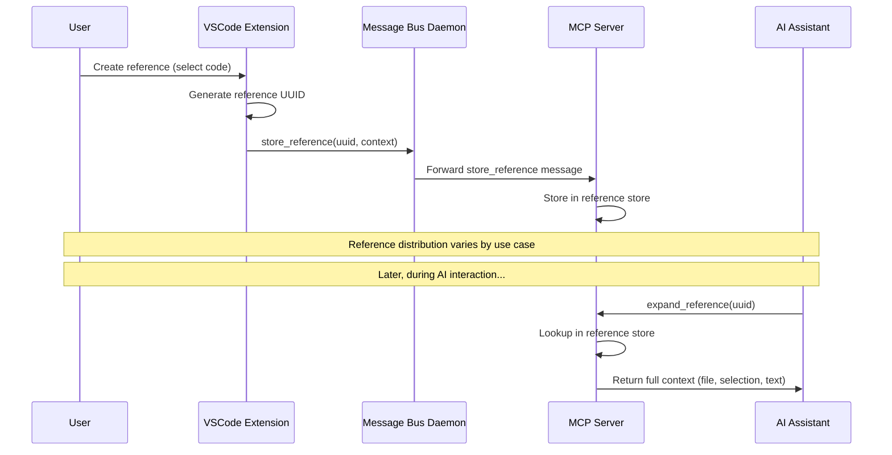

# The Symposium Reference System

The symposium reference system enables AI assistants to access code context through compact, persistent references. It provides a two-part approach: lightweight reference identifiers and rich context storage.

## Overview

The system allows users to select code in their IDE and create references that can be shared with AI assistants. Instead of copying large blocks of code or complex file paths, users share compact references like `<symposium-ref id="uuid"/>` that AI assistants can expand to get full context.

## Core Components

### Compact References
- **Format**: `<symposium-ref id="uuid-here"/>`
- **Purpose**: Lightweight identifiers that can be easily copied and pasted
- **Benefits**: No implementation details exposed, works across different chat sessions

### Context Storage
The system stores rich context data associated with each reference:
```typescript
{
  relativePath: string,           // File path relative to workspace
  selectionRange: {               // Selected code location
    start: { line: number, column: number },
    end: { line: number, column: number }
  },
  selectedText: string            // The actual selected code
}
```

### Reference Lifecycle
1. **Creation**: User selects code, system generates UUID and stores context
2. **Distribution**: Compact reference is sent to relevant destinations
3. **Expansion**: AI assistant uses `expand_reference` to retrieve full context
4. **Usage**: AI has access to file path, selection range, and code content

## Message Flow



## Data Storage

**Reference Storage** (`mcp-server/src/ipc.rs`):
1. Daemon receives `store_reference` messages from VSCode extension
2. Forwards to all connected MCP servers for redundancy
3. MCP server deserializes and stores in reference store
4. Associates UUID with full context data

**Reference Retrieval** (`mcp-server/src/mcp_tools.rs`):
1. AI uses `expand_reference` MCP tool with UUID
2. MCP server looks up context in reference store
3. Returns structured data with file path, selection range, and code text

## Use Cases

The reference system supports multiple workflows:

1. **Ask Socratic Shell**: Select code and route compact reference to AI terminals
2. **Walkthrough Comments**: Reference specific code locations in documentation
3. **Code Review**: Share precise code selections in review discussions
4. **Cross-Session Context**: Maintain references across different chat sessions

## Implementation Details

### Message Types
- `store_reference`: Stores context data associated with a UUID
- `expand_reference`: Retrieves context data for a given UUID

### Storage Architecture
- **Distributed**: Multiple MCP servers can store the same reference
- **Persistent**: References survive across MCP server restarts (TODO: verify)
- **Scoped**: References are workspace-specific

### Error Handling
- Missing references return clear error messages
- Malformed reference data is logged and rejected
- Network failures don't lose reference data due to distributed storage

## Current Issues (as of debugging)

**Deserialization Mismatch**: The Rust `ReferenceContext` struct expects different field names than what the TypeScript extension sends:
- Extension sends: `relativePath`, `selectionRange`, `selectedText`  
- Rust expects: `file`, `line`, `selection`, `metadata`

This prevents references from being stored successfully.

## Key Files

- `ide/vscode/src/extension.ts` - Reference creation and IPC communication
- `mcp-server/src/ipc.rs` - `store_reference` message handling 
- `mcp-server/src/mcp_tools.rs` - `expand_reference` MCP tool implementation
- `mcp-server/src/types.rs` - `ReferenceContext` data structure definitions

## Future Enhancements

- **Reference Metadata**: Add timestamps, user info, project context
- **Reference Expiration**: Automatic cleanup of old references
- **Reference Sharing**: Cross-workspace or cross-user reference sharing
- **Rich Context**: Include surrounding code, git blame, related files