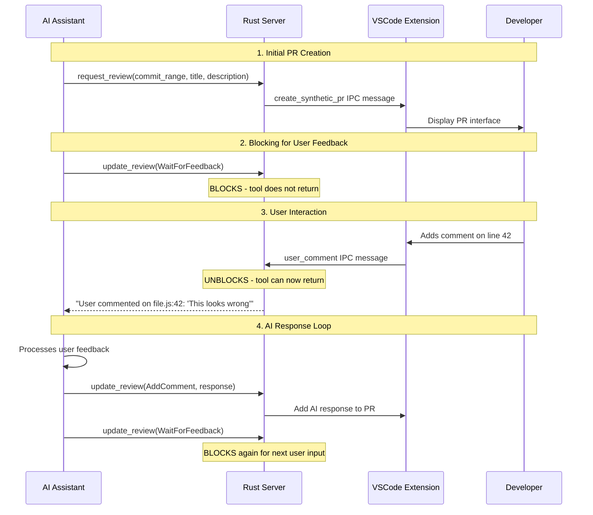
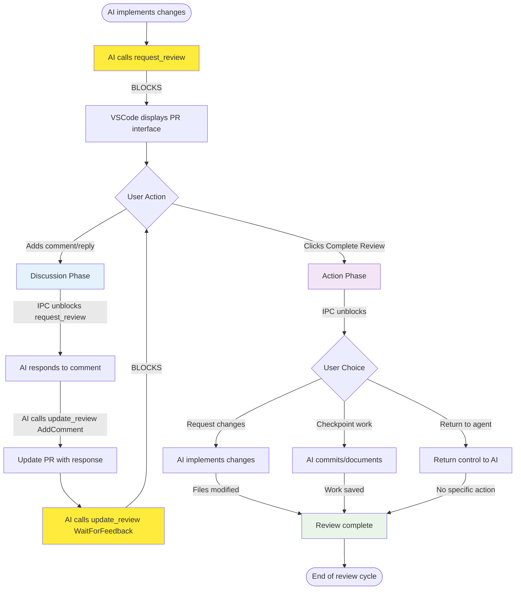
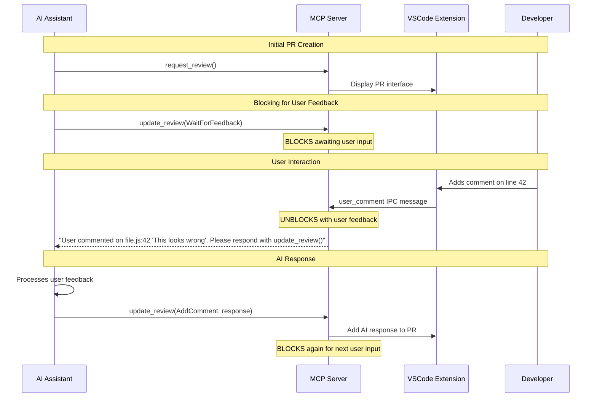

# Synthetic Pull Requests

Synthetic Pull Requests provide a GitHub-style code review interface for LLM-generated changes, enabling familiar PR workflows (approve/request changes) without requiring remote Git repositories.

## Architecture Overview

The Rust MCP server manages:

* Preparing the review by examining the git state and scraping notable comments
* Persisting the state of the review in a JSON file

The IDE extension manages:

* Visualizing diffs + comments
* Tree navigation
* Diff display
* IPC communication

## Roundtripping and Blocking

**The Challenge**: MCP servers have no way to asynchronously notify LLMs. Once an MCP tool returns, the server cannot "wake up" the AI assistant later when events occur.

**The Solution**: **Blocking MCP tools** that don't return until user interaction completes.



This creates a **natural conversation loop** where the AI assistant blocks until the user provides input, processes that feedback, responds, then blocks again waiting for the next user interaction.

## System State Flow



**Key States**:
- **🟡 Blocking States**: `request_review` and `update_review(WaitForFeedback)` wait for user input (yellow)
- **🔵 Discussion Phase**: Back-and-forth comments, no file changes (blue)  
- **🟣 Action Phase**: User gives explicit instructions for next steps (purple)
- **🟢 Complete**: Review cycle finished (green)

**State Transitions**:
- `request_review` blocks initially until first user interaction
- User comments trigger **Discussion Phase** → AI responds with `update_review(AddComment)` → `update_review(WaitForFeedback)` blocks again
- User "Complete Review" triggers **Action Phase** → AI takes requested action → review ends
- Each phase has different LLM instructions (discuss vs. implement)

## Core Workflow

1. **AI Implementation**: LLM writes/modifies files in local directory
2. **PR Creation**: AI calls `request_review(commit_range, title, description)`
3. **Diff Generation**: Server parses Git range, generates structured diffs
4. **AI Comment Extraction**: Server finds 💡❓TODO/FIXME markers in changed lines
5. **VSCode Display**: Extension shows GitHub-style PR interface with diffs and comments
6. **Blocking for Feedback**: AI calls `update_review(WaitForFeedback)` and blocks
7. **User Review**: Developer reviews using familiar PR patterns, adds comments
8. **IPC Unblocking**: User comments trigger IPC messages that unblock the MCP tool
9. **AI Response**: AI processes feedback, responds with `update_review(AddComment, response)`
10. **Loop**: AI blocks again with `update_review(WaitForFeedback)` for continuous interaction

## Component Details

### Rust MCP Server (`server/src/synthetic_pr/`)

**Git Service** (`git_service.rs`):
- Uses `git2` crate for repository operations
- Parses commit ranges: `HEAD`, `HEAD~2`, `abc123..def456`
- Generates structured diffs with file statistics and line-by-line hunks

**Comment Parser** (`comment_parser.rs`):
- Regex-based extraction: `💡 insight`, `❓ question`, `TODO:`, `FIXME:`
- **Only parses changed lines** (from diff hunks, not entire files)
- Associates comments with specific line numbers and file paths

**Review State** (`review_state.rs`):
- JSON serialization to `.socratic-shell-review.json`
- Tracks review status: Pending, Approved, ChangesRequested

**MCP Tools** (`mcp_tools.rs`):
- `request_review()`: Create new synthetic PR from Git commit range
- `update_review()`: Handle review actions, **blocks for user feedback**
- `get_review_status()`: Query current review state

### VSCode Extension (`extension/src/`)

**Synthetic PR Provider** (`syntheticPRProvider.ts`):
- Manages `CommentController` for GitHub-style commenting
- Handles comment thread creation and management
- **Key gap**: `handleCommentSubmission()` needs to send IPC messages for roundtrip

**Tree Provider** (`syntheticPRTreeProvider.ts`):
- GitHub-style file browser in Explorer sidebar
- Shows file changes with +/- statistics
- Click-to-diff navigation

**Diff Content Provider** (`syntheticFileProvider.ts`):
- `TextDocumentContentProvider` for `dialectic-diff:` URI scheme
- **Hunk reverse-application**: Reconstructs "before" state from current files + diff hunks
- Enables VSCode's native red/green diff highlighting

**Extension Main** (`extension.ts`):
- IPC communication via Unix socket
- Message routing: `create_synthetic_pr`, `update_synthetic_pr`
- Process discovery and daemon connection

## Current State & LLM Roundtrip Gap

```mermaid
graph TB
    subgraph "✅ Working"
        A[Git operations]
        B[Diff generation]
        C[AI comment parsing]
        D[GitHub-style diffs]
        E[Comment threads]
        F[Reply buttons]
        G[Tree navigation]
    end
    
    subgraph "🔄 Missing: LLM Roundtrip"
        H[User comments] -.->|Gap| I[AI responses]
        I -.->|Gap| J[Updated PR]
    end
    
    subgraph "Current Flow"
        K[User adds comment] --> L[handleCommentSubmission]
        L --> M[Local state only]
        M -.->|No connection| N[AI Assistant]
    end
    
    subgraph "Needed Flow"
        O[User adds comment] --> P[Send via IPC]
        P --> Q[MCP server processing]
        Q --> R[AI notification]
        R --> S[AI response]
        S --> T[Update PR]
    end
```



## LLM Roundtrip Design: Blocking MCP Tool Pattern

**The Solution**: **Blocking MCP tool with IPC unblocking**



**Key Architecture Principles**:

1. **MCP Tools Block**: `request_review()` and `update_review(WaitForFeedback)` block until user provides input
2. **IPC Unblocks**: User comments in VSCode send IPC messages that unblock the MCP tool
3. **Structured Response**: MCP tool returns structured data about user feedback (file, line, content)
4. **AI Processes**: AI assistant processes feedback and calls `update_review()` with response
5. **Continuous Loop**: Each AI response blocks again, waiting for next user input

**Tool Behavior**:
- `update_review()` description: *"This tool is used to interact with the user through their IDE. Do not invoke it except when asked to do so by other tools within dialectic."*
- Only invoke when explicitly instructed by other Dialectic tools
- Always blocks awaiting user interaction

## File Structure

```
server/src/synthetic_pr/
├── mod.rs              # Module exports
├── git_service.rs      # Git operations with git2
├── comment_parser.rs   # AI comment extraction
├── review_state.rs     # JSON state persistence
└── mcp_tools.rs        # MCP tool implementations

extension/src/
├── syntheticPRProvider.ts     # CommentController management
├── syntheticPRTreeProvider.ts # File browser tree view
├── syntheticFileProvider.ts   # Diff content provider
└── extension.ts               # IPC and main logic
```

## Implementation Status

### ✅ Completed: Server-Side Blocking Pattern

**MCP Tool Interface** - Real implementation in `server/src/synthetic_pr/mcp_tools.rs`:

```rust
{{#include ../../server/src/synthetic_pr/mcp_tools.rs:user_feedback}}
```

**Blocking MCP Tools** - Real implementation in `server/src/server.rs`:

```rust
{{#include ../../server/src/server.rs:request_review_tool}}
```

```rust
{{#include ../../server/src/server.rs:update_review_tool}}
```

**LLM Instruction Formatting** - The `format_user_feedback_message` method creates explicit instructions:

For **comment feedback**:
```
The user reviewed your code changes and left a comment on file `src/auth.rs` at line 42:

User comment: 'This validation logic looks incomplete - what about edge cases?'

Code context:
```rust
function validateInput(input: string) {
    return input.length > 0; // Line 42
}
```

Please analyze the user's feedback and prepare a thoughtful response addressing their concern. 
Do NOT modify any files on disk.

When ready, invoke the update_review tool with:
- review_id: 'abc123'
- action: AddComment
- comment: { response: 'Your response text here' }

After responding, invoke update_review again with action: WaitForFeedback to continue the conversation.
```

For **completion feedback**:
```
User completed their review and selected: 'Request agent to make changes'
Additional notes: 'Focus on the validation logic we discussed'

Based on the review discussion, please implement the requested changes.
You may now edit files as needed.

When finished, invoke: update_review(review_id: 'abc123', action: Approve)
```

### 🔄 Next: IPC Message Handling

**Missing IPC Implementation**:
- `wait_for_user_feedback()` method currently returns stub/error
- Need to implement actual blocking mechanism with message queues
- Extension must send `user_comment` IPC messages to unblock server

**Required IPC Message Types**:
```typescript
interface UserCommentPayload {
    review_id: string;
    feedback_type: "comment" | "complete_review";
    file_path?: string;
    line_number?: number;
    comment_text?: string;
    completion_action?: "request_changes" | "checkpoint" | "return";
    additional_notes?: string;
    context_lines?: string[];
}
```

### 🚧 Remaining: Extension Integration

**Extension Changes Needed**:
1. **Enhanced `handleCommentSubmission()`** - Send user comments via IPC
2. **Complete Review UI** - Tree panel action with three completion choices
3. **IPC Message Routing** - Handle `user_comment` message type
