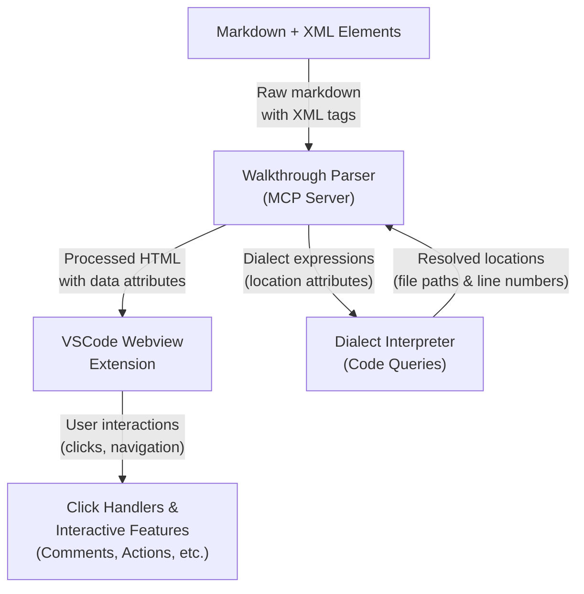
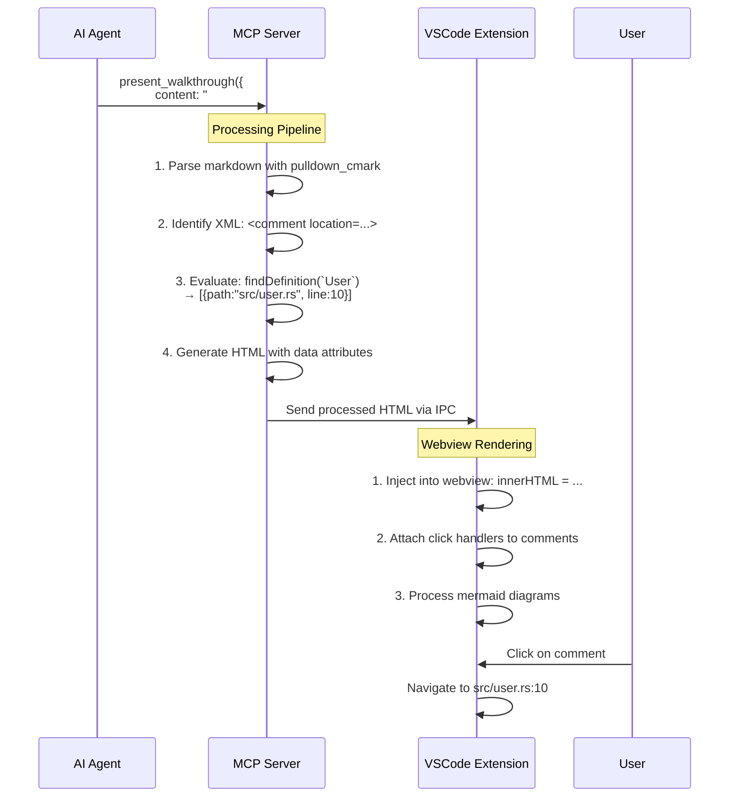

# Code Walkthroughs

Walkthroughs are interactive markdown documents that help explain code changes, architectural decisions, and system behavior. They combine standard markdown with specialized XML elements that can reference code locations, embed git diffs, and provide interactive elements.

## Overview

The walkthrough system consists of three main components:

1. **Markdown + XML Format**: Authors write walkthroughs using markdown with embedded XML elements (`<comment>`, `<action>`, `<mermaid>`)
2. **Server-side Parser**: The MCP server's `walkthrough_parser` module converts the markdown to HTML, resolving code locations and generating interactive elements
3. **VSCode Integration**: The VSCode extension renders the processed HTML in a webview with click handlers and interactive features

## System Architecture



## Processing Pipeline

When a walkthrough is presented:

1. **Parsing**: The `WalkthroughParser` uses `pulldown_cmark` to parse markdown while identifying XML elements
2. **Resolution**: Dialect expressions in `location` attributes are evaluated to find code locations
3. **HTML Generation**: XML elements are converted to styled HTML with embedded data for interactivity
4. **VSCode Rendering**: The extension displays the HTML in a webview and attaches click handlers

## Walkthrough Format Overview

Walkthroughs are authored as standard markdown documents with embedded XML elements for interactive features:

- `<comment location="...">` - Contextual comments at specific code locations
- `<action button="...">` - Interactive buttons for follow-up tasks
- `<mermaid>` - Architecture diagrams and flowcharts

The `location` attributes use Dialect expressions to target code locations (e.g., `findDefinition("MyClass")`, `search("src/auth.rs", "async fn")`).

For complete format specification and usage guidelines, see the [AI guidance documentation](../../guidance.md).

## Technical Implementation

### Parsing Process

The `WalkthroughParser` in `symposium/mcp-server/src/walkthrough_parser.rs` handles the conversion from markdown+XML to interactive HTML:

1. **Markdown Parsing**: Uses `pulldown_cmark` to parse markdown into a stream of events
2. **XML Detection**: Identifies inline and block-level XML elements (`<comment>`, `<action>`, `<mermaid>`)
3. **Sequential Processing**: Processes events one by one, collecting content between opening and closing tags
4. **Element Resolution**: For each XML element:
   - Parses attributes using `quick_xml`
   - Evaluates Dialect expressions in `location` attributes via `DialectInterpreter`
   - Resolves code locations to file paths and line numbers
   - Generates structured data for client-side interaction
5. **HTML Generation**: Converts resolved elements to styled HTML with embedded JSON data

### Element Resolution Examples

#### Comment Element Processing

Input:
```xml
<comment location="findDefinition(`validateToken`)" icon="lightbulb">
This function validates authentication tokens
</comment>
```

Internal processing:
1. Parse XML attributes: `location="findDefinition(`validateToken`)"`, `icon="lightbulb"`
2. Evaluate Dialect expression: `findDefinition(`validateToken`)` → `[{definedAt: {path: "src/auth.rs", start: {line: 42, column: 0}, ...}, ...}]`
3. Generate comment data with unique ID and normalized locations
4. Create HTML with click handlers

Output HTML:
```html
<div class="comment-item" data-comment='{"id":"comment-uuid","locations":[{"path":"src/auth.rs","line":42,"column":0,...}],"comment":["This function validates authentication tokens"]}' style="cursor: pointer; border: 1px solid var(--vscode-panel-border); ...">
    <div style="display: flex; align-items: flex-start;">
        <div class="comment-icon" style="margin-right: 8px;">💡</div>
        <div class="comment-content" style="flex: 1;">
            <div class="comment-locations" style="font-weight: 500; ...">src/auth.rs:42</div>
            <div class="comment-text">This function validates authentication tokens</div>
        </div>
    </div>
</div>
```

### HTML Generation Strategy

The parser generates VSCode-compatible HTML with:

- **CSS Variables**: Uses VSCode theme colors (`var(--vscode-panel-border)`, `var(--vscode-foreground)`, etc.)
- **Embedded Data**: Stores structured data in `data-*` attributes for click handlers
- **Icon Mapping**: Converts icon names to emoji representations
- **Location Display**: Shows file paths and line numbers for easy navigation

### VSCode Integration

#### Message Flow

1. **MCP Tool Call**: AI agent calls `present_walkthrough` with markdown content
2. **Server Processing**: MCP server parses and resolves the walkthrough to HTML
3. **Extension Delivery**: VSCode extension receives processed HTML via IPC message
4. **Webview Rendering**: Extension injects HTML into webview and attaches handlers

#### Extension Implementation

In `symposium/vscode-extension/src/extension.ts`:
```typescript
if (message.type === 'present_walkthrough') {
    const walkthroughPayload = message.payload as PresentWalkthroughPayload;
    
    // Set base URI for file resolution
    this.walkthroughProvider.setBaseUri(walkthroughPayload.base_uri);
    
    // Show walkthrough HTML content in webview
    this.walkthroughProvider.showWalkthroughHtml(walkthroughPayload.content);
}
```

#### Webview Rendering

In `symposium/vscode-extension/src/walkthroughWebview.ts`:
```typescript
// Inject server-rendered HTML directly
contentElement.innerHTML = message.content;

// Add placement icons to all dialectic links
addPlacementIcons();

// Process mermaid diagrams in the HTML content  
processMermaidDiagrams();

// Restore user interaction state
restoreOffscreenState();
```

#### Click Handler Registration

The extension automatically attaches click handlers to:

- **Comment elements**: Navigate to code locations or show disambiguation dialog
- **Action buttons**: Send messages back to the AI agent
- **Mermaid diagrams**: Process and render using mermaid.js

### Data Flow Example

For a complete walkthrough processing flow:

