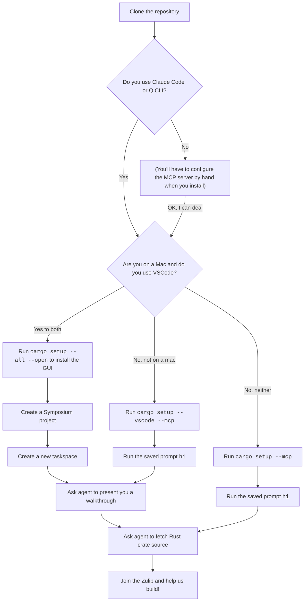

# Get started

This page will walk you through using Symposium for the first time. Symposium can be used in a lot of ways so here's a little tree to help you decide. 

```mermaid
flowchart TD
    Clone["Clone the repository"] --> UseAgent
    UseAgent -- Yes --> WhatDoYouUse
    UseAgent -- No --> SetupMCP
    WhatDoYouUse -- Yes to both --> GUI
    WhatDoYouUse -- No, not on a mac --> VSCode
    WhatDoYouUse -- No, neither --> MCP
    SetupMCP -- OK, I can deal --> WhatDoYouUse 

    GUI --> CreateSymposiumProject
    CreateSymposiumProject --> CreateTaskspace
    CreateTaskspace --> TryWalkthrough --> TryGetCrateSource
    VSCode --> SayHiCode --> TryWalkthrough
    MCP --> SayHiMCP --> TryGetCrateSource
    TryGetCrateSource --> Contribute

    GUI["Run <code>cargo setup --all --open</code> to install the GUI"]
    UseAgent{"Do you use Claude Code or Q CLI?"}
    WhatDoYouUse{"Are you on a Mac and do you use VSCode?"}
    CreateSymposiumProject["Create a Symposium project"]
    CreateTaskspace["Create a new taskspace"]
    VSCode["Run <code>cargo setup --vscode --mcp</code>"]
    MCP["Run <code>cargo setup --mcp</code>"]
    SayHiCode["Run the saved prompt <code>hi</code>"]
    SayHiMCP["Run the saved prompt <code>hi</code>"]
    TryWalkthrough["Ask agent to present you a walkthrough"]
    TryGetCrateSource["Ask agent to fetch Rust crate source"]
    Contribute["Join the Zulip and help us build!"]
    SetupMCP["(You'll have to configure the MCP server by hand when you install)"]

    click Clone "./install.html"
    click GUI "./install.html#using-the-symposium-gui-app"
    click VSCode "./install.html#using-the-vscode-plugin--the-mcp-server"
    click MCP "./install.html#using-just-the-mcp-server"
    click SetupMCP "./install.html#other-agents"
    click CreateSymposiumProject "./symposium-project.html"
    click SayHiCode "./say-hi.html"
    click SayHiMCP "./say-hi.html"
    click CreateTaskspace "./taskspaces.html"
    click TryWalkthrough "./walkthroughs.html"
    click TryGetCrateSource "./rust_crate_source.html"
    click Contribute "../contribute.html"
    click WhatDoYouUse "./unopinionated.html"
    click UseAgent "./unopinionated.html"
```

