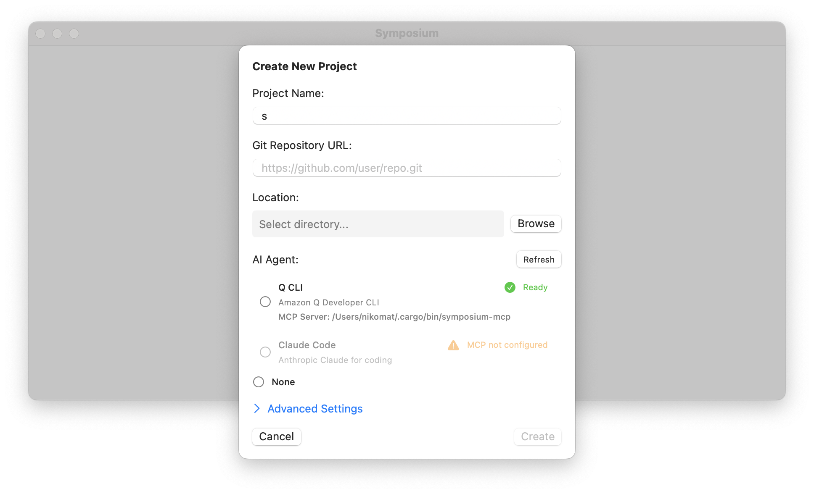

# Create Symposium Project

When you first start symposium, you will be asked to grant persissions (accessibility). Once that is done, you will be asked if you want to create a new project or load an existing one. If you select to create a new project, you get a dialog like this one:

* **Project name:** Name of the project, typically your repository name
* **Git repository URL:** URL for your source code.
* **Location:** where will the symposium project live. The project will be a [directory](../ref/symposium-projects.md).
* **AI Agent:** select what AI agent we should start in each taskspace. We attempt to detect whether they have been properly configured; the refresh button will refresh the list.

