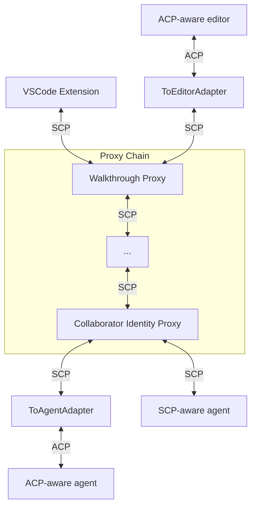
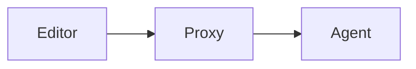

# Elevator pitch

> What are you proposing to change?

We propose to prototype **SCP (Symposium Component Protocol)**, a set of extended capabilities for Zed's Agent Client Protocol (ACP). SCP capabilities enable composable agent architectures. Instead of building monolithic AI tools, SCP allows developers to create modular components that can be mixed and matched like Unix pipes or browser extensions.

This RFD builds on the concepts introduced in [SymmACP: extending Zed's ACP to support Composable Agents](https://smallcultfollowing.com/babysteps/blog/2025/10/08/symmacp), with the protocol renamed to SCP for this implementation.

Key changes:
* Extend ACP with rich content blocks (HTML panels, inline comments) and capability negotiation
* Implement a proxy chain architecture where each component adds specific capabilities
* Redesign Symposium as a collection of SCP components rather than a monolithic MCP server
* Create adapters for compatibility with existing ACP agents and editors

# Status quo

> How do things work today and what problems does this cause? Why would we change things?

Today's AI development tools are largely monolithic. If you want to change one piece - the UI, add a feature, or switch backends - you're stuck rebuilding everything from scratch. This creates several problems:

**For Symposium specifically:**
* Our current architecture is a single MCP server with various tools bundled together
* Adding new interaction patterns (like walkthroughs) requires complex IPC mechanisms and tight coupling with VSCode
* Features like collaboration patterns, time awareness, and rich presentations are hard-coded rather than composable
* Users can't easily customize or extend the experience

**For the broader ecosystem:**
* Every AI tool reinvents the wheel for basic capabilities (chat UI, tool integration, etc.)
* Innovative features developed in one tool can't be easily adopted by others
* Users are locked into specific tool ecosystems rather than being able to mix and match capabilities
* The lack of interoperability slows innovation and fragments the community

# What we propose to do about it

> What are you proposing to improve the situation?

We propose to develop **SCP (Symposium Component Protocol)** as an [extension to ACP](https://agentclientprotocol.com/protocol/extensibility) that enables composable agent architectures. The core idea is a proxy chain where each component adds specific capabilities:



SCP contains three kinds of actors:

* *Editors* (like the VSCode extension) interact directly with users;
* *Proxies* (like the walkthroughs or collaborator identity) sit between the editor and the agent, introducing new behavior;
* *Agents* provide the base model behavior.

For proxies, we say that the "editor" of a proxy is the upstream actor and the "agent" of a proxy is the downstream proxy.

## Initialization of SCP proxies

The ACP protocol defines an [initialization phase](https://agentclientprotocol.com/protocol/initialization) where editors and agents advertise their [capabilities](https://agentclientprotocol.com/protocol/schema#clientcapabilities) to one another. An SCP-aware editor includes a custom `"symposium"` capability in the `_meta` field sent to downstream proxies and agents. SCP-aware proxies also advertise their capabilities upstream to the editor.

SCP proxies expect to be initialized by an SCP-aware editor. The editor provides the proxy with its successors on the proxy chain. The proxy can then create those processes. If initialization by a "non-SCP-aware" editor, the proxy will simply return an error. The `ToEditor` proxy can create an SCP-aware bridge in those cases.

## Symposium's features become proxies

We will define all of Symposium's features as proxies.

* The *walkthrough* proxy adds the ability to display walkthroughs and place comments.
* The *collaborator identity* gives the agent custom behavior, like the ability to learn from its user.
* The *IDE integration* proxy adds tools for working with the IDE; as today, these tools will "desugar" to a base set of 

For now, the proxy chain for a taskspace will be hard-coded. In the future we expect to give users the ability to define their own tools.

## The editor provides base capabilities

SCP proxies make use of capabilities provided by the editor. These capabilities are advertised as part of the ACP initialization step:

* The `html_panel` capability indicates the ability to display HTML provided by the panel. This HTML can reference pre-defined classes and widgets that permit linking into files and other modes of interaction.
* The `file_comment `capability indicates the editor will permit comments to be displayed on specific lines of the file.
* The `ide_operation` capability family indicates the editor can provide various IDE operations ("get-selection", "find-all-references", etc).

## The Symposium VSCode extension is the prototype Symposium editor

Symposium's VSCode extension will serve as the prototype Symposium editor, supporting all the above capabilities. It will create a "terminal-like" window based, initially, on the (Apache-2.0 licensed) editor from `continue.dev` that allows communication with the agent. When the agent sends walkthroughs or requests IDE support, they are provided by the editor.

## Bridging to ACP agents

The `ToAgent` convert allows converting a "plain ACP" agent into an SCP agent. ACP agents do not support the full capabilities of SCP agents (see the [implementation section](#implementation-details-and-plan) for details) but they do support the ability for SCP proxies to define MCP tools; this is needed to support walkthroughs and collaborator identities. This support works by creating a "shim" MCP tool that receives input over stdio and communicates it via side-channel back to the `ToAgent` actor, which can then send SCP messages backwards.

 # Bridging to ACP editors

While not planned for initial implementation, it should be possible to bridge an SCP proxy chain to an ACP editor by providing a `ToEditor` transformer that initializes the proxy chain (based on some undefined source of configuration) but without the extended capabilities (walkthroughs, etc). This would permit Symposium to be used in (e.g.) Zed. However, a preferred route would be to contribute full Symposium support upstream to Zed.

# Shiny future

> How will things will play out once this feature exists?

## Composable Development Experience

SCP enables users to mix and match development capabilities. Interactive walkthroughs display as HTML panels with inline code comments. Collaboration patterns adapt to individual working styles. A developer can add a "research assistant" proxy to their chain and gain research capabilities while keeping existing walkthroughs and collaboration patterns.

## Upstreaming to ACP

As SCP proves useful, these extensions can be contributed to the ACP specification. Rich content blocks, capability negotiation, and proxy chaining would become standard ACP features, eliminating the need for adapter components. Existing SCP components would work unchanged, communicating over native ACP.

## User-Defined Tool Composition

Users will define their own development environments by composing proxy components. A Rust developer might configure crate-analysis, documentation-generation, and performance-profiling proxies. A web developer might prefer TypeScript-analysis, accessibility-checking, and deployment-automation proxies. This creates a marketplace where specialized components can be developed, shared, and combined.

## Multiple Active Agents

SCP supports multiple agents working simultaneously within a taskspace. A user might have a coding agent for implementation, a research agent for investigation, and a review agent for quality analysis. These agents coordinate through the proxy chain, sharing context and handing off tasks.

## Context-Aware Proxy Selection

SCP could automatically configure proxy chains based on project context. A Rust project with async dependencies might include async-analysis and tokio-debugging proxies. A web project with accessibility requirements might include WCAG-compliance and screen-reader-testing proxies. This reduces setup overhead while ensuring developers have appropriate capabilities for their projects.

**Future Extensions:** Advanced features like session state manipulation (for tangent mode) and conversation history modification will require additional protocol extensions for proxy coordination. These capabilities will be designed as the ecosystem matures.

# Implementation details and plan

> Tell me more about your implementation. What is your detailed implementaton plan?

**TODO:** Add concrete implementation plan with phases and deliverables.

## SCP protocol

### Definition: Editor vs Agent of a proxy

For an SCP proxy, the "editor" is defined as the upstream connection and the "agent" is the downstream connection.



### SCP editor capabilities

An SCP-aware editor provides the following capability during ACP initialization:

```json
/// Including the symposium section *at all* means that the editor
/// supports symposium proxy initialization.
"_meta": {
    "symposium": {
        "version": "1.0",
        "html_panel": true,      // or false, if this is the ToEditor proxy
        "file_comment": true,    // or false, if this is the ToEditor proxy
    }
}
```

SCP proxies forward the capabilities they receive from their editor.

### SCP agent capabilities

An SCP-aware agent or proxy provides the following capability during ACP initialization:

```json
/// Including the symposium section *at all* means that the editor
/// supports symposium proxy initialization.
"_meta": {
    "symposium": {
        "version": "1.0",
        "proxy": true,    // false if this is not an SCP proxy and therefore does not expect a proxy chain
    }
}
```

The `proxy` flag indicates whether this SCP server is a *proxy* or a *final agent*:

* An SCP *agent* (`proxy = false`)  is the final node in the chain. It behaves like an ACP server except that it supports [MCP tools over SCP](#mcp-tools-over-scp) and other future SCP extensions.
* An SCP *proxy* (`proxy = true`) is an intermediate node in the chain. Proxies expect to be initialized with a [`_scp/proxy` request](#the-_scpproxy-request) before they can be used. Until the `_scp/proxy` chain is established, any other requests  result in an error. Once established, the proxy chain cannot be changed.

### The `_scp/proxy` request

The `_scp/proxy` request contains an array of `ScpServer` structures. These structures follow the same format as ACP's [`McpServer`](https://agentclientprotocol.com/protocol/schema#mcpserver) specification, with only stdio transport mode supported initially. This allows proxies to launch and connect to their downstream components using the same patterns established by ACP.

The proxy handles launching and connecting to downstream SCP servers using the same mechanisms it would use for MCP servers. This reuses existing process management and communication patterns while extending them for the proxy chain architecture.

### MCP tools over SCP

SCP extends the ACP protocol to allow MCP tools to be provided by proxies in the chain rather than only by the final agent. This enables proxies to offer interactive capabilities while maintaining compatibility with the existing MCP ecosystem.

**SCP Transport Extension:** When an agent advertises support for `"symposium"`, the ACP `McpServer` structure is extended with a new transport type: `{ "type": "scp", "name": "..." }`. This transport type indicates that the MCP server is provided by a proxy in the SCP chain rather than by an external process.

**Message Forwarding:** When the agent invokes an MCP tool using the "scp" transport, the message is forwarded to the ACP editor as an `_scp/mcp` request. The request contains an object `{"name": "...", "message": M}` that embeds the original MCP message `M` along with the name of the target proxy. This allows the editor to route the message to the appropriate proxy in the chain.

**Bidirectional Communication:** This mechanism enables full MCP protocol support through the proxy chain, including tool invocation, resource access, and prompt templates. Proxies can provide MCP tools that appear transparent to the agent while actually being handled by components earlier in the chain.

### Bridging MCP to ACP

The `ToAgent` bridge component handles the translation between SCP's proxy-provided MCP tools and traditional ACP agents that expect stdio-based MCP servers.

**Transport Translation:** The bridge converts "scp" transport MCP servers into stdio transport by providing a dummy binary that acts as a shim. When the ACP agent attempts to invoke an MCP tool, it launches this dummy binary as it would any other MCP server.

**IPC Forwarding:** The dummy binary uses inter-process communication to forward MCP messages back to the `ToAgent` bridge, which then routes them through the SCP chain to the appropriate proxy. This maintains the agent's expectation of stdio-based MCP communication while enabling the proxy architecture.

**Compatibility:** From the agent's perspective, proxy-provided MCP tools appear identical to traditional MCP servers. This ensures compatibility with existing ACP agents while unlocking the composable capabilities of the SCP ecosystem.

### HTML panels

HTML panels provide a content display mechanism that extends beyond simple text-based chat interactions. Panels are persistent, updateable UI elements that can display structured information alongside the conversation.

**Panel Management:** If the editor provides the `html_panel` capability, agents can manage panels through three core operations:

- **Show/Update Panel:** The `_scp/html_panel/show` message creates or updates a panel: `{ "id": "$UUID", ("label": "text")?, ("contents": "...html...")? }`. If a panel with the given ID already exists, it updates the provided fields (label and/or contents) and brings the panel to the front. For new panels, both label and contents must be provided or the message results in an error.

- **Clear Panel:** The `_scp/html_panel/clear` message removes a panel: `{ "id": "$UUID" }`. This allows agents to clean up panels that are no longer needed.

- **Query Panel:** The `_scp/html_panel/get` message retrieves current panel state: `{ "id": "$UUID" }`. This returns either null (if the panel doesn't exist) or the current contents, enabling agents to check panel state before updates.

**Widget Support:** Panels can contain interactive widgets that provide structured ways for users to interact with the content. This enables interfaces beyond static HTML display.

### File comments

File comments enable agents to place contextual annotations directly in source code, creating a more integrated development experience than separate chat windows.

**Comment Placement:** If the editor provides the `file_comment` capability, agents can place comments using the `_scp/file_comment/show` message: `{ "id": "$UUID", "url": "...", "start": {"line": L, ("column": C)? }, ("end": {"line": L, ("column": C)?})?, "can_reply": boolean }`.

**Position Specification:** Comments are positioned using line and column coordinates. If the start column is omitted, it defaults to the beginning of the line. If the end column is omitted, it defaults to the end of the line. If the end position is entirely omitted, the comment spans from the start position to the end of that line.

**Interactive Comments:** The `can_reply` flag determines whether the comment includes user interaction capabilities. When true, users can reply to the comment, creating a threaded discussion directly in the code. This enables collaborative code review and explanation workflows.

### Logging

SCP provides a logging capability that enables observability and testing throughout the proxy chain. This allows proxies and agents to send structured log messages that can be captured by the editor for debugging, testing, and monitoring purposes.

**Log Messages:** Agents and proxies can send `_scp/log` messages upstream: `{ "level": "info|warn|error|debug", "message": "...", ("data": {...})? }`. The editor receives these messages and can display them in output panels, write them to log files, or use them for test assertions.

**Testing Integration:** The logging capability is particularly valuable for scenario-based testing, where test frameworks can assert on expected log patterns to verify proxy behavior and message flow through the chain.

# Implementation progress

> What is the current status of implementation and what are the next steps?

## Phase 1: TypeScript ACP Server + Test Harness

**Status:** Not started

**Goal:** Build and test basic ACP communication with fast iteration cycle.

**Architecture:** TypeScript ACP Server (standalone)

**Implementation:**
- Build dummy ACP server in TypeScript using `@zed-industries/agent-client-protocol`
- Create test harness that can directly import and test server logic
- Implement basic `initialize`, `newSession`, `prompt` handlers

**Key Test:** `basic-echo.test.ts`
- Send "Hello, world" → get "Hello, user" response
- Validates ACP protocol implementation and basic message flow
- No compilation step needed - fast test iteration

## Phase 2: Continue.dev GUI Integration

**Status:** Not started

**Goal:** Connect Continue.dev GUI to TypeScript ACP server through VSCode extension.

**Architecture:** Continue.dev GUI ↔ VSCode Extension (TypeScript ACP client) ↔ TypeScript ACP Server

**Implementation:**
- Integrate Continue.dev React GUI into VSCode extension webview
- Use TypeScript ACP client to spawn and communicate with server subprocess
- Implement Continue.dev message protocol translation to ACP

**Key Test:** Manual verification + log inspection
- Type in Continue.dev GUI → see ACP messages in VSCode output logs → response appears in GUI
- Validates full GUI ↔ server communication chain

## Phase 3: ToAgent Bridge (Rust)

**Status:** Not started

**Goal:** Build the critical SCP-to-ACP bridge component that enables MCP tool forwarding.

**Architecture:** VSCode Extension ↔ ToAgent Bridge (Rust) ↔ TypeScript Dummy Agent

**Implementation:**
- Build ToAgent bridge in Rust that implements SCP protocol
- Convert "scp" transport MCP tools to stdio transport (dummy shim binaries)
- Handle `_scp/mcp` message routing between extension and downstream agent
- Forward standard ACP messages bidirectionally

**Key Test:** `mcp-bridge.test.ts`
- Send "hi" → agent invokes MCP tool → bridge routes `_scp/mcp` to extension → tool logs "I got this message: Hi" → responds "Hola"
- Validates MCP-over-SCP architecture and message routing

## Phase 4: IDE Operations Proxy (Rust)

**Status:** Not started

**Goal:** Port existing IDE operations to Rust SCP proxy architecture.

**Architecture:** VSCode Extension ↔ IDE Operations Proxy (Rust) ↔ ToAgent Bridge ↔ Dummy Agent

**Implementation:**
- Port IDE operations from existing Symposium MCP server to Rust SCP proxy
- Implement file operations, code navigation, selection handling
- Insert proxy between extension and ToAgent bridge

**Key Test:** `ide-operations.test.ts`
- Request file operations → proxy handles IDE calls → logs show successful operations
- Validates Rust proxy architecture with real functionality

## Phase 5: Walkthrough Proxy (Rust)

**Status:** Not started

**Goal:** Implement rich content capabilities with HTML panels and file comments.

**Architecture:** VSCode Extension ↔ Walkthrough Proxy (Rust) ↔ IDE Operations Proxy ↔ ToAgent Bridge ↔ Dummy Agent

**Implementation:**
- Build walkthrough proxy that generates `_scp/html_panel/show` and `_scp/file_comment/show` messages
- Implement walkthrough markdown parsing and content generation
- Handle user interactions with panels and comments

**Key Test:** `walkthrough-display.test.ts`
- Request walkthrough → HTML panel appears in VSCode → file comments placed in editor
- Validates full SCP rich content capabilities end-to-end

## Testing Strategy

**Scenario-Based Testing:**
- Each test is a directory containing mock agent scripts and test files
- Tests instantiate SCP proxy chains with mock agents as final components
- VSCode extension logs all key events to Output window for test assertions
- BDD-style tests: "when user says X, expect these log messages"

**Test Structure:**
```
test-scenarios/
├── basic-echo/
│   ├── agent.ts (TypeScript mock agent)
│   └── basic-echo.test.ts
├── mcp-bridge/
│   ├── agent.ts
│   └── mcp-bridge.test.ts
└── walkthrough-display/
    ├── agent.ts
    └── walkthrough-display.test.ts
```

**Observability:** All components use `_scp/log` messages for structured logging, enabling test assertions on expected behavior patterns.

# Frequently asked questions

> What questions have arisen over the course of authoring this document or during subsequent discussions?

## What alternative approaches did you consider, and why did you settle on this one?

We considered extending MCP directly, but MCP is focused on tool provision rather than conversation flow control. We also looked at building everything as VSCode extensions, but that would lock us into a single editor ecosystem. 

SCP's proxy chain approach provides the right balance of modularity and compatibility - components can be developed independently while still working together.

## How does this relate to other agent protocols like Google's A2A?

SCP is complementary to protocols like A2A. While A2A focuses on agent-to-agent communication for remote services, SCP focuses on composing the user-facing development experience. You could imagine SCP components that use A2A internally to coordinate with remote agents.

## What about security concerns with arbitrary proxy chains?

Users are responsible for the proxies they choose to run, similar to how they're responsible for the software they install. Proxies can intercept and modify all communication, so trust is essential. For future versions, we're considering approaches like Microsoft's Wassette (WASM-based capability restrictions) to provide sandboxed execution environments.

## Why reuse Continue.dev's GUI instead of building our own?

Continue.dev has already solved the hard problems of building a production-quality chat interface for VS Code extensions. Their GUI is specifically designed to be reusable - they use the exact same codebase for both VS Code and JetBrains IDEs by implementing different adapter layers.

Their architecture proves that message-passing protocols can cleanly separate GUI concerns from backend logic, which aligns perfectly with SCP's composable design. Rather than rebuilding chat UI, message history, streaming support, and context providers from scratch, we can focus our effort on the novel SCP protocol and proxy architecture.

The Apache 2.0 license makes this legally straightforward, and their well-documented message protocols provide a clear integration path.

## Why not just use hooks or plugins?

Hooks are fundamentally limited to what the host application anticipated. SCP proxies can intercept and modify the entire conversation flow, enabling innovations that the original tool designer never envisioned. This is the difference between customization and true composability.

## What about performance implications of the proxy chain?

The proxy chain does add some latency as messages pass through multiple hops. However, we don't expect this to be noticeable for typical development workflows. Most interactions are human-paced rather than high-frequency, and the benefits of composability outweigh the minimal latency cost.

## How will users discover and configure proxy chains?

This will be determined over time as the ecosystem develops. We expect solutions to emerge organically, potentially including registries, configuration files, or marketplace-style discovery mechanisms.

## What about resource management with multiple proxy processes?

Each proxy manages the lifecycle of processes it starts. When a proxy terminates, it cleans up its downstream processes. This creates a natural cleanup chain that prevents resource leaks.

# Revision history

Initial draft based on architectural discussions.
