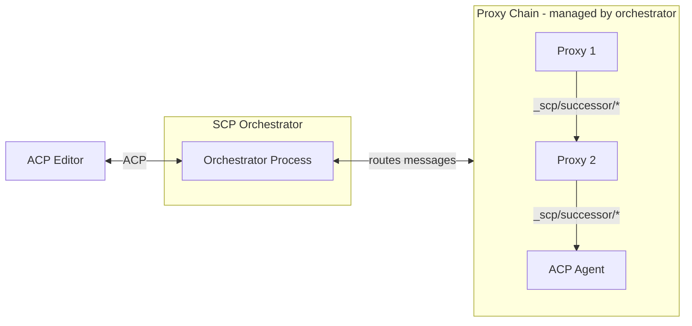
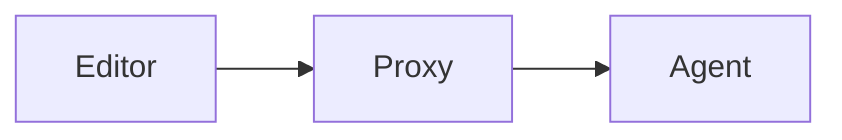

# Elevator pitch

> What are you proposing to change?

We propose to prototype **SCP (Symposium Component Protocol)**, an extension to Zed's Agent Client Protocol (ACP) that enables composable agent architectures through proxy chains. Instead of building monolithic AI tools, SCP allows developers to create modular components that can intercept and transform messages flowing between editors and agents.

This RFD builds on the concepts introduced in [SymmACP: extending Zed's ACP to support Composable Agents](https://smallcultfollowing.com/babysteps/blog/2025/10/08/symmacp), with the protocol renamed to SCP for this implementation.

Key changes:
* Define a proxy chain architecture where components can transform ACP messages
* Create an orchestrator that manages the proxy chain and presents as a normal ACP agent to editors
* Establish the `_scp/successor/*` protocol for proxies to communicate with downstream components
* Enable composition without requiring editors to understand SCP internals

# Status quo

> How do things work today and what problems does this cause? Why would we change things?

Today, extending or customizing AI agent behavior requires either:
1. Building features directly into the agent code (tight coupling)
2. Building features into the editor/client (editor-specific)
3. Using MCP tools (limited to tool calling, not message transformation)

This creates several problems:

**Limited composability:**
* Can't easily combine independent enhancements (e.g., logging + metrics + custom behavior)
* Each feature requires either agent or editor modifications
* No standard way to chain transformations or add middleware

**Lack of modularity:**
* Features are bundled into monolithic agents or editors
* Can't swap out individual behaviors without changing the entire system
* Difficult to test components in isolation

**Reinventing infrastructure:**
* Each tool builds its own message routing and transformation logic
* No standard pattern for intercepting and modifying agent interactions
* Can't share reusable components across different agents or editors

# What we propose to do about it

> What are you proposing to improve the situation?

We propose to develop **SCP (Symposium Component Protocol)** as an [extension to ACP](https://agentclientprotocol.com/protocol/extensibility) that enables composable agent architectures. The core idea is a proxy chain where each component adds specific capabilities:



SCP defines three kinds of actors:

* **Editors** spawn the orchestrator and communicate via standard ACP
* **Orchestrator** manages the proxy chain, appears as a normal ACP agent to editors
* **Proxies** intercept and transform messages, communicate with downstream via `_scp/successor/*` protocol
* **Agents** provide base AI model behavior using standard ACP

The orchestrator handles message routing, making the proxy chain transparent to editors. Proxies can transform requests, responses, or add side-effects without editors or agents needing SCP awareness.

## The Orchestrator Component

SCP introduces an **orchestrator** component that sits between the editor and the proxy chain. The orchestrator:

* Spawns and manages all proxies and the final agent based on command-line configuration
* Routes messages through the proxy chain transparently  
* Appears as a standard ACP agent to the editor
* Handles the `_scp/successor/*` protocol messages that proxies use for downstream communication

**From the editor's perspective**, it simply spawns one orchestrator process and communicates with it using normal ACP over stdio. The editor doesn't need to know about the proxy chain at all.

**Command-line orchestration:**
```bash
symposium-orchestrator \
  --proxy ./walkthrough-proxy \
  --proxy ./collaborator-proxy \
  --agent ./claude-acp-agent
```

The orchestrator advertises an `"orchestrator"` capability during ACP initialization to signal its role, but editors can treat it as any other ACP agent.

## Motivation: User-Specific Agent Customization

The real power of SCP is enabling agents that adapt to specific users, contexts, and workflows. Proxies can inject:

* **User-specific context** - Your coding style, project conventions, past decisions
* **Workflow patterns** - How you like to work (TDD, documentation-first, iterative refinement)
* **Domain knowledge** - Project-specific terminology, architecture patterns, team practices
* **Learning and adaptation** - Remember what worked well before, avoid past mistakes
* **Personal preferences** - Communication style, level of detail, explanation approaches

**Example:** A "Symposium collaborator" proxy learns that you prefer:
- Detailed architectural discussions before implementation
- Code examples with inline comments explaining the reasoning
- Incremental commits with descriptive messages
- Design documentation updated alongside code changes

The proxy transforms generic agent responses to match your workflow, without the base agent needing to know about your preferences. Different users can use different proxies with the same underlying agent.

This is fundamentally about **personalization** - making AI agents work the way *you* work, not forcing you to adapt to how they work.

# Shiny future

> How will things will play out once this feature exists?

## Composable Agent Ecosystems

SCP enables a marketplace of reusable proxy components. Developers can:
* Compose custom agent pipelines from independently-developed proxies
* Share proxies across different editors and agents
* Test and debug proxies in isolation
* Mix community-developed and custom proxies

## Simplified Agent Development

Agent developers can focus on core model behavior without implementing cross-cutting concerns:
* Logging, metrics, and observability become proxy responsibilities
* Rate limiting and caching handled externally
* Content filtering and safety policies applied consistently

## Editor Simplicity

Editors gain enhanced functionality without custom integrations:
* Add sophisticated agent behaviors by changing proxy chain configuration
* Support new agent features without editor updates
* Maintain compatibility with any ACP agent

## Standardization Path

As the ecosystem matures, successful patterns may be:
* Standardized in ACP specification itself
* Adopted by other agent protocols
* Used as reference implementations for proxy architectures

**Future Extensions:** Additional protocol extensions can add capabilities like proxy-to-proxy communication, dynamic chain reconfiguration, or state sharing between proxies. These will be designed based on real-world usage patterns.

# Implementation details and plan

> Tell me more about your implementation. What is your detailed implementaton plan?

**TODO:** Add concrete implementation plan with phases and deliverables.

## SCP protocol

### Definition: Editor vs Agent of a proxy

For an SCP proxy, the "editor" is defined as the upstream connection and the "agent" is the downstream connection.



### SCP editor capabilities

An SCP-aware editor provides the following capability during ACP initialization:

```json
/// Including the symposium section *at all* means that the editor
/// supports symposium proxy initialization.
"_meta": {
    "symposium": {
        "version": "1.0",
        "html_panel": true,      // or false, if this is the ToEditor proxy
        "file_comment": true,    // or false, if this is the ToEditor proxy
    }
}
```

SCP proxies forward the capabilities they receive from their editor.

### SCP component capabilities

SCP components advertise their role during ACP initialization:

**Orchestrator capability:**
```json
"_meta": {
    "symposium": {
        "version": "1.0",
        "orchestrator": true
    }
}
```

**Proxy capability:**
```json
"_meta": {
    "symposium": {
        "version": "1.0",
        "proxy": true
    }
}
```

**Agent capability:**
Agents don't need special SCP capabilities - they're just normal ACP agents.

### The `_scp/successor/{send,receive}` protocol

Proxies communicate with their downstream component (next proxy or agent) through special extension messages handled by the orchestrator:

**`_scp/successor/send`** - Proxy wants to send a message downstream:
```json
{
  "method": "_scp/successor/send",
  "params": {
    "message": <ACP_MESSAGE>
  }
}
```

**`_scp/successor/receive`** - Orchestrator delivers a response from downstream:
```json
{
  "method": "_scp/successor/receive", 
  "params": {
    "message": <ACP_MESSAGE>
  }
}
```

**Message flow example:**
1. Editor sends ACP `prompt` request to orchestrator
2. Orchestrator forwards to Proxy1 as normal ACP message
3. Proxy1 transforms and sends `_scp/successor/send { message: <modified_prompt> }` 
4. Orchestrator routes that to Proxy2 as normal ACP `prompt`
5. Eventually reaches agent, response flows back through chain
6. Orchestrator wraps responses in `_scp/successor/receive` going upstream

**Transparent proxy pattern:**
A pass-through proxy is trivial - just forward everything:
```rust
match message {
    // Forward from editor to successor
    AcpRequest(req) => send_to_successor(req),
    
    // Forward from successor to editor  
    ExtNotification("_scp/successor/receive", msg) => respond_to_editor(msg),
}
```

### Additional Extension Messages

Proxies can define their own extension messages beyond `_scp/successor/*` to provide specific capabilities. Examples might include:

* **Logging/observability**: `_scp/log` messages for structured logging
* **Metrics**: `_scp/metric` messages for tracking usage
* **Configuration**: `_scp/config` messages for dynamic reconfiguration

The orchestrator can handle routing these messages appropriately, or they can be handled by specific proxies in the chain.

These extensions are beyond the scope of this initial RFD and will be defined as needed by specific proxy implementations.

# Implementation progress

> What is the current status of implementation and what are the next steps?

## Current Status: Design Phase

**Completed:**
- ✅ SCP protocol design with orchestrator architecture
- ✅ `_scp/successor/{send,receive}` message protocol defined
- ✅ Basic `scp` Rust crate with foundational types
- ✅ Reuse of ACP's `McpServer` for process configuration

**Next Steps:**
- Implement orchestrator CLI tool in Rust
- Build simple pass-through proxy as proof of concept
- Create protocol message types in scp crate
- Test end-to-end proxy chain with real ACP agents

## Phase 1: Core Orchestrator (NEXT)

**Goal:** Build the orchestrator that manages proxy chains and presents as an ACP agent.

**Implementation:**
- Create `symposium-orchestrator` binary
- Parse CLI arguments for proxy chain configuration
- Spawn proxy and agent processes using tokio
- Implement ACP protocol handling (present as agent to editor)
- Route `_scp/successor/*` messages between proxies
- Handle process lifecycle and cleanup

**Key Test:** Echo through chain
- Editor → Orchestrator → Echo Agent
- Validates basic message routing works

## Phase 2: Simple Proxy (VALIDATION)

**Goal:** Prove the protocol works with a minimal proxy implementation.

**Implementation:**
- Create a pass-through proxy that forwards all messages
- Test with orchestrator and real ACP agent
- Add logging proxy that records messages without transforming

**Key Test:** Logging proxy
- Editor → Orchestrator → Logging Proxy → Agent
- Verify messages flow through correctly
- Confirm proxy sees all traffic

## Phase 3: Real Proxy Use Cases (FUTURE)

**Goal:** Implement practical proxies that demonstrate value.

**Possible implementations:**
- Rate limiting proxy
- Caching proxy
- Metrics collection proxy
- Content filtering proxy

These implementations will inform future protocol refinements.

## Testing Strategy

**Unit tests:**
- Test message serialization/deserialization
- Test process spawning logic
- Test stdio communication

**Integration tests:**
- Spawn real proxy chains
- Use actual ACP agents for end-to-end validation
- Test error handling and cleanup

**Manual testing:**
- Use with VSCode + ACP-aware agents
- Verify with different proxy configurations
- Test process management under various failure modes

# Frequently asked questions

> What questions have arisen over the course of authoring this document or during subsequent discussions?

## What alternative approaches did you consider, and why did you settle on this one?

We considered extending MCP directly, but MCP is focused on tool provision rather than conversation flow control. We also looked at building everything as VSCode extensions, but that would lock us into a single editor ecosystem. 

SCP's proxy chain approach provides the right balance of modularity and compatibility - components can be developed independently while still working together.

## How does this relate to other agent protocols like Google's A2A?

SCP is complementary to protocols like A2A. While A2A focuses on agent-to-agent communication for remote services, SCP focuses on composing the user-facing development experience. You could imagine SCP components that use A2A internally to coordinate with remote agents.

## What about security concerns with arbitrary proxy chains?

Users are responsible for the proxies they choose to run, similar to how they're responsible for the software they install. Proxies can intercept and modify all communication, so trust is essential. For future versions, we're considering approaches like Microsoft's Wassette (WASM-based capability restrictions) to provide sandboxed execution environments.

## What about the chat GUI interface?

We currently have a minimal chat GUI working in VSCode that can exchange basic messages with ACP agents. However, a richer chat interface with features like message history, streaming support, context providers, and interactive elements remains TBD.

Continue.dev has solved many of the hard problems for production-quality chat interfaces in VS Code extensions. Their GUI is specifically designed to be reusable - they use the exact same codebase for both VS Code and JetBrains IDEs by implementing different adapter layers.

Their architecture proves that message-passing protocols can cleanly separate GUI concerns from backend logic, which aligns perfectly with SCP's composable design. When we're ready to enhance the chat interface, we can evaluate whether to build on Continue.dev's foundation or develop our own approach based on what we learn from the SCP proxy framework.

The Apache 2.0 license makes this legally straightforward, and their well-documented message protocols provide a clear integration path.

## Why not just use hooks or plugins?

Hooks are fundamentally limited to what the host application anticipated. SCP proxies can intercept and modify the entire conversation flow, enabling innovations that the original tool designer never envisioned. This is the difference between customization and true composability.

## What about performance implications of the proxy chain?

The proxy chain does add some latency as messages pass through multiple hops. However, we don't expect this to be noticeable for typical development workflows. Most interactions are human-paced rather than high-frequency, and the benefits of composability outweigh the minimal latency cost.

## How will users discover and configure proxy chains?

This will be determined over time as the ecosystem develops. We expect solutions to emerge organically, potentially including registries, configuration files, or marketplace-style discovery mechanisms.

## What about resource management with multiple proxy processes?

Each proxy manages the lifecycle of processes it starts. When a proxy terminates, it cleans up its downstream processes. This creates a natural cleanup chain that prevents resource leaks.

# Revision history

Initial draft based on architectural discussions.
