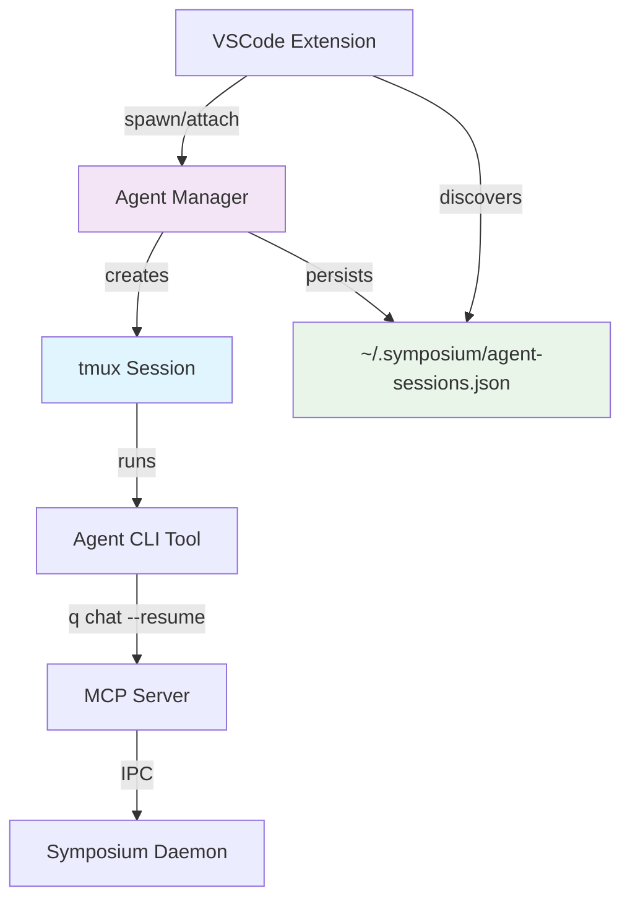

<!-- 

Instructions:

* Copy this file and give it a name like my-feature-slug.md
* Do not remove the `>` sections -- they are part of the template!
* Replace the HTML comments that give general guidance with your answers and content. Do not begin your answers with `>`, your text should be unquoted.
* For optional sections, you can leave the HTML comment as is if you do not wish to provide an answer.
* In the FAQ, begin each question with a markdown `##` section so that it gets a linkable anchor.

-->

# Elevator pitch

> What are you proposing to change?

Enable AI agents to run persistently in the background, surviving terminal disconnections and VSCode restarts. Agents would continue working on tasks asynchronously and can be attached/detached at will, similar to tmux sessions but with full integration into the Symposium ecosystem.

# Status quo

> How do things work today and what problems does this cause? Why would we change things?

Currently, AI agents (Q CLI, Claude Code) run synchronously in terminal sessions within VSCode. When the user:

- Closes VSCode → Agent dies, losing context and stopping work
- Terminal crashes → Agent dies, work is interrupted  
- Disconnects from SSH → Remote agents die
- Switches between projects → Must restart agents from scratch

This creates several problems:

- **No background work**: Agents can't continue tasks while user is away
- **Fragile sessions**: Any disconnection kills the agent and loses progress
- **Context loss**: Restarting agents means rebuilding understanding of the project
- **Poor multitasking**: Can't work on multiple projects simultaneously with persistent agents
- **SSH limitations**: Remote development is unreliable due to connection issues

The current synchronous model treats agents like traditional CLI tools, but AI agents are more like long-running services that benefit from persistence.

# What we propose to do about it

> What are you proposing to improve the situation? 

Implement a persistent agent system that:

1. **Wraps agents in tmux sessions** - Each agent runs in a dedicated tmux session that survives disconnections
2. **Provides session management** - Commands to spawn, list, attach, detach, and kill agent sessions
3. **Maintains agent metadata** - Track session state, working directories, and agent types
4. **Integrates with VSCode** - Seamless attach/detach from VSCode terminals
5. **Supports multiple agents** - Run different agents (Q CLI, Claude Code, etc.) simultaneously
6. **Preserves conversation history** - Agents maintain context across attach/detach cycles

The system builds on the existing tmux-based architecture we've already implemented, extending it with better lifecycle management and VSCode integration.

# Shiny future

> How will things will play out once this feature exists?

**Background work scenario:**
- User starts agent on a refactoring task, then goes to lunch
- Agent continues working, making commits and progress
- User returns, attaches to see what was accomplished
- Agent provides summary of work done while disconnected

**Multi-project workflow:**
- User has 3 projects with persistent agents running
- Switches between projects by attaching to different agent sessions
- Each agent maintains full context of its project
- No startup time or context rebuilding when switching

**Reliable remote development:**
- SSH connection drops during remote development
- Agent continues running on remote server
- User reconnects and reattaches to same agent session
- No work lost, agent picks up where it left off

**Collaborative handoffs:**
- Team member starts agent working on a feature
- Hands off session to another team member
- Second person attaches to same agent session
- Full context and conversation history preserved

# Implementation details and plan

> Tell me more about your implementation. What is your detailed implementaton plan? 

## Phase 1: Core Infrastructure ✅ (Completed)

- [x] Agent Manager with tmux session spawning
- [x] Session metadata persistence (`~/.symposium/agent-sessions.json`)
- [x] Basic lifecycle commands (spawn, list, attach, kill)
- [x] Status tracking and sync with tmux reality

## Phase 2: VSCode Integration (Current)

- [ ] **Seamless attach/detach from VSCode**
  - VSCode command to attach to persistent agent
  - Automatic terminal creation and tmux attach
  - Status indicators showing which agents are running
  
- [ ] **Agent discovery and selection**
  - UI to browse available persistent agents
  - Show agent status, working directory, last activity
  - Quick attach buttons in VSCode interface

- [ ] **Session lifecycle integration**
  - Spawn agents directly from VSCode taskspace creation
  - Automatic cleanup when projects are deleted
  - Handle agent crashes gracefully

## Phase 3: Enhanced Agent Experience

- [ ] **Conversation persistence improvements**
  - Ensure agents properly resume conversations in tmux
  - Handle conversation history across detach/attach cycles
  - Support for named conversations per agent

- [ ] **Background task queue**
  - Queue tasks for agents to work on while disconnected
  - Progress reporting and completion notifications
  - Integration with taskspace management

- [ ] **Multi-connection support**
  - Multiple users/terminals can connect to same agent
  - Shared conversation view and collaboration
  - Conflict resolution for simultaneous interactions

## Phase 4: Advanced Features

- [ ] **Custom pty manager** (Optional)
  - Replace tmux with custom Rust implementation
  - Better integration with Symposium ecosystem
  - More control over session lifecycle

- [ ] **Agent orchestration**
  - Coordinate multiple agents working on same project
  - Share context and results between agents
  - Hierarchical task delegation

## Technical Architecture

## Success Criteria

- [ ] Agents survive VSCode restarts and terminal disconnections
- [ ] Seamless attach/detach experience from VSCode
- [ ] Conversation history preserved across sessions
- [ ] Multiple agents can run simultaneously
- [ ] Background work continues when user is disconnected
- [ ] Reliable operation over SSH connections

# Frequently asked questions

> What questions have arisen over the course of authoring this document or during subsequent discussions? 

## What alternative approaches did you consider, and why did you settle on this one?

**Custom pty manager**: We considered building a custom pseudo-terminal manager in Rust instead of using tmux. While this would give us more control, tmux is battle-tested, widely available, and handles the complex edge cases of terminal management. We can always migrate to a custom solution later.

**Docker containers**: We explored running agents in containers for better isolation. However, this adds complexity around file system access, authentication tokens, and development tool integration. The direct execution model with tmux provides better compatibility with existing workflows.

**Background services**: We considered running agents as system services or daemons. This would provide persistence but loses the interactive terminal experience that's valuable for debugging and manual intervention.

## How does this interact with existing conversation history?

Agent CLI tools (Q CLI, Claude Code) already handle conversation persistence per working directory. The persistent agent system doesn't duplicate this - it relies on the agents' existing `--resume` functionality to restore conversation context when sessions are reattached.

## What happens if tmux isn't available?

The system gracefully degrades to the current synchronous behavior. Commands that require tmux will fail with clear error messages directing users to install tmux or use the synchronous mode.

## How do you handle agent crashes or hangs?

The Agent Manager syncs with tmux reality on startup and periodically, detecting crashed sessions and marking them appropriately. Users can kill hung sessions and spawn new ones. Future versions could include automatic restart policies and health monitoring.

## Can multiple people attach to the same agent session?

tmux natively supports multiple connections to the same session. However, this can lead to conflicts if multiple people try to interact with the agent simultaneously. Future versions could add coordination mechanisms or separate read-only observation modes.

# Revision history

- Initial draft: Created RFD based on existing implementation and planned enhancements
