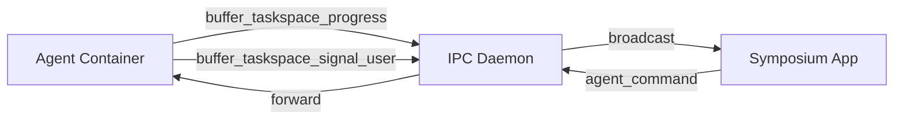
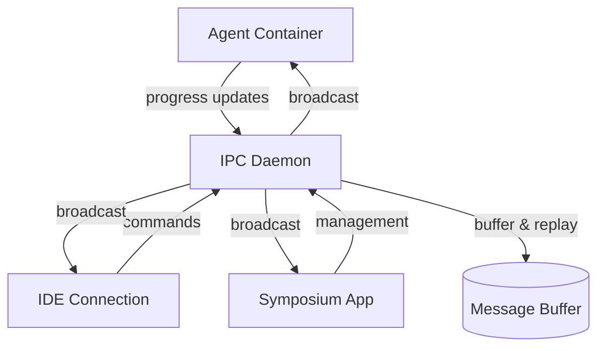

# Taskspace Architecture

This document describes the high-level architectural patterns and deployment models for Symposium taskspaces.

## Overview

A taskspace is an isolated work environment containing:
- **AI Agent**: Autonomous coding assistant (Claude Code, Q CLI, etc.)
- **Project Code**: The codebase being worked on  
- **Development Environment**: Tools, compilers, runtime dependencies
- **Communication Hub**: IPC coordination between components
- **Editor Interface**: IDE/terminal access for human collaboration

## System Components

The taskspace architecture is built from four main components, each detailed in dedicated architecture documents:

### [Agent Container](./architecture/agent-container.md)
Houses the AI agent with persistent session management:
- **Agent execution**: Claude Code/Q CLI in supervised tmux sessions
- **Session persistence**: Conversation history survives disconnections
- **SSH access**: Direct connection to agent conversation
- **Crash recovery**: Automatic restart with context preservation

### [Development Environment Container](./architecture/dev-container.md)  
Provides project-specific toolchain and IDE connectivity:
- **Language toolchains**: Auto-detected from project configuration
- **SSH access**: Remote IDE connectivity (VSCode, IntelliJ, etc.)
- **Development services**: Databases, web servers, testing frameworks
- **File system**: Shared project code with agent container

### [Container Orchestration](./architecture/orchestration.md)
Manages pod lifecycle, networking, and resource allocation:
- **Pod management**: Creation, startup coordination, health monitoring
- **Volume strategies**: Copy-on-write project storage, persistent agent state
- **Network coordination**: Port allocation, SSH configuration management
- **Resource management**: CPU, memory, storage limits and cleanup

### [IPC Communication Protocol](./architecture/ipc-protocol.md)
Enables reliable coordination between all components:
- **Message buffering**: Reliable delivery across reconnections using `buffer_` prefix
- **Request-response patterns**: Structured command/response flows
- **Connection management**: Client registration, heartbeat, automatic reconnection
- **Error handling**: Comprehensive error codes and recovery strategies

## Deployment Models

### Direct Execution Model
Components run with minimal containerization while maintaining architecture benefits:

**Agent Environment:**
- Agent and MCP server in container for isolation
- SSH access for both agent conversation and development
- Host file system access for familiar IDE workflow
- Container provides crash recovery and session persistence

**Development Environment:**  
- IDE connects directly to project files on host
- Development tools available in agent container
- Hybrid approach: containerized agent, direct file access

**Benefits:**
- Familiar development workflow (IDE opens local files)
- Minimal container overhead
- Agent isolation and crash recovery
- Easy transition to full containerization

### Containerized Execution Model  
Full container isolation with comprehensive development environment:

**Pod Architecture:**
- Agent container with tmux session management
- Development container with project toolchain
- Shared pod networking and volumes
- SSH access to both environments

**Multi-Editor Support:**
- VSCode Remote-SSH to development container
- Terminal SSH to agent container for conversation  
- Real-time collaboration: agent edits visible in IDE immediately
- Multiple connection types supported simultaneously

**Benefits:**
- Complete environment isolation
- Reproducible development environments
- Remote deployment capability
- Advanced resource management and scaling

## Configuration and Project Setup

### Project Discovery
Taskspaces automatically adapt to project requirements:

```bash
# Configuration priority order
1. Dockerfile                    # Explicit container definition
2. .devcontainer/devcontainer.json  # VSCode dev container config
3. Language detection            # package.json, Cargo.toml, etc.
4. Default environment           # Generic development container
```

### Taskspace Configuration
Each taskspace gets a host directory with complete configuration:

```
/tmp/symposium-{taskspace-id}/
├── config.yaml           # Agent and MCP server settings
├── project/              # Project code (git clone or mounted)
├── agent/
│   ├── auth/            # API keys, SSH credentials
│   ├── context/         # Collaboration patterns, project docs  
│   └── state/           # Persistent agent state, conversation history
└── containers/
    ├── agent.Dockerfile
    └── dev.Dockerfile
```

### Static Binary Deployment
The `symposium-mcp` static binary provides all coordination functionality:

**Multi-Role Binary:**
- **MCP Server**: Provides tools to agent (file ops, IDE integration, progress logging)
- **IPC Daemon**: Message buffering, broadcasting, connection management  
- **IPC Client**: Connection to parent Symposium coordination

**Deployment Benefits:**
- Single artifact to build, version, and distribute
- No runtime dependencies (MUSL static linking)
- Consistent behavior across deployment models
- Simplified container images

## Multi-Editor Connectivity Patterns

### SSH-Based Access
Both deployment models use SSH for multi-editor support:

```bash
# SSH configuration per taskspace
Host taskspace-abc123-dev
  HostName localhost
  Port 10001
  User developer
  
Host taskspace-abc123-agent
  HostName localhost  
  Port 10002
  User agent
```

### Editor Integration Examples

**VSCode Remote-SSH:**
- Connect to development container
- Full IDE experience with project files
- Integrated terminal, debugging, extensions

**Terminal Direct:**
- SSH to agent container
- Direct conversation with AI agent
- Watch agent work in real-time

**IntelliJ/RubyMine:**
- Remote development via SSH
- Language-specific toolchain in container
- Debugging and profiling support

## Communication Patterns

### Agent-Symposium Coordination


### Multi-Client Message Flow


## Scaling and Evolution Path

### Resource Management
- **Per-taskspace limits**: CPU, memory, storage quotas
- **Copy-on-write storage**: Efficient project file management
- **Automated cleanup**: Inactive taskspace removal
- **Resource monitoring**: Usage tracking and alerts

### Remote Deployment
The architecture supports natural progression to remote hosting:

1. **Local containers**: Development and testing
2. **Remote SSH hosts**: Same interface, different target
3. **Container orchestration**: Kubernetes, Docker Swarm
4. **Multi-tenant hosting**: Shared infrastructure, isolated taskspaces

### Agent Ecosystem Expansion
Foundation supports multiple agent types:

- **MCP-compatible agents**: Current focus (Claude Code, Q CLI)
- **ACP-compatible agents**: Future expansion via Agent Client Protocol
- **Custom agents**: Plugin architecture for specialized tools
- **Multi-agent coordination**: Agents collaborating on complex tasks

This architecture provides a robust foundation for AI-assisted development that scales from individual use to team collaboration and enterprise deployment.