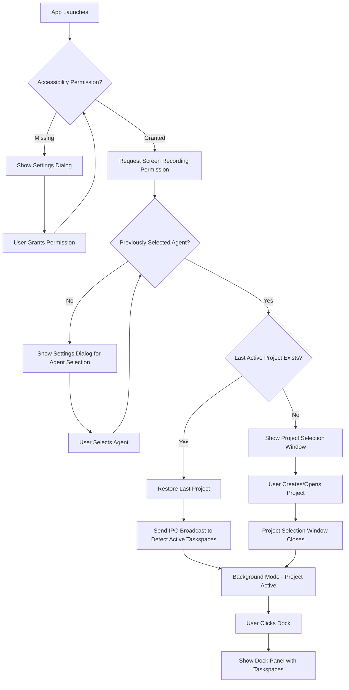
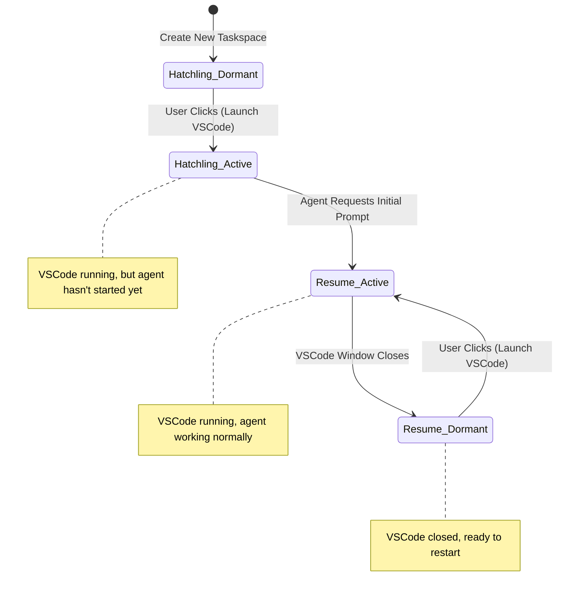

# Dock-Activated Taskspace Workflow

*Comprehensive design for the new dock-activated interface with dormant/active taskspace model*

## Overview

This document defines the complete user workflow for Symposium's dock-activated interface, replacing the current multi-window architecture with a single panel that appears on dock click and supports both single-project simplicity and intuitive taskspace state management.

## Core Principles

### Single Active Project
- Only one project is active at any time for simplicity
- Opening/creating a new project replaces the current active project
- Multi-project support is planned for future iterations

### Two-Dimensional Taskspace State
Taskspaces have two independent state dimensions:

**Runtime State** (Active/Dormant):
- **Active**: VSCode window is open and registered with Symposium
- **Dormant**: VSCode window is closed, taskspace is inactive
- Determined at runtime by IPC broadcast - taskspaces that respond are Active

**Persistent State** (Hatchling/Resume):
- **Hatchling**: Initial prompt hasn't been consumed by agent yet
- **Resume**: Initial prompt was used, agent should resume normally  
- Stored in `taskspace.json`, persists across app restarts

### Visual Representation
- **Live screenshot**: Active taskspace with existing screenshot
- **Greyed screenshot**: Dormant taskspace with existing screenshot
- **Placeholder image**: No screenshot exists (typically new/Hatchling taskspaces)

## Complete User Workflows

### App Startup Flow



### First-Time User Experience

**No Previous Projects:**
1. App startup completes → Project Selection Window appears automatically
2. Window shows "Create New Project" interface with:
   - Primary button: "Create New Project" → opens creation dialog
   - Secondary button: "Open Existing Project..." → opens file browser
3. User creates project → auto-creates first taskspace → immediately awakens it (launches VSCode)
4. Project Selection Window closes → app enters background mode with active project
5. User clicks dock → dock panel shows project with one active taskspace

### Project Management

**Project Creation:**
1. User clicks "Create New Project" → creation dialog appears
2. User fills name, Git URL, directory location
3. App creates project structure, clones repo
4. App auto-creates first taskspace (name: "New Taskspace", state: Hatchling)
5. App immediately awakens first taskspace (launches VSCode)
6. VSCode extension detects taskspace, requests initial prompt
7. Taskspace transitions: Hatchling → Resume, Dormant → Active
8. Dock panel shows project with active taskspace

**Project Opening:**
1. User clicks "Open Existing Project" in Project Selection Window → file browser opens
2. User selects .symposium directory
3. App loads project, replaces current active project (if any)
4. If previous project had active taskspaces → close their VSCode windows (with graceful cancellation)
5. Send IPC broadcast to detect active taskspaces in new project
6. Project Selection Window closes → app enters background mode with active project
7. User clicks dock → dock panel shows new project with mix of active/dormant taskspaces

**Project Closing:**
1. User has active project, clicks dock → dock panel appears with taskspaces
2. User clicks [X] button next to "Project: MyApp" in dock panel header
3. App identifies all active taskspaces and attempts to close their VSCode windows gracefully
4. If user cancels any VSCode "save changes" dialogs → abort project close operation
5. If all windows close successfully → project becomes inactive, dock panel disappears
6. Project Selection Window appears, ready for user to create/open different project

### Taskspace Lifecycle Management

#### State Transitions



#### Visual States

| State | Screenshot | Visual Appearance |
|-------|------------|------------------|
| Hatchling + Dormant | None | Placeholder image |
| Hatchling + Active | Being captured | Live preview (capturing) |
| Resume + Active | Exists | Live screenshot with updates |
| Resume + Dormant | Exists | Greyed out screenshot |

### Taskspace Interactions

**Awakening a Dormant Taskspace:**
1. User clicks dormant taskspace card in dock panel
2. Immediate visual feedback: loading spinner on card
3. App launches VSCode with taskspace directory as workspace
4. VSCode extension detects taskspace environment
5. Extension sends window registration message to app
6. App receives registration, associates window with taskspace
7. Taskspace transitions: Dormant → Active
8. Screenshot capture begins, card shows live preview
9. Loading spinner disappears, card fully active

**Taskspace Going Dormant:**
1. User closes VSCode window (or app force-closes it)
2. App detects window closure through system events
3. Taskspace transitions: Active → Dormant
4. Screenshot capture stops, last screenshot persists
5. Card appearance: screenshot greys out, indicates dormant state

**Creating New Taskspaces:**
1. User clicks "+" button in dock panel
2. App creates new taskspace directory (task-{UUID})
3. App clones project Git repo into taskspace
4. App creates taskspace.json with Hatchling state and default initial prompt
5. App immediately awakens new taskspace (launches VSCode)
6. New taskspace appears in dock panel, begins with placeholder then transitions to live

### Active/Dormant Detection System

**IPC Broadcast Protocol:**
```typescript
// Sent by Symposium app to all VSCode extensions
TaskspaceRollCall {
  type: "taskspace_roll_call",
  project_path: "/path/to/project.symposium",
  taskspace_uuids: ["uuid1", "uuid2", "uuid3"]
}

// Response from VSCode extensions for their active taskspaces
TaskspacePresent {
  type: "taskspace_present", 
  taskspace_uuid: "uuid1",
  window_title: "VSCode window title for registration"
}
```

**Detection Flow:**
1. App needs to determine active taskspaces (startup, project switch, manual refresh)
2. App sends `taskspace_roll_call` with all known taskspace UUIDs
3. VSCode extensions that are running in taskspace directories respond
4. App marks responding taskspaces as Active, others as Dormant
5. App updates dock panel visual states accordingly

### Window Management

**Graceful Window Closing:**
1. User initiates project switch or app quit
2. App identifies all VSCode windows for current project taskspaces
3. App attempts to close windows using `AXUIElementPerformAction(window, kAXCloseAction)`
4. App waits for windows to close (with timeout)
5. If user clicks "Cancel" in VSCode save dialogs → app cancels operation
6. If successful → taskspaces transition to Dormant, operation continues

**Window Association:**
- Uses existing window registration system (temporary title handshake)
- Maintains `[TaskspaceUUID: CGWindowID]` mapping for precise window management
- Supports both new window creation and existing window activation

## User Interface Design

### Two Distinct Interfaces

**Project Selection Window:**
- Traditional window that appears when no active project
- Handles project creation, opening, and lifecycle management
- Auto-appears on first launch or when current project is closed
- Standard window behaviors (minimize, close, resize)

**Dock Panel:**
- Only appears when there's an active project and dock icon is clicked
- Positioned near dock using smart positioning logic
- Auto-dismisses when clicked outside or dock clicked again
- Focused on taskspace management and interaction

### Project Selection Window Layout

**No Active Project State:**
```
┌──────────────────────────┐
│ Symposium                │ <- Window title
│ ──────────────────────── │
│                          │
│   Create New Project     │ <- Primary button
│                          │
│  Open Existing Project   │ <- Secondary button  
│                          │
│                          │
│ [Settings]               │ <- Settings access
└──────────────────────────┘
```

### Dock Panel Layout

**Active Project with Taskspaces:**
```
┌─────────────────────────┐
│ Project: MyApp      [X] │ <- Project header with close button
│ ─────────────────────── │
│                         │
│ ┌─────┐ New Taskspace   │ <- Active (live screenshot)
│ │ 📸  │ Working on auth  │
│ └─────┘ • Log 1         │
│         • Log 2         │
│ ─────────────────────── │
│                         │
│ ┌─────┐ API Routes      │ <- Dormant (grey screenshot)  
│ │ 📷  │ REST endpoints   │
│ └─────┘ (dormant)       │
│ ─────────────────────── │
│                         │
│ ┌─────┐ Database        │ <- Hatchling (placeholder)
│ │ 📝  │ Schema design    │
│ └─────┘ (not started)   │
│                         │
│ [+] New Taskspace       │ <- Create button
└─────────────────────────┘
```

**Panel Appearance and Behavior:**
- Default size: ~400px wide, ~600px tall (resizable)
- Compact design optimized for quick interactions
- Sidebar-style positioning (typically left side of screen)

### Interactive Elements

**Dock Panel Elements:**
- **Project header**: Shows project name with [X] close button
- **Taskspace cards**: Click to awaken dormant or focus active taskspaces
  - **Visual states**: Live/grey/placeholder screenshots with status indicators  
  - **Progress logs**: Show recent `log_progress` messages from agents
  - **Loading states**: Spinner during VSCode launch process
- **New taskspace button**: Creates and immediately awakens new taskspace

**Project Selection Window Elements:**
- **Create New Project**: Primary button opens project creation dialog
- **Open Existing Project**: Secondary button opens file browser for .symposium directories
- **Settings**: Access to permissions, agent selection, and preferences

## Technical Implementation Notes

### Screenshot Management
- **Storage**: `screenshot.png` in each taskspace directory
- **Capture timing**: Periodic capture during Active state (every 30 seconds)
- **Final capture**: One last screenshot when transitioning Active → Dormant
- **Memory management**: Cache cleanup when taskspaces go dormant

### State Persistence
- **Runtime state**: Only exists while Symposium is running
- **Persistent state**: Stored in `taskspace.json` files
- **Project state**: Remember last active project in app preferences
- **Panel preferences**: Remember panel size, position between uses

### Error Handling
- **Missing screenshots**: Graceful fallback to placeholder images
- **VSCode launch failures**: Clear error states, retry mechanisms
- **Window registration failures**: Automatic recovery via periodic roll calls
- **Permission issues**: Clear user guidance and recovery paths

## Migration from Current System

### Backward Compatibility
- Existing `.symposium` project directories work unchanged
- Existing `taskspace.json` files compatible (may need state field additions)
- Screenshot system builds on existing ScreenshotManager

### Architectural Changes
- **Remove**: WindowGroup-based multi-window project architecture  
- **Add**: NSPanel-based dock-activated interface for taskspace management
- **Add**: Dedicated project selection window for project lifecycle
- **Modify**: TaskspaceCard views for compact panel layout
- **Extend**: Project close functionality with graceful VSCode window cleanup

We'll implement the new dock-activated interface and migrate the existing functionality over to the new architecture.

## Success Metrics

### User Experience
- **Faster access**: Single dock click to see all project taskspaces
- **Cleaner desktop**: No persistent windows cluttering screen space
- **Intuitive interaction**: Clear visual states for taskspace status
- **Reliable state management**: Predictable active/dormant behavior

### Technical
- **Performance**: Responsive panel appearance/dismissal
- **Reliability**: Accurate active/dormant detection via IPC
- **Resource efficiency**: Screenshots only captured when needed
- **Error resilience**: Graceful handling of edge cases and failures

## Future Enhancements

### Multi-Project Support
- Project dropdown in dock panel when multiple projects are active
- Project switching without closing current project's taskspaces
- Project-specific preferences and state management

### Advanced Taskspace Features
- **Remote taskspaces**: Support for containerized development environments
- **Taskspace templates**: Pre-configured taskspace types for common workflows
- **Collaborative taskspaces**: Multiple users working in same taskspace context

### Enhanced Panel Features
- **Search/filter**: Quick taskspace finding in large projects
- **Keyboard shortcuts**: Power user access without mouse interaction
- **Contextual actions**: Right-click menus for advanced taskspace operations