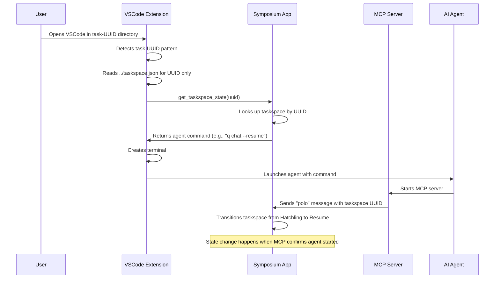

# Taskspace Bootup Flow

*How taskspaces automatically launch AI agents when VSCode opens*

## Overview

When a user opens VSCode in a taskspace directory, the Symposium extension automatically detects the environment and launches the appropriate AI agent. This flow bridges manual taskspace creation with AI agent activation.

## Flow Diagram



## Detailed Steps

### 1. VSCode Environment Detection

**Trigger**: VSCode extension activates in any workspace

**Process**:
- Extension checks if workspace directory matches `task-[UUID]` pattern
- If match found, looks for `../taskspace.json` file
- Reads only the `uuid` field from the JSON (ignores other metadata)

**Code Location**: `checkTaskspaceEnvironment()` in extension.ts

### 2. Taskspace State Query

**Message**: `get_taskspace_state`
**Payload**: `{ taskspaceUuid: string }`

**Extension sends**:
```json
{
  "type": "get_taskspace_state",
  "payload": { "taskspaceUuid": "550e8400-e29b-41d4-a716-446655440000" },
  "id": "message-uuid"
}
```

**App responds with**:
```json
{
  "type": "response", 
  "payload": {
    "success": true,
    "data": {
      "agentCommand": "q chat --resume",
      "shouldLaunch": true
    }
  },
  "id": "message-uuid"
}
```

### 3. Agent Launch Decision

**Symposium App Logic**:
- Looks up taskspace by UUID in current project
- If taskspace not found → `shouldLaunch: false`
- If taskspace in "Complete" state → `shouldLaunch: false` 
- If taskspace in "Hatchling" or "Resume" state → `shouldLaunch: true`
- Returns appropriate agent command based on:
  - User preferences (Q CLI vs Claude Code)
  - Taskspace state (fresh start vs resume)
  - Project-specific settings

**Agent Commands**:
- `q chat` - Fresh start for Hatchling taskspaces
- `q chat --resume` - Resume for existing taskspaces
- `claude-code` - Alternative agent
- Custom commands based on project configuration

### 4. Terminal Creation and Agent Launch

**Extension Process**:
- Creates new terminal with name "AI Agent - [Taskspace Name]"
- Sets working directory to the cloned repository
- Executes the agent command returned by app
- Sends initial prompt if taskspace is in Hatchling state

### 5. MCP Server Registration

**Agent Process**:
- AI agent starts and initializes MCP server
- MCP server connects to Symposium daemon via IPC
- MCP server sends "polo" message including taskspace UUID

**Polo Message**:
```json
{
  "type": "polo",
  "payload": { 
    "taskspaceUuid": "550e8400-e29b-41d4-a716-446655440000"
  },
  "shellPid": 12345
}
```

### 6. State Transition

**Symposium App Logic**:
- Receives "polo" message with taskspace UUID
- Confirms MCP server is associated with known taskspace
- Transitions taskspace state from "Hatchling" to "Resume"
- Updates taskspace.json metadata
- Refreshes UI to show active taskspace

## Key Design Principles

### Minimal Extension Logic
- Extension only reads UUID, doesn't interpret taskspace metadata
- All business logic stays in Symposium app
- Extension focuses on VSCode integration only

### App-Controlled Agent Selection
- Symposium app decides which agent to launch
- Supports user preferences and project-specific settings
- Can evolve agent selection logic without extension changes

### Confirmation-Based State Transitions
- State changes only when MCP server confirms successful startup
- Prevents orphaned taskspaces from failed agent launches
- Provides reliable feedback about agent status

### Graceful Failure Handling
- Unknown taskspace UUIDs → no agent launch
- Completed taskspaces → no agent launch  
- Failed agent startup → taskspace remains in previous state
- Network issues → falls back to default behavior

## Error Scenarios

### Taskspace Not Found
- App doesn't recognize the taskspace UUID
- Response: `shouldLaunch: false`
- Extension: No agent launched, logs warning

### Agent Launch Failure
- Terminal creation succeeds but agent command fails
- No "polo" message received within timeout
- Taskspace remains in previous state
- User can manually retry or investigate

### IPC Communication Failure
- Extension can't reach Symposium app
- Falls back to default agent command (`q chat`)
- Logs error for debugging

### Corrupted Taskspace Metadata
- taskspace.json is malformed or missing UUID
- Extension skips taskspace detection
- Behaves like normal VSCode workspace

## Future Enhancements

### Smarter UUID Discovery
- Could embed UUID in VSCode workspace settings
- Reduces file system dependency
- Enables taskspace detection in renamed directories

### Agent Health Monitoring
- Periodic "ping" messages between MCP server and app
- Automatic restart of failed agents
- UI indicators for agent status

### Multi-Agent Support
- Single taskspace could run multiple agents
- Coordination between different AI tools
- Specialized agents for different tasks

## Implementation Status

- ✅ VSCode environment detection
- ✅ UUID extraction from taskspace.json
- 🚧 IPC message sending (basic implementation)
- ❌ App-side taskspace lookup and agent selection
- ❌ Response handling in extension
- ❌ MCP server polo message with taskspace UUID
- ❌ State transition logic in app

## Related Documentation

- [Implementation Plan](./implementation-plan.md) - Overall MVP roadmap
- [Interface Plan](./interface-plan.md) - UI design for taskspace display
- [MCP Tools](../../design/mcp-tools/taskspace-orchestration.md) - Agent-side tools
