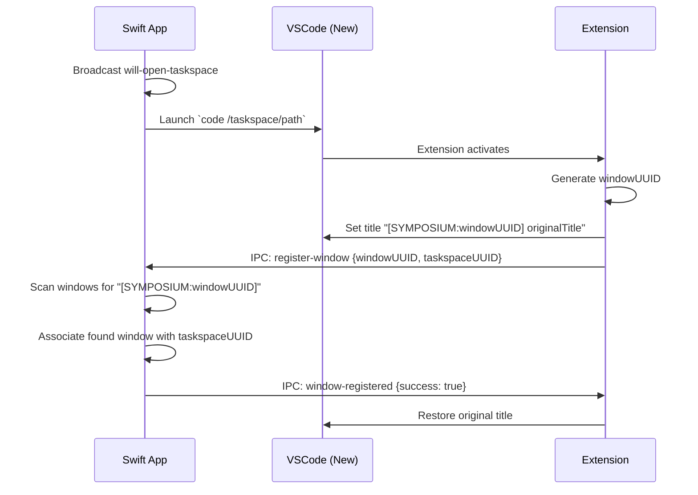
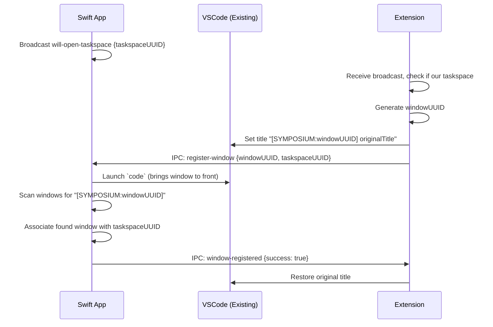

# Window Registration Design for MVP

## Problem Statement

Reliably associating VSCode windows with Symposium taskspaces is challenging due to:

1. **Process tracking fragility**: In VSCode, all windows have the same process ID.
2. **AXObserver limitations**: macOS window creation notifications have serious reliability issues and timing constraints
3. **VSCode sandbox**: Extensions cannot access native window handles or system-level window identifiers
4. **Timing races**: When launching `code`, it's unpredictable whether a new window opens or an existing window is brought to front. We also want to be robust to the case where people have opened a VSCode window to the directory already.

## Solution: Window Title Handshake

Use VSCode's `window.title` configuration API to perform a temporary handshake that enables reliable window correlation.

### Core Approach

1. **Temporary title modification**: Extension briefly sets window title to include unique identifier
2. **IPC coordination**: Extension notifies Swift app of the identifier via IPC message
3. **Window scanning**: Swift app finds window by scanning titles for the identifier
4. **Title restoration**: Extension restores original title after successful registration

### Key Benefits

- **Reliable correlation**: Unique identifiers eliminate ambiguity
- **Timing robust**: Works whether window pre-exists or is newly created
- **User-friendly**: Temporary title changes are invisible to users
- **Sandbox compatible**: Uses only standard VSCode extension APIs

## Detailed Flow

### Scenario 1: New Window Launch



### Scenario 2: Existing Window



## IPC Message Protocol

### New Message Types

```typescript
// Broadcast message (fire-and-forget)
WillOpenTaskspacePayload {
  taskspace_uuid: string
}

// Request/response pair
RegisterWindowPayload {
  window_uuid: string,
  taskspace_uuid: string
}

WindowRegisteredPayload {
  success: boolean,
  error?: string
}
```

### Message Routing

- **will-open-taskspace**: Broadcast to all listening extensions
- **register-window**: Sent from extension to Swift app
- **window-registered**: Response from Swift app to extension

## Implementation Details

### Extension Side

```typescript
class WindowRegistration {
  private originalTitle: string;
  private registrationTimeout: NodeJS.Timeout;

  async doWindowRegistration() {
    const windowUUID = crypto.randomUUID();
    const taskspaceUUID = this.detectTaskspaceUUID();
    
    // Store original title
    const config = vscode.workspace.getConfiguration();
    this.originalTitle = config.get<string>('window.title') || '';
    
    // Set temporary title
    await config.update('window.title', 
      `[SYMPOSIUM:${windowUUID}] ${this.originalTitle}`, 
      vscode.ConfigurationTarget.Workspace);
    
    // Send registration message
    this.sendIPC({
      type: 'register-window',
      window_uuid: windowUUID,
      taskspace_uuid: taskspaceUUID
    });
    
    // Set timeout to restore title if no response
    this.registrationTimeout = setTimeout(() => {
      this.restoreTitle();
    }, 5000);
  }

  onWindowRegistered(response: WindowRegisteredPayload) {
    clearTimeout(this.registrationTimeout);
    this.restoreTitle();
  }

  private async restoreTitle() {
    const config = vscode.workspace.getConfiguration();
    await config.update('window.title', this.originalTitle, 
      vscode.ConfigurationTarget.Workspace);
  }
}
```

### Swift App Side

```swift
func handleRegisterWindow(_ payload: RegisterWindowPayload) {
    let windowTitle = "[SYMPOSIUM:\(payload.windowUuid)]"
    
    // Scan all windows for the title
    if let window = findWindowByTitle(containing: windowTitle) {
        // Associate window with taskspace
        taskspaceWindows[payload.taskspaceUuid] = window
        
        // Respond with success
        sendIPC(WindowRegisteredPayload(success: true))
    } else {
        // Window not found - could retry or fail
        sendIPC(WindowRegisteredPayload(success: false, error: "Window not found"))
    }
}

func openTaskspace(_ taskspace: Taskspace) {
    // Broadcast intent
    broadcastIPC(WillOpenTaskspacePayload(taskspaceUuid: taskspace.uuid))
    
    // Launch VSCode
    launchCode(taskspace.directoryPath)
}
```

## Edge Cases and Error Handling

### Timeout Handling
- **Extension timeout**: 5 second timeout to restore title if no response
- **Swift app timeout**: Could implement retry logic if window not found immediately

### Duplicate Registration
- **Harmless duplicates**: Multiple registrations for same taskspace are safe
- **Extension triggers**: Both activation and will-open-taskspace can trigger registration

### Window Not Found
- **Retry logic**: Swift app could retry window scanning after brief delay
- **Fallback**: Extension restores title and logs error

### Re-registration Support
- **Manual trigger**: "Re-register windows" button in Swift app
- **Broadcast approach**: Send will-open-taskspace for each active taskspace
- **Bulk operation**: All listening extensions re-register simultaneously

## Integration with Existing MVP

### Current State
- Taskspaces launch VSCode via `code` command
- Extensions detect taskspace directories and launch AI agents
- No reliable window association currently exists

### Required Changes

1. **MCP Server**: Add IPC message types for window registration
2. **VSCode Extension**: Implement window registration logic and broadcast listening
3. **Swift App**: Add window scanning and association logic
4. **UI**: Add "Re-register windows" button for manual recovery

### Backward Compatibility
- Existing taskspaces continue to work without window association
- Window registration is additive - doesn't break existing functionality
- Graceful degradation if registration fails

## Future Enhancements

### Multiple Windows per Taskspace
- Current design supports one window per taskspace
- Could extend to register multiple windows with same taskspace UUID
- Would require additional UI to distinguish between windows

### Window State Persistence
- Could store window positions/sizes in taskspace.json
- Restore window layout when re-opening taskspaces
- Integrate with existing tiling functionality

### Cross-Platform Support
- Window title approach works on all platforms VSCode supports
- Platform-specific window enumeration (macOS CGWindow, Windows HWND, Linux X11)
- Consistent IPC protocol across platforms

## Success Criteria

Window registration is successful when:
- [x] VSCode windows can be reliably associated with taskspace UUIDs
- [x] Association works for both new and existing windows
- [x] User never sees temporary title modifications
- [x] System gracefully handles registration failures
- [x] Manual re-registration provides recovery mechanism
- [x] Integration doesn't disrupt existing taskspace functionality
