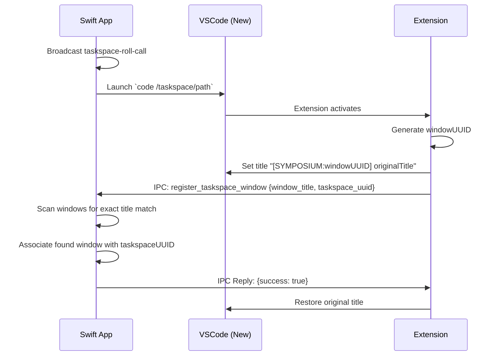
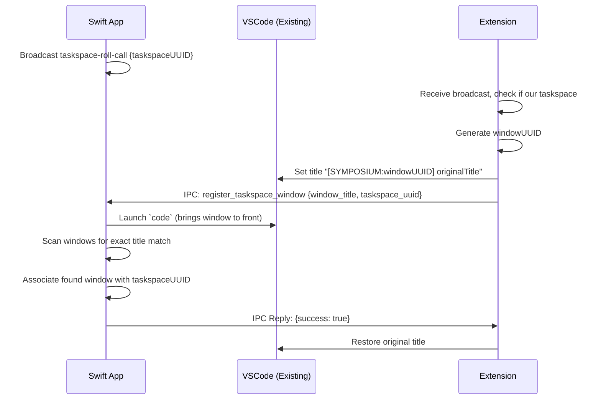

# Window Registration Design for MVP

## Problem Statement

Reliably associating VSCode windows with Symposium taskspaces is challenging due to:

1. **Process tracking fragility**: In VSCode, all windows have the same process ID.
2. **AXObserver limitations**: macOS window creation notifications have serious reliability issues and timing constraints
3. **VSCode sandbox**: Extensions cannot access native window handles or system-level window identifiers
4. **Timing races**: When launching `code`, it's unpredictable whether a new window opens or an existing window is brought to front. We also want to be robust to the case where people have opened a VSCode window to the directory already.

## Solution: Window Title Handshake

Use VSCode's `window.title` configuration API to perform a temporary handshake that enables reliable window correlation.

### Core Approach

1. **Temporary title modification**: Extension briefly sets window title to include unique identifier
2. **IPC coordination**: Extension notifies Swift app of the identifier via IPC message
3. **Window scanning**: Swift app finds window by scanning titles for the identifier
4. **Title restoration**: Extension restores original title after successful registration

### Key Benefits

- **Reliable correlation**: Unique identifiers eliminate ambiguity
- **Timing robust**: Works whether window pre-exists or is newly created
- **User-friendly**: Temporary title changes are invisible to users
- **Sandbox compatible**: Uses only standard VSCode extension APIs

## Detailed Flow

### Scenario 1: New Window Launch



### Scenario 2: Existing Window



## IPC Message Protocol

### Direct Extension-to-Swift App Communication

Window registration uses direct IPC between the VSCode extension and Swift app, bypassing the MCP server entirely.

```typescript
// Message sent by VSCode extension to Swift app
RegisterTaskspaceWindowPayload {
  window_title: string,      // Full window title including unique identifier
  taskspace_uuid: string     // UUID of the taskspace to associate
}

// Reply sent by Swift app back to extension
IpcReply {
  success: boolean,
  error?: string
}
```

### Message Flow

1. **Extension**: Generate `windowUUID`, set title to `[SYMPOSIUM:${windowUUID}] ${originalTitle}`
2. **Extension**: Send `register_taskspace_window` message directly to Swift app
3. **Swift App**: Search for window with exact title match
4. **Swift App**: Reply directly to extension with success/failure
5. **Extension**: Receive reply, restore original title

## Implementation Details

### Extension Side

```typescript
class WindowRegistration {
  private originalTitle: string;
  private registrationTimeout: NodeJS.Timeout;

  async doWindowRegistration() {
    const windowUUID = crypto.randomUUID();
    const taskspaceUUID = this.detectTaskspaceUUID();
    
    // Store original title
    const config = vscode.workspace.getConfiguration();
    this.originalTitle = config.get<string>('window.title') || '';
    
    // Set temporary title
    const tempTitle = `[SYMPOSIUM:${windowUUID}] ${this.originalTitle}`;
    await config.update('window.title', tempTitle, 
      vscode.ConfigurationTarget.Workspace);
    
    // Send registration message
    this.sendIPC({
      type: 'register_taskspace_window',
      window_title: tempTitle,
      taskspace_uuid: taskspaceUUID
    });
    
    // Set timeout to restore title if no response
    this.registrationTimeout = setTimeout(() => {
      this.restoreTitle();
    }, 5000);
  }

  onWindowRegistered(response: IpcReply) {
    clearTimeout(this.registrationTimeout);
    this.restoreTitle();
  }

  private async restoreTitle() {
    const config = vscode.workspace.getConfiguration();
    await config.update('window.title', this.originalTitle, 
      vscode.ConfigurationTarget.Workspace);
  }
}
```

### Swift App Side

```swift
func handleRegisterTaskspaceWindow(_ payload: RegisterTaskspaceWindowPayload) {
    // Search for window with exact title match
    if let window = findWindowByTitle(exact: payload.windowTitle) {
        // Associate window with taskspace
        taskspaceWindows[payload.taskspaceUuid] = window
        
        // Respond with success
        sendIPC(IpcReply(success: true))
    } else {
        // Window not found
        sendIPC(IpcReply(success: false, error: "Window not found"))
    }
}

func openTaskspace(_ taskspace: Taskspace) {
    // Broadcast intent
    broadcastIPC(WillOpenTaskspacePayload(taskspaceUuid: taskspace.uuid))
    
    // Launch VSCode
    launchCode(taskspace.directoryPath)
}

// Periodic recovery for unregistered taskspaces
func startPeriodicWindowRecovery() {
    Timer.scheduledTimer(withTimeInterval: 30.0, repeats: true) { _ in
        for taskspace in currentProject?.taskspaces ?? [] {
            if taskspaceWindows[taskspace.uuid] == nil {
                // No window registered - broadcast to trigger re-registration
                broadcastIPC(WillOpenTaskspacePayload(taskspaceUuid: taskspace.uuid))
            }
        }
    }
}
```

## Edge Cases and Error Handling

### Timeout Handling
- **Extension timeout**: 5 second timeout to restore title if no response
- **Swift app timeout**: Could implement retry logic if window not found immediately

### Duplicate Registration
- **Harmless duplicates**: Multiple registrations for same taskspace are safe
- **Extension triggers**: Both activation and taskspace-roll-call can trigger registration

### Automatic Recovery
- **Periodic broadcasts**: Swift app periodically (every 30 seconds) sends `taskspace-roll-call` for taskspaces with no associated windows
- **Self-healing**: Extensions automatically re-register when they receive broadcasts for their taskspace
- **Robust to failures**: System recovers from VSCode crashes, extension reloads, or missed registrations

### Re-registration Support
- **Manual trigger**: "Re-register windows" button in Swift app
- **Broadcast approach**: Send taskspace-roll-call for each active taskspace
- **Bulk operation**: All listening extensions re-register simultaneously

## Integration with Existing MVP

### Current State
- Taskspaces launch VSCode via `code` command
- Extensions detect taskspace directories and launch AI agents
- No reliable window association currently exists

### Required Changes

1. **VSCode Extension**: Implement window registration logic and broadcast listening
2. **Swift App**: Add `register_taskspace_window` message handling, window scanning with exact title matching, and association logic
3. **UI**: Add "Re-register windows" button for manual recovery

### Backward Compatibility
- Existing taskspaces continue to work without window association
- Window registration is additive - doesn't break existing functionality
- Graceful degradation if registration fails

## Future Enhancements

### Multiple Windows per Taskspace
- Current design supports one window per taskspace
- Could extend to register multiple windows with same taskspace UUID
- Would require additional UI to distinguish between windows

### Window State Persistence
- Could store window positions/sizes in taskspace.json
- Restore window layout when re-opening taskspaces
- Integrate with existing tiling functionality

### Cross-Platform Support
- Window title approach works on all platforms VSCode supports
- Platform-specific window enumeration (macOS CGWindow, Windows HWND, Linux X11)
- Consistent IPC protocol across platforms

## Success Criteria

Window registration is successful when:
- [x] VSCode windows can be reliably associated with taskspace UUIDs
- [x] Association works for both new and existing windows
- [x] User never sees temporary title modifications
- [x] System gracefully handles registration failures
- [x] Manual re-registration provides recovery mechanism
- [x] Integration doesn't disrupt existing taskspace functionality

**Status**: ✅ COMPLETE - Window registration system fully implemented and working with screenshot capture.
