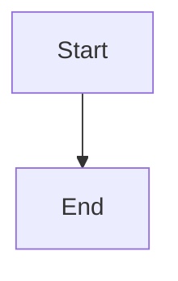

# Triple-Tickification: Converting XML to Markdown Code Blocks

## Overview

Converting walkthrough XML elements to markdown code block syntax to fix parsing issues and improve developer experience.

## Problem

The original XML syntax for walkthrough elements had parsing issues:
- Blank lines inside `<mermaid>` tags caused markdown parser to split content into separate elements
- XML syntax felt unnatural for developers writing markdown
- Mermaid diagrams would "escape" their proper containers during rendering

## Solution

Replace XML elements with markdown code blocks using triple-tick syntax:

### Current XML Syntax
```xml
<mermaid>
flowchart TD
    A[Start] --> B[End]
</mermaid>

<comment location="findDefinition('foo')" icon="lightbulb">
This explains the foo function
</comment>

<gitdiff range="HEAD~2..HEAD" />

<action button="Run tests">
Should we run the test suite now?
</action>
```

### New Code Block Syntax
````markdown


```comment(location="findDefinition('foo')", icon="lightbulb")
This explains the foo function
```

```gitdiff(range="HEAD~2..HEAD")
```

```action(button="Run tests")
Should we run the test suite now?
```
````

## Implementation Progress

### ✅ Completed
- [x] **Mermaid support** (commit 9a842ba)
  - Added code block processing to walkthrough parser
  - Handles `mermaid` language in fenced code blocks
  - Preserves content exactly as-is (no more blank line issues)
  - Added test coverage
  - Verified end-to-end functionality

- [x] **Generic parameter parser** (commit 499c574)
  - Parse `identifier(param1="value1", param2="value2")` syntax
  - Support for mermaid, comment, gitdiff, action identifiers
  - Robust parameter parsing with quote handling
  - Boolean flag support (exclude-unstaged, exclude-staged)
  - Comprehensive test coverage for parser functionality

- [x] **Comment support** (commit 499c574)
  - Parse `comment(location="...", icon="...")` syntax
  - Extract parameters from function-call style syntax
  - Generate appropriate HTML output
  - End-to-end testing verified

- [x] **GitDiff support** (commit 29d7e40)
  - Parse `gitdiff(range="...", exclude-unstaged, exclude-staged)` syntax
  - Handle boolean flags in parameter list
  - Generate gitdiff HTML containers
  - Test coverage complete

- [x] **Action support** (commit 29d7e40)
  - Parse `action(button="...")` syntax
  - Generate interactive button HTML
  - Full functionality verified

- [x] **Clean break implementation** (commit 01d11b5)
  - Removed all XML element detection and parsing
  - Disabled XML processing completely
  - All code block tests passing (6/6)
  - Only code block syntax supported now

### 🚧 In Progress
- [ ] **Documentation updates**
  - Update walkthrough format documentation
  - Update examples in guidance files
  - Update any remaining XML references

### 📋 Planned
- [ ] **Test cleanup**
  - Remove old XML test infrastructure
  - Clean up unused XML parsing methods
  - Remove XML-related imports if unused

### 🔄 Migration Strategy
- ✅ Clean break approach implemented
- ✅ Each element type implemented in separate commits
- ✅ All functionality working with new syntax
- 🚧 Update documentation and examples
- 📋 Final cleanup of old code

## Technical Details

### Parser Architecture
- Modified `process_events_sequentially()` to handle `Event::Start(Tag::CodeBlock(_))`
- Added `is_special_code_block()` to detect our custom languages
- Added `process_code_block()` to handle content extraction and HTML generation
- Reuses existing XML element structures and resolution logic

### Parameter Parsing
Using function-call syntax: `element(param1="value1", param2="value2")`
- More familiar to developers than XML attributes
- Easier to parse than MyST-style directives
- Consistent with programming language conventions

## Testing
- Unit tests for each element type
- End-to-end walkthrough tests
- Verify rendering in VSCode webview

## Next Steps
1. Implement comment code block support
2. Implement gitdiff code block support  
3. Implement action code block support
4. Update documentation and examples
5. Remove old XML processing code (if desired)
