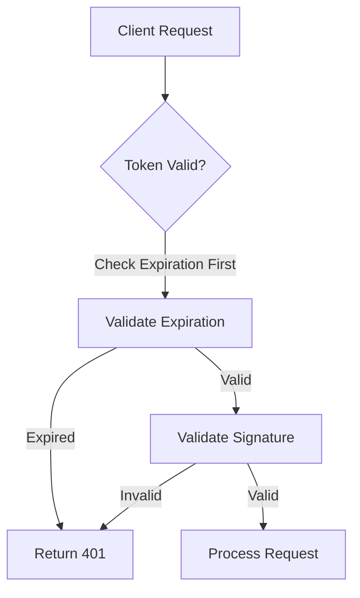
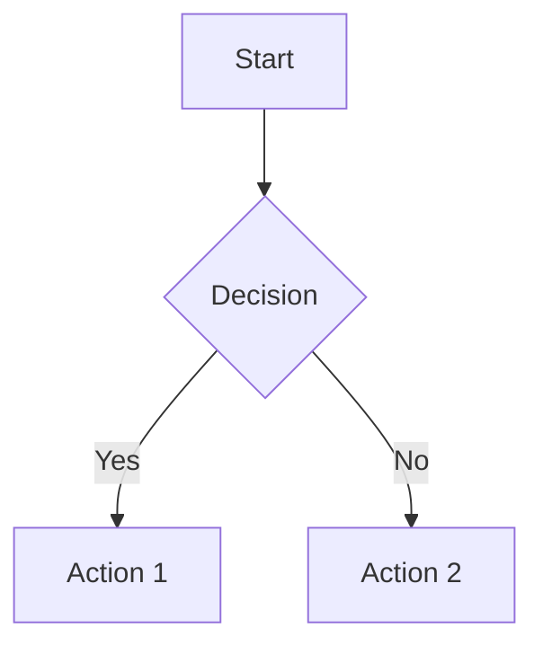

# Walkthrough Format Specification

*This chapter defines the markdown+code block format for code walkthroughs.*

# Symposium references

Whenever the user sends you a message that includes an XML `<symposium-ref/>` element, you SHOULD use the `expand_reference` tool with the contents of the `id` attribute to determine what it means.

## Example Walkthrough

Here's a complete walkthrough showing the authentication system changes:

```markdown
# Authentication System Updates

We've refactored the token validation system to improve performance and security.

## System architecture

The new validation architecture works as follows:



## Key Changes

The main improvement is in how we handle token expiration:

```comment
location: findDefinition(`validateToken`)
icon: lightbulb

This function now checks expiration before signature validation. This avoids expensive 
cryptographic operations on tokens that are already expired.
```

We also updated the login flow to use shorter-lived tokens by default:

```comment
location: search(`src/auth.rs`, `async fn login`)

The default token lifetime is now 1 hour instead of 24 hours. Users can still 
request longer-lived tokens through the `remember_me` parameter.
```

## What Changed

Here are all the files that were modified:

```gitdiff
range: HEAD~2..HEAD
```

## Next Steps

```action
button: Test the changes

Run the authentication test suite to verify the changes work correctly.
```

```action
button: Update documentation

The API documentation needs to reflect the new default token lifetime.
```
```

This walkthrough combines regular markdown with specialized code block elements: `mermaid`, `comment`, `gitdiff`, and `action`.

## Code Block Elements

### Mermaid

Render mermaid graphs and diagrams to visualize architecture, flows, or relationships:



**Use when:** Explaining system architecture, data flow, or complex relationships that benefit from visual representation.

### Comments

Place contextual comments at specific code locations to highlight important details, decisions, or areas needing attention. Users can "reply" to comments using the GUI and have those messages forwarded to you in the chat.

```comment
location: DIALECT_EXPRESSION
icon: question

Markdown content explaining this code location.
Can include **formatting** and [links](https://example.com).
```

**Parameters:**
- `location` (required) - expression that resolves to code location(s). Common examples:
  - `findDefinition("validateToken")` -- definition of a function/class/variable
  - `findReferences("User")` -- all references to a symbol
  - `search("src/auth.rs", "impl.*Token")` -- regex search in specific file
  - `search("src", "\s*fn login")` -- search directory `src` for regex `\s*fn login` in all files (respects gitignore)
  - `search("src", "\s*fn login", ".rs")` -- search directory for regex `\s*fn login` in `.rs` files(respects gitignore)
  - `lines("src/auth.rs", 42, 45)` -- specific line range (use sparingly, prefer search)
- `icon` (optional) - VSCode codicon name (e.g., `question`, `lightbulb`, `warning`)

**Content:** Markdown text explaining the code, highlighting decisions, or noting areas for review.

**Use when:** 
- Explaining complex logic or algorithms
- Highlighting important design decisions
- Pointing out areas you were uncertain about how to do something, areas where you see potential flaws, or areas where you deviated from the plan
- Pointing out "// TODO" items and other placeholders

### Git Diffs

Embed git diffs showing code changes:

```gitdiff
range: HEAD~2..HEAD
```

```gitdiff
range: abc123
exclude_unstaged: true
exclude_staged: true
```

**Parameters:**
- `range` (required) - Git commit range or single commit
- `exclude_unstaged` (optional) - Exclude unstaged changes when range includes HEAD
- `exclude_staged` (optional) - Exclude staged changes when range includes HEAD

**Use when:** The most common use is to show the code that you recently authored. Keep ranges focused on the commits that you created in this case. Can also be used when discussing gitdiffs for any other reason.

### Actions

Provide interactive buttons for user actions:

```action
button: Fix the validation logic

How should I handle expired tokens differently?
```

**Parameters:**
- `button` (required) - Text displayed on the button

**Content:** Message sent to AI assistant when button is clicked

**Use when:** 
- Suggesting next steps or follow-up tasks
- Offering to help with related work
- Providing quick access to common questions
- **Not for:** Simple navigation (use comments with links instead)

## Location Expressions

Expressions in `location` parameters target specific code locations. Here are the main functions:

### Symbol-based targeting
```markdown
<!-- Find where a symbol is defined -->
```comment
location: findDefinition(`MyClass`)
```

<!-- Find all references to a symbol -->
```comment
location: findReferences(`validateToken`)
```
```

### Search-based targeting
```markdown
<!-- Search specific file for pattern -->
```comment
location: search(`src/auth.rs`, `async fn`)
```

<!-- Search directory for pattern in specific file types -->
```comment
location: search(`src`, `struct.*User`, `.rs`)
```

<!-- Search all files in directory -->
```comment
location: search(`tests`, `#\[test\]`)
```
```

### Line-based targeting
```markdown
<!-- Target specific line range (use sparingly) -->
```comment
location: lines(`src/main.rs`, 10, 15)
```
```

**Best practices:**
- Prefer `search()` over `lines()` - more resilient to code changes
- Use specific patterns in search to avoid too many matches
- Test expressions to ensure they find the intended locations
- If multiple matches, users will get a disambiguation dialog

## Content Guidelines

### Effective Comments
**Good comments:**
- Explain *why* something was implemented this way
- Highlight non-obvious design decisions
- Point out potential gotchas or edge cases
- Provide context that helps understand the broader system

**Avoid:**
- Simply describing what the code does (code should be self-documenting)
- Repeating information obvious from variable/function names
- Generic praise ("This is good code")

### Walkthrough Structure
**Recommended flow:**
1. **Introduction** - Brief overview of what changed and why
2. **Architecture/Overview** - Mermaid diagrams for complex changes
3. **Key Changes** - Comments on the most important modifications
4. **Supporting Changes** - Git diffs and additional context
5. **Next Steps** - Actions for follow-up work

### When to Use Each Element
- **Mermaid:** Complex systems, data flows, state machines
- **Comments:** Specific code explanations, design decisions, review points
- **Git diffs:** Showing scope of changes, file-level context
- **Actions:** Next steps, follow-up questions, related tasks

### Anti-Patterns to Avoid

**Comments:**
- Don't comment obvious code: `<comment>This function returns a string</comment>`
- Don't use for simple navigation: Use direct links instead of comment buttons
- Don't create comments without specific location targeting

**Git diffs:**
- Don't include massive commit ranges that overwhelm users
- Don't show diffs for unrelated changes mixed together
- Don't use gitdiff when a simple file link would suffice

**Actions:**
- Don't create actions for information that should be in comments
- Don't use vague button text like "Continue" or "Next"
- Don't create actions that don't provide useful context to the AI

**Mermaid:**
- Don't use diagrams for simple linear processes
- Don't create overly complex diagrams that are hard to read
- Don't use mermaid when a simple list would be clearer

## Error Handling and Recovery

### Expression Failures
When expressions in `location` attributes fail:

- **Invalid syntax** - The error message should indicate the problem
- **No matches found** - Try broader search patterns, verify file paths, or remove the extension from the search (it is optional)
- **File not found** - Verify paths are relative to project root

**Recovery patterns:**
```xml
<!-- If specific search fails, try broader pattern -->
<comment location="search(`src/auth.rs`, `validateToken`)">
<!-- Fallback: <comment location="search(`src`, `validateToken`, `.rs`)"> -->
```

### Performance Considerations

**For large codebases:**
- Use specific file paths rather than directory-wide searches
- Prefer symbol-based targeting over regex when possible
- Limit search scope with file extensions
- Avoid overly broad patterns that match many files

**Examples:**
```xml
<!-- Good: Specific and targeted -->
<comment location="search(`src/auth/mod.rs`, `pub fn login`)">

<!-- Avoid: Too broad, may be slow -->
<comment location="search(`src`, `.*`, `.rs`)">
```

### Tool Orchestration Patterns

**Progressive disclosure approach:**
1. Start with `ide_operation` to find locations
2. Use `fs_read` to examine specific files
3. Create walkthrough with targeted comments

**Example workflow:**
```
1. ide_operation: findDefinitions("User") 
2. fs_read: Read the found files to understand structure
3. present_walkthrough: Create walkthrough with specific comments
```

**When to combine tools:**
- **Code analysis**: `ide_operation` + `fs_read` for comprehensive understanding
- **Documentation**: `fs_read` + `present_walkthrough` for explaining existing code
- **Debugging**: `ide_operation` to trace references, then targeted comments

## Troubleshooting

### Common Issues

**"No locations found" for comments:**
- Verify file paths are correct and relative to project root
- Check that search patterns match actual code syntax
- Try simpler patterns first, then add complexity

**Walkthrough not displaying properly:**
- Ensure all XML elements are properly closed
- Check that Dialect expressions use correct quoting (backticks recommended)
- Verify mermaid syntax is valid

**Performance issues:**
- Reduce search scope by specifying file extensions
- Use more specific search patterns
- Avoid searching entire directories when possible

**Action buttons not working:**
- Ensure button text is descriptive and clear
- Keep action messages concise and specific
- Test that actions provide useful context to continue conversation

### Best Practices Summary

**Do:**
- Start with simple, targeted searches
- Use descriptive button text and comment content
- Test Dialect expressions before including in walkthroughs
- Provide context in comments about your reasoning and decisions
- Use mermaid diagrams for complex architectural explanations

**Don't:**
- Use overly broad search patterns in large codebases
- Create comments that just describe what code does
- Forget to include gitdiff ranges for code you recently authored
- Use line-based targeting unless absolutely necessary

**Progressive approach:**
1. **Simple walkthrough** - Basic structure with gitdiff and a few key comments
2. **Enhanced walkthrough** - Add mermaid diagrams and more detailed comments  
3. **Interactive walkthrough** - Include action buttons for follow-up tasks
