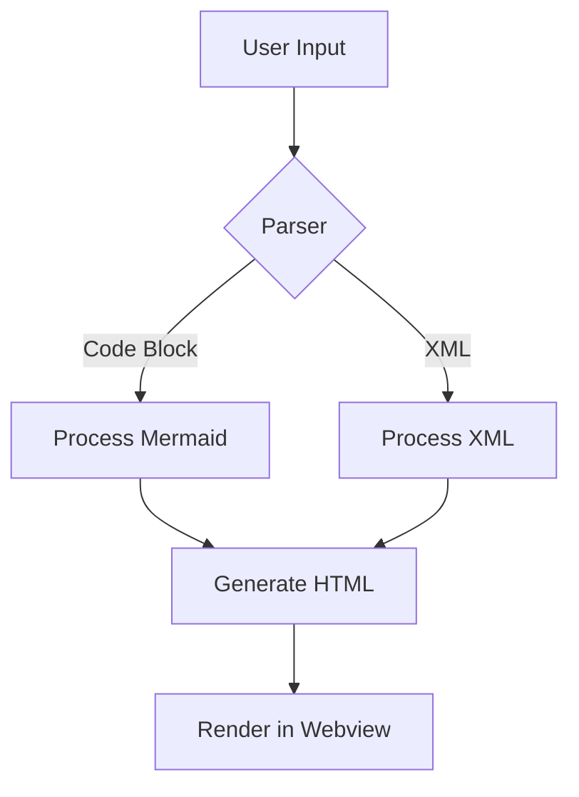
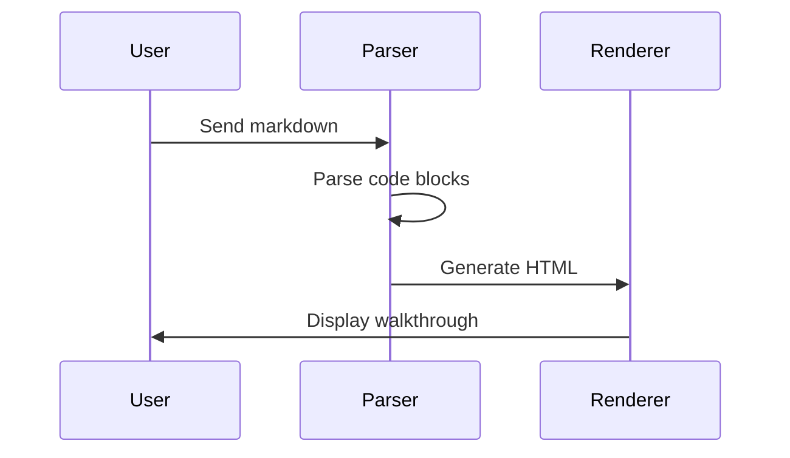

# Test Mermaid Code Block Syntax

This is a test walkthrough to verify the new mermaid code block syntax works correctly.

## Architecture Overview

Here's how the system works:

## Another Diagram

This one has blank lines to test the original issue:

The new syntax should handle both diagrams correctly without the blank line parsing issues.
